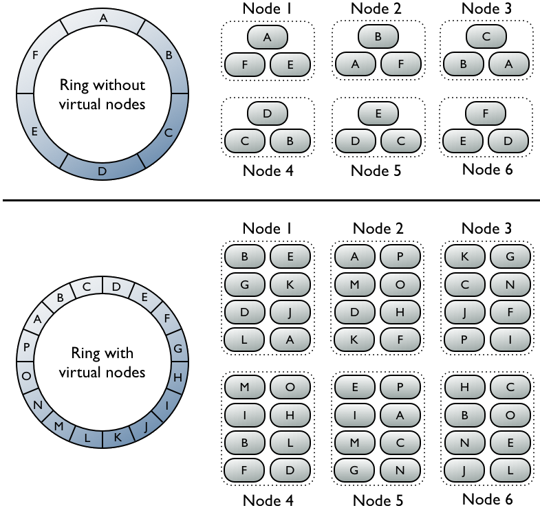

# How data is distributed across a cluster \(using virtual nodes\) {#archDataDistributeDistribute .concept}

Vnodes use consistent hashing to distribute data without requiring new token generation and assignment.

Prior to Cassandra 1.2, you had to calculate and assign a single [token](/en/archived/cassandra/1.1/docs/initialize/token_generation.html) to each node in a cluster. Each token determined the node's position in the ring and its portion of data according to its hash value. In Cassandra 1.2 and later, each node is allowed many tokens. The new paradigm is called virtual nodes \(vnodes\). Vnodes allow each node to own a large number of small [partition ranges](/en/glossary/doc/glossary/gloss_partition_range.html) distributed throughout the cluster. Vnodes also use consistent hashing to distribute data but using them doesn't require token generation and assignment.

**Note:** DataStax recommends using **8** vnodes \(tokens\). Using 8 vnodes distributes the workload between systems with a ~10% variance and has minimal impact on performance.

The top portion of the graphic shows a cluster without vnodes. In this paradigm, each node is assigned a single token that represents a location in the ring. Each node stores data determined by mapping the [partition key](/en/glossary/doc/glossary/gloss_partition_key.html) to a token value within a range from the previous node to its assigned value. Each node also contains copies of each row from other nodes in the cluster. For example, if the replication factor is 3, range E replicates to nodes 5, 6, and 1. Notice that a node owns exactly one contiguous partition range in the ring space.

The bottom portion of the graphic shows a ring with vnodes. Within a cluster, virtual nodes are randomly selected and non-contiguous. The placement of a row is determined by the hash of the partition key within many smaller partition ranges belonging to each node.

**Parent topic:** [Virtual nodes](../../cassandra/architecture/archDataDistributeVnodesUsing.md)

