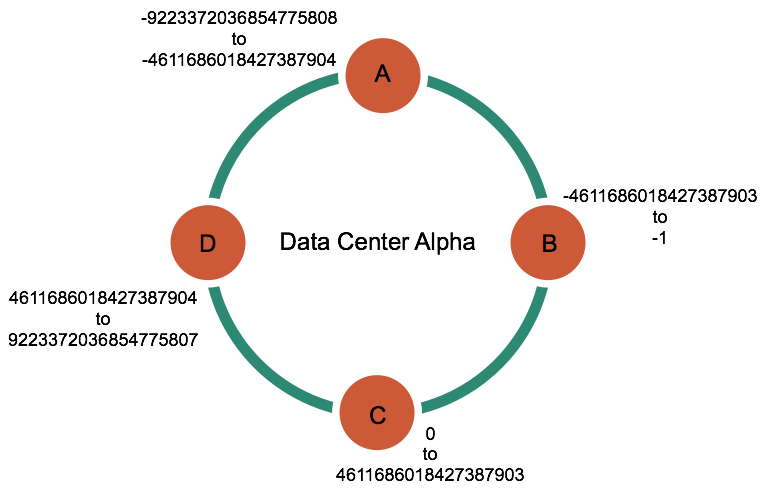

# Consistent hashing {#archDataDistributeHashing .concept}

Consistent hashing allows distribution of data across a cluster to minimize reorganization when nodes are added or removed.

Consistent hashing allows distribution of data across a cluster to minimize reorganization when nodes are added or removed. Consistent hashing partitions data based on the partition key. \(For an explanation of partition keys and primary keys, see the [Data modeling example](/en/cql-oss/3.3/cql/ddl/dataModelingApproach.html) in *CQL for Cassandra 2.2 and later*.\)

For example, if you have the following data:

|name|age|car|gender|
|----|---|---|------|
|jim|36|camaro|M|
|carol|37|bmw|F|
|johnny|12| |M|
|suzy|10| |F|

Cassandra assigns a hash value to each partition key:

|Partition key|Murmur3 hash value|
|-------------|------------------|
|jim|-2245462676723223822|
|carol|7723358927203680754|
|johnny|-6723372854036780875|
|suzy|1168604627387940318|

Each node in the cluster is responsible for a range of data based on the hash value.

Cassandra places the data on each node according to the value of the partition key and the range that the node is responsible for. For example, in a four node cluster, the data in this example is distributed as follows:

|Node|Start range|End range|Partition key|Hash value|
|----|-----------|---------|-------------|----------|
|A|-9223372036854775808|-4611686018427387904|johnny|-6723372854036780875|
|B|-4611686018427387903|-1|jim|-2245462676723223822|
|C|0|4611686018427387903|suzy|1168604627387940318|
|D|4611686018427387904|9223372036854775807|carol|7723358927203680754|

**Parent topic:** [Data distribution and replication](../../cassandra/architecture/archDataDistributeAbout.md)

