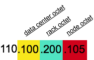

# RackInferringSnitch {#archSnitchRackInf .concept}

Determines the location of nodes by rack and datacenter corresponding to the IP addresses.

The RackInferringSnitch determines the proximity of nodes by rack and datacenter, which are assumed to correspond to the 3rd and 2nd octet of the node's IP address, respectively. This snitch is best used as an example for writing a custom snitch class \(unless this happens to match your deployment conventions\).

**Parent topic:** [Snitches](../../cassandra/architecture/archSnitchesAbout.md)

