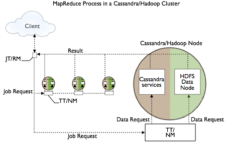

# Hadoop support {#configHadoop .concept}

Cassandra support for integrating Hadoop with Cassandra.

Cassandra support for integrating Hadoop with Cassandra includes:

-   MapReduce

**Note:** Apache Pig is no longer supported as of Cassandra 3.0.

You can use Cassandra 3.0 with Hadoop 2.x or 1.x with some restrictions:

-   You must run separate datacenters: one or more datacenters with nodes running just Cassandra \(for Online Transaction Processing\) and others with nodes running C\* & with Hadoop installed. See [Isolate Cassandra and Hadoop](configHadoop.md#configHadoopIsolate) for details.
-   Before starting the datacenters of Cassandra/Hadoop nodes, disable virtual nodes \(vnodes\).

    **Note:** You only need to disable vnodes in datacenters with nodes running Cassandra AND Hadoop.

To disable virtual nodes:

1.  In the cassandra.yaml file, set num\_tokens to 1.
2.  Uncomment the initial\_token property and set it to 1 or to the value of a generated token for a multi-node cluster.
3.  Start the cluster for the first time.

    You cannot convert single-token nodes to vnodes. See [Enabling virtual nodes on an existing production cluster](configVnodesProduction.md)for another option.

Setup and configuration, described in the [Apache docs](http://wiki.apache.org/cassandra/HadoopSupport), involves overlaying a Hadoop cluster on Cassandra nodes, configuring a separate server for the Hadoop NameNode/JobTracker, and installing a Hadoop TaskTracker and Data Node on each Cassandra node. The nodes in the Cassandra datacenter can draw from data in the HDFS Data Node as well as from Cassandra. The Job Tracker/Resource Manager \(JT/RM\) receives MapReduce input from the client application. The JT/RM sends a MapReduce job request to the Task Trackers/Node Managers \(TT/NM\) and an optional clients MapReduce. The data is written to Cassandra and results sent back to the client.

 

The Apache docs also cover how to get configuration and integration support.

## Input and Output Formats {#InputOutputFormats .section}

Hadoop jobs can receive data from CQL tables and indexes and can write their output to Cassandra tables as well as to the Hadoop FileSystem. Cassandra 3.0 supports the following formats for these tasks:

-   CqlInputFormat class: for importing job input into the Hadoop filesystem from CQL tables
-   CqlOutputFormat class: for writing job output from the Hadoop filesystem to CQL tables
-   CqlBulkOutputFormat class: generates Cassandra SSTables from the output of Hadoop jobs, then loads them into the cluster using the SSTableLoaderBulkOutputFormat class

Reduce tasks can store keys \(and corresponding bound variable values\) as CQL rows \(and respective columns\) in a given CQL table.

## Running the wordcount example {#confHadoopWordCt .section}

Wordcount example JARs are located in the examples directory of the Cassandra source code installation. There are CQL and legacy examples in the hadoop\_cql3\_word\_count and hadoop\_word\_count subdirectories, respectively. Follow instructions in the readme files.

## Isolating Hadoop and Cassandra workloads {#configHadoopIsolate .section}

When you create a keyspace using CQL, Cassandra creates a virtual datacenter for a cluster, even a one-node cluster, automatically. You assign nodes that run the same type of workload to the same datacenter. The separate, virtual datacenters for different types of nodes segregate workloads running Hadoop from those running Cassandra. Segregating workloads ensures that only one type of workload is active per datacenter. Separating nodes running a sequential data load, from nodes running any other type of workload, such as Cassandra real-time OLTP queries is a best practice.

The location of the [cassandra.yaml](/en/archived/cassandra/3.x/cassandra/configuration/configCassandra_yaml.html) file depends on the type of installation:

|Package installations|/etc/cassandra/cassandra.yaml|
|Tarball installations|install\_location/resources/cassandra/conf/cassandra.yaml|

**Parent topic:** [Configuration](../../cassandra/configuration/configTOC.md)

