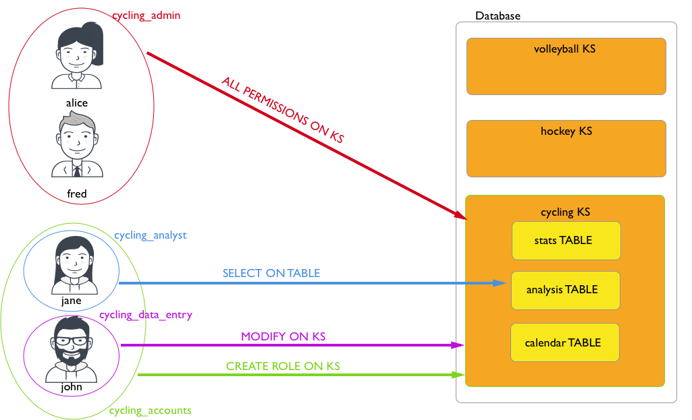

# About Internal authentication {#secureAboutNativeAuth .concept}

Internal authentication is based on Cassandra-controlled roles and passwords.

Like many databases, Cassandra uses rolenames and passwords for internal authentication. Role-based authentication encompasses both users and roles to bring a number of useful features to authorization. Roles can represent either actual individual users or roles that those users have in administering and accessing the Cassandra cluster.

  

For example, a user named *alice* is created and given login privileges:

```
**CREATE ROLE** alice **WITH PASSWORD =** 'enjoyLife' **AND LOGIN =** true;
```

Note that the user is created as a role and this user can log into the database with the assigned password credentials. Roles can be created with superuser, non-superuser, and login privileges. Superuser privileges allow a role to perform any database operations. Next, we create a role that will have be given access to all the functionality of a particular keyspace:

```
**CREATE ROLE** cycling_admin **WITH PASSWORD =** '1234abcd';
**GRANT ALL PERMISSIONS ON KEYSPACE** cycling **TO** cycling_admin;
```

This role, when assigned to a user, will provide certain privileges to the user based on the role's privileges; the role that is granted this role will inherit the *cycling\_admin* privileges. The *cycling\_admin* role is granted all permissions on the keyspace *cycling* in the second command. When *alice* is granted the role *cycling\_admin*, *alice* is now granted all permissions on the keyspace *cycling*:

```
**GRANT** cycling_admin **TO** alice;
```

An individual user can be granted any number of roles, just as any functional role can be granted another role's permissions. In this example, the role *cycling\_analyst* has the ability to select data, and then gains the ability to select data in the another table *hockey* when the role *hockey\_analyst* is granted.

```
**CREATE ROLE** cycling_analyst **WITH PASSWORD =** 'zyxw9876';
**GRANT SELECT ON TABLE** cycling.analysis **TO** cycling_analyst;
**CREATE ROLE** hockey_analyst **WITH PASSWORD =** 'Iget2seeAll';
**GRANT SELECT ON TABLE** hockey.analysis **TO** hockey_analyst;
**GRANT** hockey_analyst **TO** cycling_analyst;
**GRANT** cyclist_analyst **TO** jane;
```

If a user then is granted the role of *cycling\_analyst* role, that user will be able to select data in the additional table *hockey* The illustration above would be modified to show that the user *jane* now has access to two tables.

**Note:** Permissions and `SUPERUSER` status are inherited, but the `LOGIN` privilege is not.

An important change that roles-based access control also introduces is that the need for `SUPERUSER` privileges in order to perform user/role management operations is removed. A role can be authorized to create roles or be authorized to grant and revoke permissions:

```
// Give cycling_accounts the right to create roles
**GRANT CREATE ON ALL ROLES TO** cycling_accounts;
// Give cycling_accounts the right to grant or revoke permissions
**GRANT AUTHORIZE ON KEYSPACE** cycling **TO** cycling_accounts;
**GRANT** cyclist_accounts **TO** jane;
**GRANT** cyclist_accounts **TO** john;
```

Internal authentication and authorization information is stored in the following Cassandra tables:

 system\_auth.roles
 :   Table that stores the role name, whether the role can be used for login, whether the role is a superuser, what other roles the role may be a member of, and a bcrypt salted hash password for the role.

  system\_auth.role\_members
 :   Table that stores the roles and role members.

  system\_auth.role\_permissions
 :   Table that stores the role, a resource \(keyspace, table\), and the permission that the role has to access the resource.

  system\_auth.recqlshSourceole\_permissons\_index
 :   Table that stores the role and a resource that the role has a set permission.

 Cassandra is configured with a default superuser role and password pair of *cassandra*/*cassandra* by default. Using this role, additional roles can be created using CQL commands. To secure the system, this default role should be deleted once a non-default superuser has been created.

Once roles and passwords have been set, Cassandra can be [configured to use authentication](secureConfigNativeAuth.md) in the cassandra.yaml file.

The location of the [cassandra.yaml](/en/archived/cassandra/3.x/cassandra/configuration/configCassandra_yaml.html) file depends on the type of installation:

|Package installations|/etc/cassandra/cassandra.yaml|
|Tarball installations|install\_location/resources/cassandra/conf/cassandra.yaml|

If roles exist and Cassandra is configured to use authentication, Cassandra tools must be executed with optional authentication options.

-   [cqlsh with authentication](secureLoginCqlsh.md)
-   [DevCenter authenticated connections](/en/latest-devcenter/devcenter/connectionManager.html)
-   [DataStax drivers](/en/developer/driver-matrix/doc/common/driverMatrix.html) - produced and certified by DataStax to work with Cassandra.

**Parent topic:** [Internal authentication](../../cassandra/configuration/secureInternalAuthenticationTOC.md)

