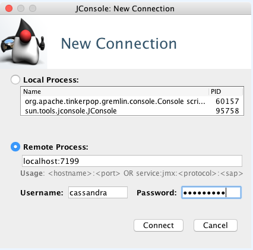

# Using jconsole with authentication {#secureJconsole .task}

How to use jconsole with authentication.

After configuring JMX authentication, using `jconsole` requires a username and password to complete the remote connection to the Cassandra cluster. Use an appropriate username/password combination.

1.  Start `jconsole` using a pre-configured JMX username and password for `<username>` and `<password>`:

      

    For Cassandra 3.6 and later, the username and password can be an internally configured Cassandra role and password.

**Parent topic:** [JMX authentication and authorization](../../cassandra/configuration/secureJMXAuthenticationTOC.md)

