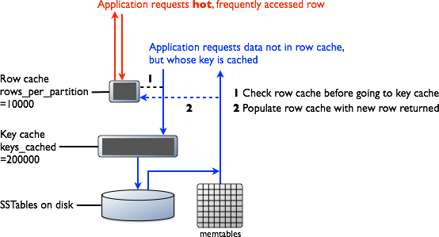

# How is data read? {#dmlAboutReads .concept}

How Cassandra combines results from the active memtable and potentially multiple SSTables to satisfy a read.

To satisfy a read, Cassandra must combine results from the active memtable and potentially multiple SSTables.

Cassandra processes data at several stages on the read path to discover where the data is stored, starting with the data in the memtable and finishing with SSTables:

-   Check the memtable
-   Check row cache, if enabled
-   Checks Bloom filter
-   Checks partition key cache, if enabled
-   Goes directly to the compression offset map if a partition key is found in the partition key cache, or checks the partition summary if not

    If the partition summary is checked, then the partition index is accessed

-   Locates the data on disk using the compression offset map
-   Fetches the data from the SSTable on disk

## Memtable { .section}

If the memtable has the desired partition data, then the data is read and then merged with the data from the SSTables. The SSTable data is accessed as shown in the following steps.

## Row Cache { .section}

Typical of any database, reads are fastest when the most in-demand data fits into memory. The operating system page cache is best at improving performance, although the row cache can provide some improvement for very read-intensive operations, where read operations are 95% of the load. Row cache is contra-indicated for write-intensive operations. The row cache, if enabled, stores a subset of the partition data stored on disk in the SSTables in memory. In Cassandra 2.2 and later, it is stored in fully off-heap memory using a new implementation that relieves garbage collection pressure in the JVM. The subset stored in the row cache use a configurable amount of memory for a specified period of time. The row cache uses LRU \(least-recently-used\) eviction to reclaim memory when the cache has filled up.

The row cache size is configurable, as is the number of rows to store. Configuring the number of rows to be stored is a useful feature, making a "Last 10 Items" query very fast to read. If row cache is enabled, desired partition data is read from the row cache, potentially saving two seeks to disk for the data. The rows stored in row cache are frequently accessed rows that are merged and saved to the row cache from the SSTables as they are accessed. After storage, the data is available to later queries. The row cache is not write-through. If a write comes in for the row, the cache for that row is invalidated and is not cached again until the row is read. Similarly, if a partition is updated, the entire partition is evicted from the cache. When the desired partition data is not found in the row cache, then the [Bloom filter](/en/glossary/doc/glossary/gloss_bloom_filter.html) is checked.

## Bloom Filter { .section}

First, Cassandra checks the Bloom filter to discover which SSTables are likely to have the request partition data. The Bloom filter is stored in off-heap memory. Each SSTable has a Bloom filter associated with it. A Bloom filter can establish that a SSTable does not contain certain partition data. A Bloom filter can also find the likelihood that partition data is stored in a SSTable. It speeds up the process of partition key lookup by narrowing the pool of keys. However, because the Bloom filter is a probabilistic function, it can result in false positives. Not all SSTables identified by the Bloom filter will have data. If the Bloom filter does not rule out an SSTable, Cassandra checks the [partition key cache](../operations/opsConfiguringCaches.md)

The Bloom filter grows to approximately 1-2 GB per billion partitions. In the extreme case, you can have one partition per row, so you can easily have billions of these entries on a single machine. The Bloom filter is tunable if you want to trade memory for performance.

## Partition Key Cache { .section}

The partition key cache, if enabled, stores a cache of the partition index in off-heap memory. The key cache uses a small, configurable amount of memory, and each "hit" saves one seek during the read operation. If a partition key is found in the key cache can go directly to the compression offset map to find the compressed block on disk that has the data. The partition key cache functions better once warmed, and can greatly improve over the performance of cold-start reads, where the key cache doesn't yet have or has purged the keys stored in the key cache. It is possible to limit the number of partition keys saved in the key cache, if memory is very limited on a node. If a partition key is not found in the key cache, then the [partition summary](/en/glossary/doc/glossary/gloss_index_summary.html) is searched.

The partition key cache size is configurable, as are the number of partition keys to store in the key cache.

## Partition Summary { .section}

The partition summary is an off-heap in-memory structure that stores a sampling of the partition index. A partition index contains all partition keys, whereas a partition summary samples every X keys, and maps the location of every Xth key's location in the index file. For example, if the partition summary is set to sample every 20 keys, it will store the location of the first key as the beginning of the SSTable file, the 20th key and its location in the file, and so on. While not as exact as knowing the location of the partition key, the partition summary can shorten the scan to find the partition data location. After finding the range of possible partition key values, the [partition index](/en/glossary/doc/glossary/gloss_primary_index.html) is searched.

By configuring the sample frequency, you can trade memory for performance, as the more granularity the partition summary has, the more memory it will use. The sample frequency is changed using the [index interval](/en/cql-oss/3.3/cql/cql_reference/cqlCreateTable.html#tabProp) property in the table definition. A fixed amount of memory is configurable using the [index\_summary\_capacity\_in\_mb](../configuration/configCassandra_yaml.md#index_summary_capacity_in_mb) property, and defaults to 5% of the heap size.

## Partition Index { .section}

The partition index resides on disk and stores an index of all partition keys mapped to their offset. If the partition summary has been checked for a range of partition keys, now the search passes to the partition index to seek the location of the desired partition key. A single seek and sequential read of the columns over the passed-in range is performed. Using the information found, the partition index now goes to the compression offset map to find the compressed block on disk that has the data. If the partition index must be searched, two seeks to disk will be required to find the desired data.

## Compression offset map { .section}

The compression offset map stores pointers to the exact location on disk that the desired partition data will be found. It is stored in off-heap memory and is accessed by either the partition key cache or the partition index. The desired compressed partition data is fetched from the correct SSTable\(s\) once the compression offset map identifies the disk location. The query receives the result set.

**Note:** Within a partition, all rows are not equally expensive to query. The very beginning of the partition \(the first rows, clustered by your key definition\) is slightly less expensive to query because there is no need to consult the partition-level index.

The compression offset map grows to 1-3 GB per terabyte compressed. The more you compress data, the greater number of compressed blocks you have and the larger the compression offset table. Compression is enabled by default even though going through the compression offset map consumes CPU resources. Having compression enabled makes the page cache more effective, and typically, almost always pays off.

**Parent topic:** [How Cassandra reads and writes data](../../cassandra/dml/dmlIntro.md)

