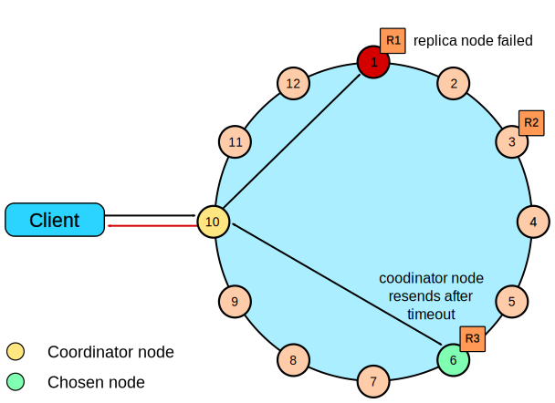

# How are read requests accomplished? {#dmlClientRequestsRead .concept}

The three types of read requests that a coordinator node can send to a replica.

There are three types of read requests that a [coordinator](/en/glossary/doc/glossary/gloss_coordinator_node.html) can send to a replica:

-   A direct read request
-   A digest request
-   A background read repair request

In a direct read request, the coordinator node contacts one replica node. Then the coordinator sends a digest request to a number of replicas determined by the [consistency level](dmlAboutDataConsistency.md) specified by the client. The digest request checks the data in the replica node to make sure it is up to date. Then the coordinator sends a digest request to all remaining replicas. If any replica nodes have out of date data, a background [read repair](../operations/opsRepairNodesReadRepair.md) request is sent. Read repair requests ensure that the requested row is made consistent on all replicas involved in a read query.

For a digest request the coordinator first contacts the replicas specified by the consistency level. The coordinator sends these requests to the replicas that currently respond the fastest. The contacted nodes respond with a digest of the requested data; if multiple nodes are contacted, the rows from each replica are compared in memory for consistency. If they are not consistent, the replica having the most recent data \(based on the timestamp\) is used by the coordinator to forward the result back to the client. To ensure that all replicas have the most recent version of the data, read repair is carried out to update out-of-date replicas.

For illustrated examples of read requests, see [Examples of read consistency levels](dmlClientRequestsReadExp.md).

## Rapid read protection using speculative\_retry {#speculative-retry .section}

Rapid read protection allows Cassandra to still deliver read requests when the originally selected replica nodes are either down or taking too long to respond. If the table has been configured with the [`speculative_retry`](/en/cql-oss/3.3/cql/cql_reference/cqlCreateTable.html#tabProp__morespeculativeRetry) property, the coordinator node for the read request will retry the request with another replica node if the original replica node exceeds a configurable timeout value to complete the read request.

 

-   **[Examples of read consistency levels](../../cassandra/dml/dmlClientRequestsReadExp.md)**  
Read request examples with different consistency levels.

**Parent topic:** [Data consistency](../../cassandra/dml/dmlDataConsistencyTOC.md)

