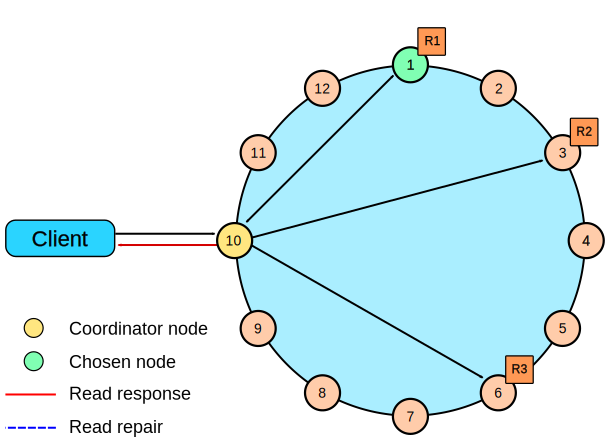
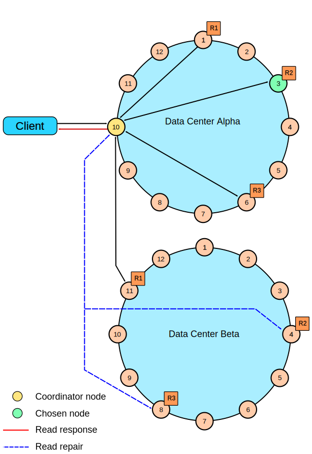
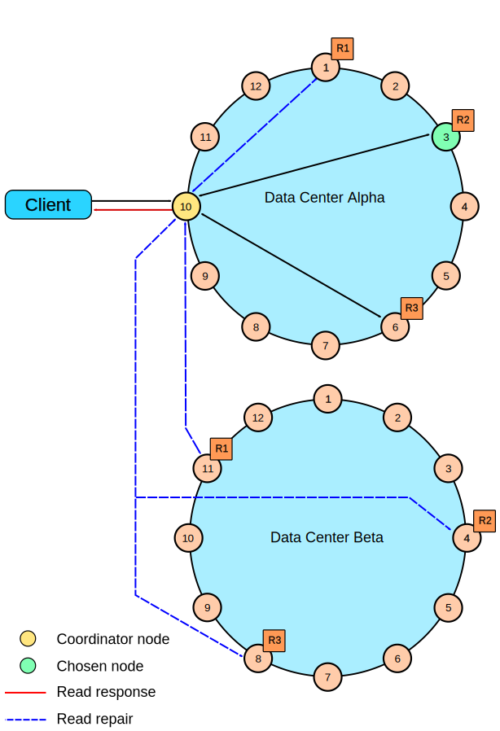
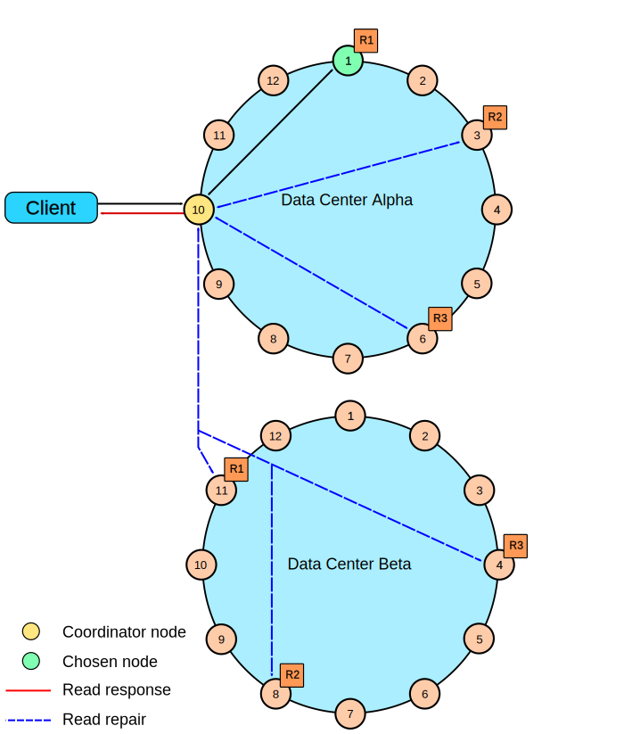

# Examples of read consistency levels {#dmlClientRequestsReadExp .concept}

Read request examples with different consistency levels.

The following diagrams show examples of read requests using these consistency levels:

-   [QUORUM in a single datacenter](dmlClientRequestsReadExp.md#single-dc-quorum)
-   [ONE in a single datacenter](dmlClientRequestsReadExp.md#single-dc-one)
-   [QUORUM in two datacenters](dmlClientRequestsReadExp.md#two-dc-quorum)
-   [LOCAL\_QUORUM in two datacenters](dmlClientRequestsReadExp.md#two-dc-local-quorum)
-   [ONE in two datacenters](dmlClientRequestsReadExp.md#two-dc-one)
-   [LOCAL\_ONE in two datacenters](dmlClientRequestsReadExp.md#two-dc-local-one)

[Rapid read protection diagram](dmlClientRequestsRead.md#speculative-retry) shows how the speculative retry table property affects consistency.

## A single datacenter cluster with a consistency level of `QUORUM` {#single-dc-quorum .example}

In a single datacenter cluster with a replication factor of 3, and a read consistency level of `QUORUM`, 2 of the 3 replicas for the given row must respond to fulfill the read request. If the contacted replicas have different versions of the row, the replica with the most recent version will return the requested data. In the background, the third replica is checked for consistency with the first two, and if needed, a read repair is initiated for the out-of-date replicas.

 

## A single datacenter cluster with a consistency level of `ONE` {#single-dc-one .example}

In a single datacenter cluster with a replication factor of 3, and a read consistency level of `ONE`, the closest replica for the given row is contacted to fulfill the read request. In the background a read repair is potentially initiated, based on the `read_repair_chance` setting of the table, for the other replicas.

 

## A two datacenter cluster with a consistency level of `QUORUM` {#two-dc-quorum .example}

In a two datacenter cluster with a replication factor of 3, and a read consistency of `QUORUM`, 4 replicas for the given row must respond to fulfill the read request. The 4 replicas can be from any datacenter. In the background, the remaining replicas are checked for consistency with the first four, and if needed, a read repair is initiated for the out-of-date replicas.

 

## A two datacenter cluster with a consistency level of `LOCAL_QUORUM` {#two-dc-local-quorum .example}

In a multiple datacenter cluster with a replication factor of 3, and a read consistency of `LOCAL_QUORUM`, 2 replicas in the same datacenter as the coordinator node for the given row must respond to fulfill the read request. In the background, the remaining replicas are checked for consistency with the first 2, and if needed, a read repair is initiated for the out-of-date replicas.

 

## A two datacenter cluster with a consistency level of `ONE` {#two-dc-one .example}

In a multiple datacenter cluster with a replication factor of 3, and a read consistency of `ONE`, the closest replica for the given row, regardless of datacenter, is contacted to fulfill the read request. In the background a read repair is potentially initiated, based on the `read_repair_chance` setting of the table, for the other replicas.

 

## A two datacenter cluster with a consistency level of `LOCAL_ONE` {#two-dc-local-one .example}

In a multiple datacenter cluster with a replication factor of 3, and a read consistency of `LOCAL_ONE`, the closest replica for the given row in the same datacenter as the coordinator node is contacted to fulfill the read request. In the background a read repair is potentially initiated, based on the `read_repair_chance` setting of the table, for the other replicas.

 

**Parent topic:** [How are read requests accomplished?](../../cassandra/dml/dmlClientRequestsRead.md)

