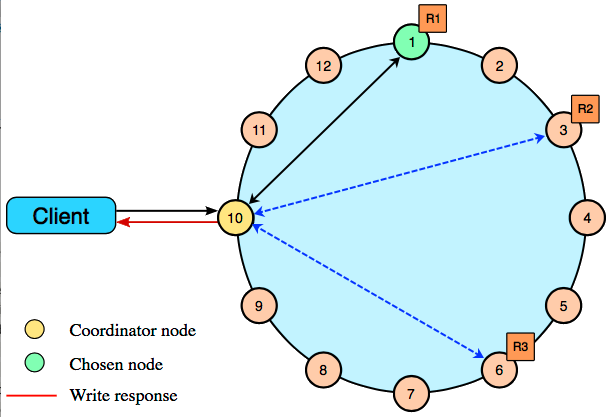

# How are write requests accomplished? {#dmlClientRequestsWrite .concept}

How write requests work.

The coordinator sends a write request to *all* replicas that own the row being written. As long as all replica nodes are up and available, they will get the write regardless of the [consistency level](dmlConfigConsistency.md) specified by the client. The write consistency level determines how many replica nodes must respond with a success acknowledgment in order for the write to be considered successful. Success means that the data was written to the commit log and the memtable as described in [how data is written](dmlHowDataWritten.md).

The coordinator node forwards the write to replicas of that row, and responds to the client once it receives write acknowledgments from the number of nodes specified by the consistency level. Exceptions:

-   If the coordinator cannot write to enough replicas to meet the requested consistency level, it throws an `Unavailable` Exception and does not perform any writes.
-   If there are enough replicas available but the required writes don't finish within the timeout window, the coordinator throws a `Timeout` Exception.

For example, in a single datacenter 10-node cluster with a replication factor of 3, an incoming write will go to all 3 nodes that own the requested row. If the write consistency level specified by the client is `ONE`, the first node to complete the write responds back to the coordinator, which then proxies the success message back to the client. A consistency level of `ONE` means that it is possible that 2 of the 3 replicas can miss the write if they happen to be down at the time the request is made. If a replica misses a write, the row is made consistent later using one of the [built-in repair mechanisms](../operations/opsRepairNodesTOC.md): hinted handoff, read repair, or anti-entropy node repair.

 

-   **[Multiple datacenter write requests](../../cassandra/dml/dmlClientRequestsMultiDCWrites.md)**  
How write requests work when using multiple datacenters.

**Parent topic:** [Data consistency](../../cassandra/dml/dmlDataConsistencyTOC.md)

