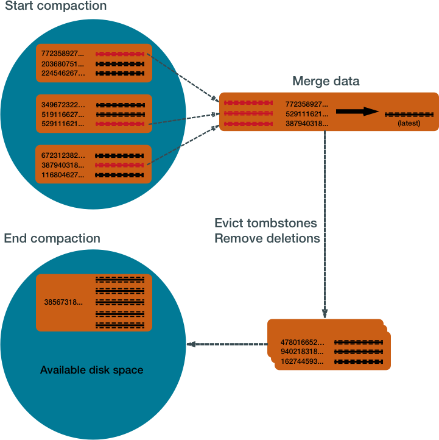
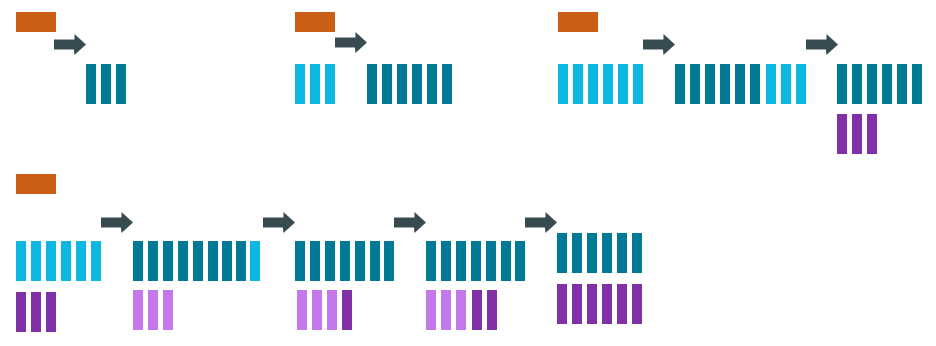
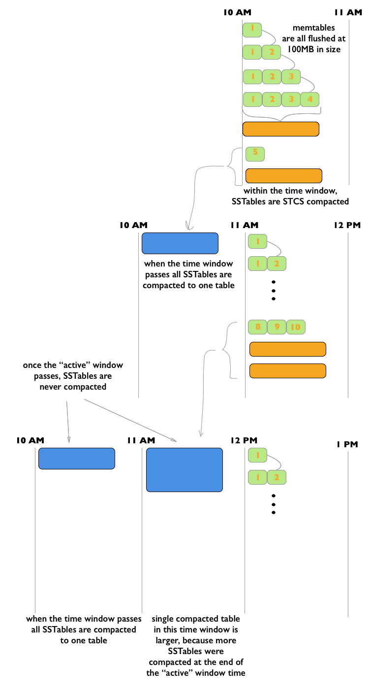

# How is data maintained? {#dmlHowDataMaintain .concept}

Cassandra processes data at several stages on the write path. Compaction to maintain healthy SSTables is the last step in the write path process.

The Cassandra write process stores data in files called SSTables. SSTables are immutable. Instead of overwriting existing rows with inserts or updates, Cassandra writes new timestamped versions of the inserted or updated data in new SSTables. Cassandra does not perform deletes by removing the deleted data: instead, Cassandra marks it with [tombstones](/en/glossary/doc/glossary/gloss_tombstone.html).

Over time, Cassandra may write many versions of a row in different SSTables. Each version may have a unique set of columns stored with a different timestamp. As SSTables accumulate, the distribution of data can require accessing more and more SSTables to retrieve a complete row.

To keep the database healthy, Cassandra periodically merges SSTables and discards old data. This process is called compaction.

## Compaction {#dml-compaction .section}

Compaction works on a collection of SSTables. From these SSTables, compaction collects all versions of each unique row and assembles one complete row, using the most up-to-date version \(by timestamp\) of each of the row's columns. The merge process is performant, because rows are sorted by [partition key](/en/glossary/doc/glossary/gloss_partition_key.html) within each SSTable, and the merge process does not use random I/O. The new versions of each row is written to a new SSTable. The old versions, along with any rows that are ready for deletion, are left in the old SSTables, and are deleted as soon as pending reads are completed.

Compaction causes a temporary spike in disk space usage and disk I/O while old and new SSTables co-exist. As it completes, compaction frees up disk space occupied by old SSTables. It improves read performance by incrementally replacing old SSTables with compacted SSTables. Cassandra can read data directly from the new SSTable even before it finishes writing, instead of waiting for the entire compaction process to finish.

As Cassandra processes writes and reads, it replaces the old SSTables with new SSTables in the page cache. The process of caching the new SSTable, while directing reads away from the old one, is incremental — it does not cause a the dramatic cache miss. Cassandra provides predictable high performance even under heavy load.

## Compaction strategies {#dml_types_of_compaction .section}

Cassandra supports different compaction strategies, which control how which SSTables are chosen for compaction, and how the compacted rows are sorted into new SSTables. Each strategy has its own strengths. The sections that follow explain each of Cassandra's compaction strategies.

Although each of the following sections starts with a generalized recommendation, many factors complicate the choice of a compaction strategy. See [Which compaction strategy is best?](dmlHowDataMaintain.md#dml_which_compaction_strategy_is_best).

 SizeTieredCompactionStrategy \(STCS\)
 :   Recommended for write-intensive workloads.

    The SizeTieredCompactionStrategy \(STCS\) initiates compaction when Cassandra has accumulated a set number \(default: 4\) of similar-sized SSTables. STCS merges these SSTables into one larger SSTable. As these larger SSTables accumulate, STCS merges these into even larger SSTables. At any given time, several SSTables of varying sizes are present.

      

    While STCS works well to compact a write-intensive workload, it makes reads slower because the merge-by-size process does not group data by rows. This makes it more likely that versions of a particular row may be spread over many SSTables. Also, STCS does not evict deleted data predictably because its trigger for compaction is SSTable size, and SSTables might not grow quickly enough to merge and evict old data. As the largest SSTables grow in size, the amount of disk space needed for both the new and old SSTables simultaneously during STCS compaction can outstrip a typical amount of disk space on a node.

    -   **Pros:** Compacts write-intensive workload very well.
    -   **Cons:** Can hold onto stale data too long. Amount of memory needed increases over time.

  LeveledCompactionStrategy \(LCS\)
 :   Recommended for read-intensive workloads.

    The LeveledCompactionStrategy \(LCS\) alleviates some of the read operation issues with STCS. This strategy works with a series of levels. First, data in memtables is flushed to SSTables in the first level \(L0\). LCS compaction merges these first SSTables with larger SSTables in level L1.

      

    The SSTables in levels greater than L1 are merged into SSTables with a size greater than or equal to `sstable_size_in_mb` \(default: 160 MB\). If a L1 SSTable stores data of a partition that is larger than L2, LCS moves the SSTable past L2 to the next level up.

      

    In each of the levels above L0, LCS creates SSTables that are about the same size. Each level is 10X the size of the last level, so level L1 has 10X as many SSTables as L0, and level L2 has 100X as many. If the result of the compaction is more than 10 SSTables in level L1, the excess SSTables are moved to level L2.

    The LCS compaction process guarantees that the SSTables within each level starting with L1 have non-overlapping data. For many reads, this process enables Cassandra to retrieve all the required data from only one or two SSTables. In fact, 90% of all reads can be satisfied from one SSTable. Since LCS does not compact L0 tables, however, resource-intensive reads involving many L0 SSTables may still occur.

    At levels beyond L0, LCS requires less disk space for compacting — generally, 10X the fixed size of the SSTable. Obsolete data is evicted more often, so deleted data uses smaller portions of the SSTables on disk. However, LCS compaction operations take place more often and place more I/O burden on the node. For write-intensive workloads, the payoff of using this strategy is generally not worth the performance loss to I/O operations. In many cases, tests of LCS-configured tables reveal I/O saturation on writes and compactions.

    **Note:** Cassandra bypasses compaction operations when [bootstrapping](/en/glossary/doc/glossary/gloss_bootstrap.html) a new node using LCS into a cluster. The original data is moved directly to the correct level because there is no existing data, so no partition overlap per level is present. For more information, see [Apache Cassandra 2.2 - Bootstrapping Performance Improvements for Leveled Compaction](https://www.datastax.com/blog/2015/06/apache-cassandra-22-bootstrapping-performance-improvements-leveled-compaction).

    -   **Pros:** Disk requirements are easier to predict. Read operation latency is more predictable. Stale data is evicted more frequently.
    -   **Cons:** Much higher I/O utilization impacting operation latency

  TimeWindowCompactionStrategy \(TWCS\)
 :   Recommended for time series and expiring TTL workloads.

    The TimeWindowCompactionStrategy \(TWCS\) is similar to DTCS with simpler settings. TWCS groups SSTables using a series of time windows. During compaction, TWCS applies STCS to uncompacted SSTables in the most recent time window. At the end of a time window, TWCS compacts all SSTables that fall into that time window into a single SSTable based on the SSTable maximum timestamp. Once the major compaction for a time window is completed, no further compaction of the data will ever occur. The process starts over with the SSTables written in the next time window.

     

    As the figure shows, from 10 AM to 11 AM, the memtables are flushed from memory into 100MB SSTables. These SSTables are compacted into larger SSTables using STCS. At 11 AM, all these SSTables are compacted into a single SSTable, and never compacted again by TWCS. At 12 NOON, the new SSTables created between 11 AM and 12 NOON are compacted using STCS, and at the end of the time window the TWCS compaction repeats. Notice that each TWCS time window contains varying amounts of data.

    **Note:** For an animated explanation, see the [Datastax Academy Time Window Compaction Strategy](https://academy.datastax.com/courses/ds210-datastax-enterprise-operations-apache-cassandra/time-windowed-compaction) video.

    The TWCS configuration has two main property settings:

    -   compaction\_window\_unit: time unit used to define the window size \(milliseconds, seconds, hours, and so on\)
    -   compaction\_window\_size: how many units per window \(1,2,3, and so on\)

    The configuration for the above example: `compaction_window_unit = ‘minutes’`,`compaction_window_size = 60`

    **Pros**: Used for time series data, stored in tables that use the default TTL for all data. Simpler configuration than that of DTCS.

    **Cons**: Not appropriate if out-of-sequence time data is required, since SSTables will not compact as well. Also, not appropriate for data without a TTL, as storage will grow without bound. Less fine-tuned configuration is possible than with DTCS.

  DateTieredCompactionStrategy \(DTCS\)
 :   Deprecated in Cassandra 3.0.8/3.8.

    The DateTieredCompactionStrategy \(DTCS\) is similar to STCS. But instead of compacting based on SSTable size, DTCS compacts based on SSTable age. \(Each column in an SSTable is marked with the timestamp at write time. As the *age* of an SSTable, DTCS uses the oldest \(minimum\) timestamp of any column the SSTable contains.\)

    Configuring the DTCS time window ensures that new and old data are not mixed in merged SSTables. In fact, using Time-To-Live \(TTL\) timestamps, DTCS can eject whole SSTables containing expired data. This strategy often generates similar-sized SSTables if time series data is ingested at a steady rate.

    DTCS compacts SSTables into larger tables, as with STCS, when the system accumulates a configurable number of SSTables within a configurable time interval. However, DTCS skips compacting SSTables that reach a configurable age. This logic reduces the number of times data is rewritten. Queries that ask for data in a particular last time interval, such as an hour, can be executed very efficiently on DTCS-compacted SSTables \(particularly if the requested time interval is coordinated with the configured interval for compaction\).

    One use case that can cause difficulty with this strategy is out-of-sequence writing. For example, an operation that writes a timestamped record with a timestamp outside the current time window. Read repairs can inject out-of-sequence timestamps, so be sure to turn off read repairs when using DTCS. For more information, see [DateTieredCompactionStrategy: Notes from the Field](https://www.datastax.com/blog/2015/04/datetieredcompactionstrategy-notes-field).

    -   **Pros**: Specifically designed for time series data, stored in tables that use the default TTL. DTCS is a better choice when fine-tuning is required to meet space-related SLAs.

    -   **Cons**: Insertion of records out of time sequence \(by repairs or hint replaying\) can increase latency or cause errors. In some cases, it may be necessary to turn off read repair and carefully test and control the use of TIMESTAMP options in BATCH, DELETE, INSERT and UPDATE CQL commands.

 ## Which compaction strategy is best? {#dml_which_compaction_strategy_is_best .section}

To implement the best compaction strategy:

1.  Review your application's requirements.
2.  Configure the table to use the most appropriate strategy.
3.  Test the compaction strategies against your data.

The following questions are based on the experiences of Cassandra developers and users with the strategies described above.

 Does your table process time series data?
 :   If so, your best choices are TWCS or DTCS. For details, read the descriptions on this page.

 If your table is not focused on time series data, the choice becomes more complicated The following questions introduce other considerations that may guide your choice.

 Does your table handle more reads than writes, or more writes than reads?
 :   LCS is a good choice if your table processes twice as many reads as writes or more – especially randomized reads. If the proportion of reads to writes is closer, the performance hit exacted by LCS may not be worth the benefit. Be aware that LCS can be quickly overwhelmed by a high volume of writes.

  Does the data in your table change often?
 :   One advantage of LCS is that it keeps related data in a small set of SSTables. If your data is *immutable* or not subject to frequent [upserts](/en/glossary/doc/glossary/gloss_upsert.html), STCS accomplishes the same type of grouping without the LCS performance hit.

  Do you require predictable levels of read and write activity?
 :   LCS keeps the SSTables within predictable sizes and numbers. For example, if your table's read/write ratio is small, and it is expected to conform to a Service Level Agreements \(SLAs\) for reads, it may be worth taking the write performance penalty of LCS in order to keep read rates and latency at predictable levels. And you may be able to overcome this write penalty through horizontal scaling \(adding more nodes\).

  Will your table be populated by a batch process?
 :   On both batch reads and batch writes, STCS performs better than LCS. The batch process causes little or no fragmentation, so the benefits of LCS are not realized; batch processes can overwhelm LCS-configured tables.

  Does your system have limited disk space?
 :   LCS handles disk space more efficiently than STCS: it requires about 10% *headroom* in addition to the space occupied by the data is handles. STCS and DTCS generally require, in some cases, as much as 50% more than the data space.

  Is your system reaching its limits for I/O?
 :   LCS is significantly more I/O intensive than DTCS or STCS. Switching to LCS may introduce extra I/O load that offsets the advantages.

 ## Testing compaction strategies {#dml_testing_compaction_strategies .section}

Suggestions for determining which compaction strategy is best for your system:

-   Create a three-node cluster using one of the compaction strategies, stress test the cluster using cassandra-stress, and measure the results.
-   Set up a node on your existing cluster and use Cassandra's write survey mode to sample live data. See [What’s new in Cassandra 1.1: live traffic sampling](https://www.datastax.com/blog/2012/01/whats-new-cassandra-11-live-traffic-sampling).

## Configuring and running compaction {#dml_starting_compaction .section}

Set the compaction strategy for a table in the parameters for the CREATE TABLE or ALTER TABLE command. For details, see [Table properties](/en/cql-oss/3.3/cql/cql_reference/cqlCreateTable.html#tabProp__moreCompaction).

You can start compaction manually using the [nodetool compact](../tools/toolsCompact.md) command.

## More information about compaction {#dml-more-information-about-contraction .section}

The following blog posts and videos provide more information from developers that have tested compaction strategies:

-   [When to Use Leveled Compaction](https://www.datastax.com/blog/2011/10/when-use-leveled-compaction)
-   [Leveled compaction in Apache Cassandra](https://www.datastax.com/blog/2011/10/leveled-compaction-apache-cassandra)
-   [Using TimeWindowCompactionStrategy for Time Series Workloads](https://www.youtube.com/watch?v=PWtekUWCIaw)
-   [DateTieredCompactionStrategy: Notes from the Field](https://www.datastax.com/blog/2015/04/datetieredcompactionstrategy-notes-field)
-   [Date-Tiered Compaction in Cassandra](https://labs.spotify.com/2014/12/18/date-tiered-compaction/)
-   [DateTieredCompactionStrategy: Compaction for Time Series Data](https://www.datastax.com/blog/2014/11/datetieredcompactionstrategy-compaction-time-series-data).
-   [What delays a tombstone purge when using LCS in Cassandra](http://stackoverflow.com/questions/27862808/what-delays-a-tombstone-purge-when-using-lcs-in-cassandra)

**Parent topic:** [How Cassandra reads and writes data](../../cassandra/dml/dmlIntro.md)

