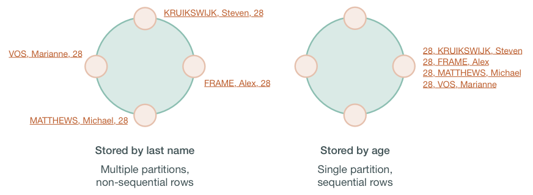

# How are indexes stored and updated? {#dmlIndexInternals .concept}

A brief description of how Cassandra stores and distributes indexes.

Secondary indexes are used to filter a table for data stored in non-primary key columns. For example, a table storing cyclist names and ages using the last name of the cyclist as the primary key might have a secondary index on the age to allow queries by age. Querying to match a non-primary key column is an anti-pattern, as querying should always result in a continuous slice of data retrieved from the table.

  

If the table rows are stored based on last names, the table may be spread across several partitions stored on different nodes. Queries based on a particular range of last names, such as all cyclists with the last name `Matthews` will retrieve sequential rows from the table, but a query based on the age, such as all cyclists who are `28`, will require all nodes to be queried for a value. Non-primary keys play no role in ordering the data in storage, thus querying for a particular value of a non-primary key column results in scanning all partitions. Scanning all partitions generally results in a prohibitive read latency, and is not allowed.

Secondary indexes can be built for a column in a table. These indexes are stored locally on each node in a hidden table and built in a background process. If a secondary index is used in a query that is not restricted to a particular partition key, the query will have prohibitive read latency because all nodes will be queried. A query with these parameters is only allowed if the query option `ALLOW FILTERING` is used. This option is not appropriate for production environments. If a query includes both a partition key condition and a secondary index column condition, the query will be successful because the query can be directed to a single node partition.

This technique, however, does not guarantee trouble-free indexing, so know [when and when not to use an index](/en/cql-oss/3.3/cql/cql_using/useWhenIndex.html). In the example shown above, an index on the age could be used, but a better solution is to create a materialized view or additional table that is ordered by age.

As with relational databases, keeping indexes up to date uses processing time and resources, so unnecessary indexes should be avoided. When a column is updated, the index is updated as well. If the old column value still exists in the memtable, which typically occurs when updating a small set of rows repeatedly, Cassandra removes the corresponding obsolete index entry; otherwise, the old entry remains to be purged by compaction. If a read sees a stale index entry before compaction purges it, the reader thread invalidates it.

**Parent topic:** [How Cassandra reads and writes data](../../cassandra/dml/dmlIntro.md)

