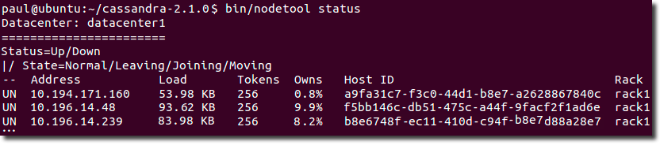

# Initializing a multiple node cluster \(multiple datacenters\) {#initMultipleDS .task}

A deployment scenario for a Cassandra cluster with multiple datacenters.

This topic contains information for deploying an Apache Cassandra™ cluster with multiple datacenters. If you're new to Cassandra, and haven't set up a cluster, see [Planning and testing cluster deployments](/en/landing_page/doc/landing_page/planning/planningAbout.html).

This example describes installing a six node cluster spanning two datacenters. Each node is configured to use the [GossipingPropertyFileSnitch](../architecture/archsnitchGossipPF.md) \(multiple rack aware\) and 256 virtual nodes \(vnodes\).

In Cassandra, the term datacenter is a grouping of nodes. Data center is synonymous with replication group, that is, a grouping of nodes configured together for replication purposes.

Each node must be correctly configured before starting the cluster. You must determine or perform the following before starting the cluster:

-   A good understanding of how Cassandra works. At minimum, be sure to read [Understanding the architecture](../architecture/archTOC.md) \(especially the [Data replication](../architecture/archDataDistributeReplication.md) section\) and [the rack feature of Cassandra](/en/landing_page/doc/landing_page/planning/planningAntiPatterns.html#AntiPatRack).
-   Install Cassandra on each node.
-   Choose a name for the cluster.
-   Get the IP address of each node.
-   Determine which nodes will be seed nodes. **Do not make all nodes seed nodes.** Please read [Internode communications \(gossip\)](../architecture/archGossipAbout.md).
-   Determine the [snitch](../architecture/archSnitchesAbout.md) and [replication strategy](../architecture/archDataDistributeAbout.md). The [GossipingPropertyFileSnitch](../architecture/archsnitchGossipPF.md) and [NetworkTopologyStrategy](../architecture/archDataDistributeAbout.md) are recommended for production environments.
-   Determine a naming convention for each datacenter and rack. Examples: DC1, DC2 or 100, 200 / RAC1, RAC2 or R101, R102. Choose the name carefully; renaming a datacenter is not possible.
-   The [cassandra.yaml configuration file](../configuration/configCassandra_yaml.md), and property files such as cassandra-rackdc.properties, give you more configuration options. See the [Configuration section](../configuration/configTOC.md) for more information.

1.  Suppose you install Cassandra on these nodes:

    ```
    node0 10.168.66.41 (seed1)
    node1 10.176.43.66
    node2 10.168.247.41
    node3 10.176.170.59 (seed2)
    node4 10.169.61.170
    node5 10.169.30.138
    ```

    **Note:** It is a best practice to have more than one seed node per datacenter.

2.  If you have a firewall running in your cluster, you must open certain ports for communication between the nodes. See [Configuring firewall port access](../configuration/secureFireWall.md).

3.  If Cassandra is running, you must stop the server and clear the data:

    Doing this removes the default [cluster\_name](../configuration/configCassandra_yaml.md#cluster_name) \(Test Cluster\) from the system table. All nodes must use the same cluster name.

    Package installations:

    1.  Stop Cassandra:

        ```language-bash
        sudo service cassandra stop #Stops Cassandra
        ```

    2.  Clear the data:

        ```language-bash
        sudo rm -rf /var/lib/cassandra/*
        ```

    Tarball installations:

    1.  Stop Cassandra:

        ```language-bash
        ps auwx | grep cassandra
        ```

        ```language-bash
        sudo kill pid
        ```

    2.  Clear the data:

        ``` {#d111e209 .language-bash}
        sudo rm -rf install\_location/data/*
        ```

4.  Set the properties in the cassandra.yaml file for each node:

    **Note:** After making any changes in the cassandra.yaml file, you must restart the node for the changes to take effect.

    Properties to set:

    -   cluster\_name:
    -   num\_tokens: recommended value: 256
    -   -seeds: internal IP address of each seed node

        In new clusters. Seed nodes don't perform [bootstrap](/en/glossary/doc/glossary/gloss_bootstrap.html) \(the process of a new node joining an existing cluster.\)

    -   listen\_address: 

        If the node is a seed node, this address must match an IP address in the seeds list. Otherwise, gossip communication fails because it doesn't know that it is a seed.

        If not set, Cassandra asks the system for the local address, the one associated with its hostname. In some cases Cassandra doesn't produce the correct address and you must specify the listen\_address.

    -   rpc\_address:listen address for client connections
    -   endpoint\_snitch: name of snitch \(See [endpoint\_snitch](../configuration/configCassandra_yaml.md#endpoint_snitch).\) If you are changing snitches, see [Switching snitches](../operations/opsSwitchSnitch.md).
    **Note:** If the nodes in the cluster are identical in terms of disk layout, shared libraries, and so on, you can use the same copy of the cassandra.yaml file on all of them.

    Example:

    ```
    cluster_name: 'MyCassandraCluster'
    num_tokens: 256
    seed_provider:
      - class_name: org.apache.cassandra.locator.SimpleSeedProvider
        parameters:
             - seeds:  "10.168.66.41,10.176.170.59"
    listen_address:
    endpoint_snitch: GossipingPropertyFileSnitch
    ```

    **Note:** Include at least one node from *each* datacenter in the seeds list.

5.  In the cassandra-rackdc.properties file, assign the datacenter and rack names you determined in the Prerequisites. For example:

    **Nodes 0 to 2**

    ```
    ## Indicate the rack and dc for this node
    dc=DC1
    rack=RAC1
    ```

    **Nodes 3 to 5**

    ```
    ## Indicate the rack and dc for this node
    dc=DC2
    rack=RAC1
    ```

6.  The `GossipingPropertyFileSnitch` always loads cassandra-topology.properties when that file is present. Remove the file from each node on any new cluster or any cluster migrated from the `PropertyFileSnitch`.

7.  After you have installed and configured Cassandra on all nodes, DataStax recommends starting the seed nodes one at a time, and then start the rest of the nodes.

    **Note:** If the node has restarted because of automatic restart, you must first stop the node and clear the directories, as described [above](initSingleDS.md#single-ds-step-3).

    Package installations:

    ```language-bash
    sudo service cassandra start #Starts Cassandra
    ```

    Tarball installations:

    ```language-bash
    cd install\_location
    ```

    ```language-bash
    bin/cassandra
    ```

8.  To check that the ring is up and running, run:

    Package installations:

    ```language-bash
    nodetool status
    ```

    Tarball installations:

    ```language-bash
    cd install\_location
    ```

    ```language-bash
    bin/nodetool status
    ```

    The output should list each node, and show its status as `UN` \(Up Normal\).

      

    The location of the [cassandra.yaml](/en/archived/cassandra/3.x/cassandra/configuration/configCassandra_yaml.html) file depends on the type of installation:

        |Package installations|/etc/cassandra/cassandra.yaml|
    |Tarball installations|install\_location/resources/cassandra/conf/cassandra.yaml|


**Parent topic:** [Initializing a cluster](../../cassandra/initialize/initTOC.md)

**Related information**  


[Install locations](../install/installLocationsTOC.md)

