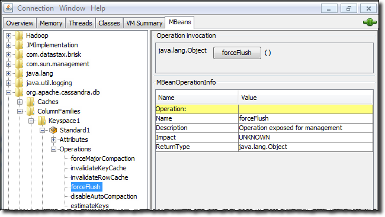

# Monitoring a Cassandra cluster {#opsMonitoring .concept}

Understanding the performance characteristics of a Cassandra cluster is critical to diagnosing issues and planning capacity.

Understanding the performance characteristics of a Cassandra cluster is critical to diagnosing issues and planning capacity.

Cassandra exposes a number of statistics and management operations via Java Management Extensions \(JMX\). JMX is a Java technology that supplies tools for managing and monitoring Java applications and services. Any statistic or operation that a Java application has exposed as an MBean can then be monitored or manipulated using JMX.

JMX\). JMX is a Java technology that supplies tools for managing and monitoring Java applications and services. Any statistic or operation that a Java application has exposed as an MBean can then be monitored or manipulated using JMX.

During normal operation, Cassandra outputs information and statistics that you can monitor using JMX-compliant tools, such as:

-   The Cassandra [nodetool utility](../tools/toolsNodetool.md)
-   JConsole

Using the same tools, you can perform certain administrative commands and operations such as flushing caches or doing a [node repair](/en/glossary/doc/glossary/gloss_node_repair.html).

## Monitoring using the nodetool utility {#opsMonitoringNodetool .section}

The [nodetool utility](../tools/toolsNodetool.md) is a command-line interface for monitoring Cassandra and performing routine database operations. It is typically run from an operational Cassandra node.

The nodetool utility supports the most important JMX metrics and operations, and includes other useful commands for Cassandra administration, such as the [proxyhistogram command](../tools/toolsProxyHistograms.md). This example shows the output from nodetool proxyhistograms after running 4,500 insert statements and 45,000 select statements on a three [ccm](https://github.com/pcmanus/ccm) node-cluster on a local computer.

```
$ nodetool proxyhistograms

proxy histograms
Percentile      Read Latency     Write Latency     Range Latency
                    (micros)          (micros)          (micros)
50%                  1502.50            375.00            446.00
75%                  1714.75            420.00            498.00
95%                 31210.25            507.00            800.20
98%                 36365.00            577.36            948.40
99%                 36365.00            740.60           1024.39
Min                   616.00            230.00            311.00
Max                 36365.00          55726.00          59247.00
```

For a summary of the ring and its current state of general health, use the [status command](../tools/toolsStatus.md). For example:

```
$ nodetool status

Note: Ownership information does not include topology; for complete information, specify a keyspace
Datacenter: datacenter1
=======================
Status=Up/Down
|/ State=Normal/Leaving/Joining/Moving
--  Address    Load       Tokens  Owns    Host ID                               Rack
UN  127.0.0.1  47.66 KB   1       33.3%   aaa1b7c1-6049-4a08-ad3e-3697a0e30e10  rack1
UN  127.0.0.2  47.67 KB   1       33.3%   1848c369-4306-4874-afdf-5c1e95b8732e  rack1
UN  127.0.0.3  47.67 KB   1       33.3%   49578bf1-728f-438d-b1c1-d8dd644b6f7f  rack1
```

The nodetool utility provides commands for viewing detailed metrics for tables, server metrics, and compaction statistics:

-    [nodetool tablestats](../tools/toolsTablestats.md) displays statistics for each table and keyspace.
-   [nodetool tablehistograms](../tools/toolsTablehisto.md) provides statistics about a table, including read/write latency, row size, column count, and number of SSTables.
-   [ nodetool netstats](../tools/toolsNetstats.md) provides statistics about network operations and connections.
-   [nodetool tpstats](../tools/toolsTPstats.md) provides statistics about the number of active, pending, and completed tasks for each stage of Cassandra operations by thread pool.

## Monitoring using JConsole {#opsMonitoringJconsole .section}

JConsole is a JMX-compliant tool for monitoring Java applications such as Cassandra. It is included with Sun JDK 5.0 and higher. JConsole consumes the JMX metrics and operations exposed by Cassandra and displays them in a well-organized GUI. For each node monitored, JConsole provides these six separate tab views:

-   Overview

    Displays overview information about the Java VM and monitored values.

-   Memory

    Displays information about memory use.

-   Threads

    Displays information about thread use.

-   Classes

    Displays information about class loading.

-   VM Summary

    Displays information about the Java Virtual Machine \(VM\).

-   Mbeans

    Displays information about MBeans.


The Overview and Memory tabs contain information that is very useful for Cassandra developers. The Memory tab allows you to compare heap and non-heap memory usage, and provides a control to immediately perform Java garbage collection.

For specific Cassandra metrics and operations, the most important area of JConsole is the MBeans tab. This tab lists the following Cassandra MBeans:

-   org.apache.cassandra.auth

    Includes permissions cache.

-   org.apache.cassandra.db

    Includes caching, table metrics, and compaction.

-   org.apache.cassandra.internal

    Internal server operations such as gossip, hinted handoff, and Memtable values.

-   org.apache.cassandra.metrics

    Includes metrics on CQL, clients, keyspaces, read repair, storage, and threadpools and other topics.

-   org.apache.cassandra.net

    Inter-node communication including FailureDetector, MessagingService and StreamingManager.

-   org.apache.cassandra.request

    Tasks related to read, write, and replication operations.

-   org.apache.cassandra.service

    Includes GCInspector.


When you select an MBean in the tree, its MBeanInfo and MBean Descriptor are displayed on the right, and any attributes, operations or notifications appear in the tree below it. For example, selecting and expanding the org.apache.cassandra.db MBean to view available actions for a table results in a display like the following:

  

If you choose to monitor Cassandra using JConsole, keep in mind that JConsole consumes a significant amount of system resources. For this reason, DataStax recommends running JConsole on a remote machine rather than on the same host as a Cassandra node.

The JConsole CompactionManagerMBean exposes [compaction metrics](opsCompactionMetrics.md) that can indicate when you need to add capacity to your cluster.

-   **[Compaction metrics](../../cassandra/operations/opsCompactionMetrics.md)**  
Monitoring compaction performance is an important aspect of knowing when to add capacity to your cluster.
-   **[Thread pool and read/write latency statistics](../../cassandra/operations/opsThreadPoolStats.md)**  
Increases in pending tasks on thread pool statistics can indicate when to add additional capacity.
-   **[Table statistics](../../cassandra/operations/opsTableStatistics.md)**  
Compaction metrics provide a number of statistics that are important for monitoring performance trends.

**Parent topic:** [Monitoring Cassandra](../../cassandra/operations/monitoringCassandraTOC.md)

