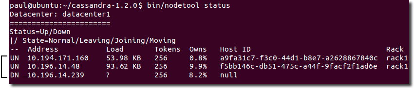

# Removing a node {#opsRemoveNode .task}

Reduce the size of a datacenter.

Use these instructions when you want to remove nodes to reduce the size of your cluster, not for [replacing a dead node](opsReplaceNode.md).

**Attention:** If you are not using [virtual nodes](../architecture/archDataDistributeVnodesUsing.md) \(vnodes\), you must rebalance the cluster.

-   Check whether the node is up or down using [nodetool status](../tools/toolsStatus.md):

    The nodetool command shows the status of the node \(UN=up, DN=down\):

    

-   If the node is up, run [nodetool decommission](../tools/toolsDecommission.md).

    This assigns the ranges that the node was responsible for to other nodes and replicates the data appropriately.

    Use [nodetool netstats](../tools/toolsNetstats.md) to monitor the progress.

-   If the node is down, choose the appropriate option:

    -   If the cluster uses vnodes, remove the node using the [nodetool removenode](../tools/toolsRemoveNode.md) command.
    -   If the cluster does not use vnodes, before running the [nodetool removenode](../tools/toolsRemoveNode.md) command, [adjust your tokens](../configuration/configGenTokens.md) to evenly distribute the data across the remaining nodes to avoid creating a hot spot.
-   If removenode fails, run [nodetool assassinate](../tools/toolsAssassinate.md).

**Parent topic:** [Adding or removing nodes, datacenters, or clusters](../../cassandra/operations/opsAddingRemovingNodeTOC.md)

