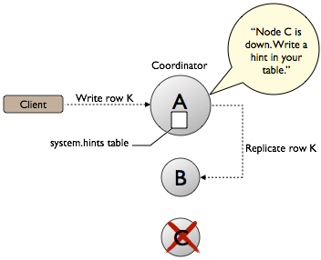

# Hinted Handoff: repair during write path {#opsRepairNodesHintedHandoff .concept}

Describes hinted handoff, repair during write path.

On occasion, a node becomes unresponsive while data is being written. Reasons for unresponsiveness are hardware problems, network issues, or overloaded nodes that experience long garbage collection \(GC\) pauses. By design, hinted handoff inherently allows Cassandra to continue performing the same number of writes even when the cluster is operating at reduced capacity.

After the failure detector marks a node as down, missed writes are stored by the coordinator for a period of time, if hinted handoff is [enabled](../configuration/configCassandra_yaml.md#hinted_handoff_enabled) in the cassandra.yaml file. In Cassandra 3.0 and later, the hint is stored in a local hints directory on each node for improved replay. The hint consists of a target ID for the downed node, a hint ID that is a time UUID for the data, a message ID that identifies the Cassandra version, and the data itself as a blob. Hints are flushed to disk every 10 seconds, reducing the staleness of the hints. When gossip discovers when a node has comes back online, the coordinator replays each remaining hint to write the data to the newly-returned node, then deletes the hint file. If a node is down for longer than [max\_hint\_window\_in\_ms](../configuration/configCassandra_yaml.md#max_hint_window_in_ms) \(3 hours by default\), the coordinator stops writing new hints.

The coordinator also checks every ten minutes for hints corresponding to writes that timed out during an outage too brief for the failure detector to notice through gossip. If a replica node is overloaded or unavailable, and the failure detector has not yet marked the node as down, then expect most or all writes to that node to fail after the timeout triggered by [write\_request\_timeout\_in\_ms,](/en/archived/cassandra/2.2/cassandra/configuration/configCassandra_yaml.html#reference_ds_qfg_n1r_1k__write_request_timeout_in_ms) \(10 seconds by default\). The coordinator returns a `TimeOutException` exception, and the write will fail but a hint will be stored. If several nodes experience brief outages simultaneously, substantial memory pressure can build up on the coordinator. The coordinator tracks how many hints it is currently writing, and if the number increases too much, the coordinator refuses writes and throws the `OverloadedException` exception.

The consistency level of a write request affects whether hints are written and a write request subsequently fails. If the cluster consists of two nodes, A and B, with a replication factor of 1, each row is stored on only one node. Suppose node A is the coordinator, but goes down before a row K is written to it with a consistency level of ONE. In this case, the consistency level specified cannot be met, and since node A is the coordinator, it cannot store a hint. Node B cannot write the data, because it has not received the data as the coordinator nor has a hint been stored. The coordinator checks the number of replicas that are up and will not attempt to write the hint if the consistency level specified by a client cannot be met. A hinted handoff failure occurs and will return a `UnavailableException` exception. The write request fails and the hint is not written.

In general, the recommendation is to have enough nodes in the cluster and a replication factor sufficient to avoid write request failures. For example, consider a cluster consisting of three nodes, A, B, and C,with a replication factor of 2. When a row K is written to the coordinator \(node A in this case\), even if node C is down, the consistency level of ONE or QUORUM can be met. Why? Both nodes A and B will receive the data, so the consistency level requirement is met. A hint is stored for node C and written when node C comes up. In the meantime, the coordinator can acknowledge that the write succeeded.

For applications that want Cassandra to accept writes when all the normal replicas are down and consistency level ONE cannot be satisfied, Cassandra provides consistency level ANY. ANY guarantees that the write is durable and readable after an appropriate replica target becomes available and receives the hint replay.

Nodes that die might have stored undelivered hints, because any node can be a coordinator. The data on the dead node will be stale after a long outage as well. If a node has been down for an extended period of time, a [manual repair](opsRepairNodesManualRepair.md) should be run.

At first glance, it seems that hinted handoff eliminates the need for manual repair, but this is not true because hardware failure is inevitable and has the following ramifications:

-   Loss of the historical data necessary to tell the rest of the cluster exactly what data is missing.
-   Loss of hints-not-yet-replayed from requests that the failed node coordinated.

When removing a node from the cluster by decommissioning the node or by using the [nodetool removenode](/en/archived/cassandra/2.2/cassandra/tools/toolsRemoveNode.html) command, Cassandra automatically removes hints targeting the node that no longer exists. Cassandra also removes hints for dropped tables.

For more explanation about hint storage, see [What's Coming to Cassandra in 3.0: Improved Hint Storage and Delivery](https://www.datastax.com/dev/blog/whats-coming-to-cassandra-in-3-0-improved-hint-storage-and-delivery) or an older blog that discusses the basics, [Modern hinted handoff](https://www.datastax.com/dev/blog/modern-hinted-handoff).

The location of the [cassandra.yaml](/en/archived/cassandra/3.x/cassandra/configuration/configCassandra_yaml.html) file depends on the type of installation:

|Package installations|/etc/cassandra/cassandra.yaml|
|Tarball installations|install\_location/resources/cassandra/conf/cassandra.yaml|

**Parent topic:** [Repairing nodes](../../cassandra/operations/opsRepairNodesTOC.md)

