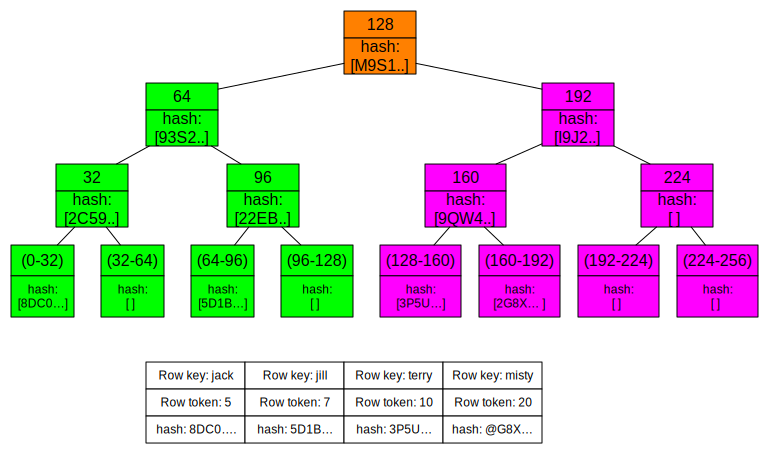

# Manual repair: Anti-entropy repair {#opsRepairNodesManualRepair .concept}

Describe how manual repair works.

[Anti-entropy](/en/glossary/doc/glossary/gloss_anti_entropy.html) node repairs are important for every Cassandra cluster. Frequent data deletions and downed nodes are common causes of data inconsistency. Use anti-entropy repair for routine maintenance and when a cluster needs fixing by running the [nodetool repair](../tools/toolsRepair.md) command.

## How does anti-entropy repair work? {#how-anti-entropy-repair-works .section}

Cassandra accomplishes anti-entropy repair using Merkle trees, similar to Dynamo and Riak. Anti-entropy is a process of comparing the data of all replicas and updating each replica to the newest version. Cassandra has two phases to the process:

1.  Build a Merkle tree for each replica
2.  Compare the Merkle trees to discover differences

Merkle trees are binary hash trees whose leaves are hashes of the individual key values. The leaf of a Cassandra Merkle tree is the hash of a row value. Each Parent node higher in the tree is a hash of its respective children. Because higher nodes in the Merkle tree represent data further down the tree, Casandra can check each branch independently without requiring the coordinator node to download the entire data set. For anti-entropy repair Cassandra uses a compact tree version with a depth of 15 \(2^15 = 32K leaf nodes\). For example, a node containing a million partitions with one damaged partition, about 30 partitions are streamed, which is the number that fall into each of the *leaves* of the tree. Cassandra works with smaller Merkle trees because they require less storage memory and can be transferred more quickly to other nodes during the comparison process.

After the initiating node receives the Merkle trees from the participating peer nodes, the initiating node compares every tree to every other tree. If a difference is detected, the differing nodes exchange data for the conflicting range\(s\), and the new data is written to SSTables. The comparison begins with the top node of the Merkle tree. If no difference is detected, the process proceeds to the left child node and compares and then the right child node. When a node is found to differ, inconsistent data exists for the range that pertains to that node. All data that corresponds to the leaves below that Merkle tree node will be replaced with new data. For any given replica set, Cassandra performs validation compaction on only one replica at a time.

Merkle tree building is quite resource intensive, stressing disk I/O and using memory. Some of the options discussed here help lessen the impact on the cluster performance.

The `nodetool repair` command can be run on either a specified node or on all nodes if a node is not specified. The node that initiates the repair becomes the coordinator node for the operation. To build the Merkle trees, the coordinator node determines peer nodes with matching ranges of data. A major, or validation, compaction is triggered on the peer nodes. The validation compaction reads and generates a hash for every row in the stored column families, adds the result to a Merkle tree, and returns the tree to the initiating node. Merkle trees use hashes of the data, because in general, hashes will be smaller than the data itself. [Repair in Cassandra](https://www.datastax.com/dev/blog/repair-in-cassandra) discusses this process in more detail.

## Full vs Incremental repair {#full-vs-incremental-repair .section}

Th section above describes a full repair of a node's data: Cassandra compares all SSTables for that node and makes necessary repairs. The default setting is incremental repair. An incremental repair persists data that has already been repaired, and only builds Merkle trees for unrepaired SSTables. This more efficient process depends on new metadata that marks the rows in an SSTable as repaired or unrepaired.

Reducing the size of the Merkle tree improves the performance of the incremental repair process, assuming repairs are run frequently. Incremental repairs work like full repairs, with an initiating node requesting Merkle trees from peer nodes with the same unrepaired data, and then comparing the Merkle trees to discover mismatches. Once the data has been reconciled and new SSTables built, the initiating node issues an anti-compaction command. Anti-compaction is the process of segregating repaired and unrepaired ranges into separate SSTables, unless the SSTable fits entirely within the repaired range. In the latter case, the SSTable metadata `repairedAt` is updated to reflect its repaired status.

Anti-compaction is handled differently, depending on the compaction strategy assigned to the data.

-   Size-tiered compaction \(STCS\) splits repaired and unrepaired data into separate pools for separate compactions. A major compaction generates two SSTables, one for each pool of data.
-   Leveled compaction \(LCS\) performs size-tiered compaction on unrepaired data. After repair completes, Casandra moves data from the set of unrepaired SSTables to L0.
-   Date-tiered \(DTCS\) splits repaired and unrepaired data into separate pools for separate compactions. A major compaction generates two SSTables, one for each pool of data. DTCS compaction should not use incremental repair.

Full repair is the default in Cassandra 2.1 and earlier. Incremental repair is the default for Cassandra 2.2 and later. In Cassandra 2.2 and later, when a full repair is run, SSTables are marked as repaired and anti-compacted.

## Parallel vs Sequential repair {#parallel-vs-sequential-repair .section}

Sequential repair takes action on one node after another. Parallel repair repairs all nodes with the same replica data at the same time.

Sequential repair takes a snapshot of each replica. Snapshots are hardlinks to existing SSTables. They are immutable and require almost no disk space. The snapshots are active while the repair proceeds, then Cassandra deletes them. When the coordinator node finds discrepancies in the Merkle trees, the coordinator node makes required repairs from the snapshots. For example, for a table in a keyspace with a Replication factor RF=3 and replicas A, B and C, the repair command takes a snapshot of each replica immediately and then repairs each replica from the snapshots sequentially \(using snapshot A to repair replica B, then snapshot A to repair replica C, then snapshot B to repair replica C\).

Parallel repair works on nodes A, B, and C all at once. During parallel repair, the [dynamic snitch](https://www.datastax.com/blog/2012/08/dynamic-snitching-cassandra-past-present-and-future) processes queries for this table using a replica in the snapshot that is not undergoing repair.

Sequential repair is the default in Cassandra 2.1 and earlier. Parallel repair is the default for Cassandra 2.2 and later.

**Note:** Sequential and incremental do not work together in Cassandra 2.1.

## Partitioner range \( `-pr`\) { .section}

Within a cluster, Cassandra stores a particular range of data on multiple nodes. If you run `nodetool repair` on one node at a time, Cassandra may repair the same range of data several times \(depending on the replication factor used in the keyspace\). If you use the partitioner range option \( `-pr`\), `nodetool repair` only repairs a specified range of data once, rather than repeating the repair operation. This decreases the strain on network resources, although `nodetool repair` still builds Merkle trees for each replica.

**Note:** If you use this option, you must run `nodetool repair -pr`on every node in the cluster to repair all data. Otherwise, some ranges of data will not be repaired.

The partitioner range option is recommended for routine maintenance. Do not use it to repair a downed node. Do not use with incremental repair \(default for Cassandra 3.0 and later\).

## Local \(`-local, --in-local-dc`\) vs datacenter \(`dc, --in-dc`\) vs Cluster-wide repair { .section}

Consider carefully before using `nodetool repair` across datacenters, instead of within a local datacenter. When you run repair locally on a node using `-local` or `--in-local-dc`, the command runs only on nodes within the same datacenter as the node that runs it. Otherwise, the command runs cluster-wide repair processes on all nodes that contain replicas, even those in different datacenters. For example, if you start `nodetool repair` over two datacenters, DC1 and DC2, each with a replication factor of 3, `repair`must build Merkle tables for 6 nodes. The number of Merkle Tree increases linearly for additional datacenters. Cluster-wide repair also increases network traffic between datacenters tremendously, and can cause cluster issues.

If the local option is too limited, consider using the `-dc` or `--in-dc` options, limiting repairs to a specific datacenter. This does not repair replicas on nodes in other datacenters, but it can decrease network traffic while repairing more nodes than the local options.

The `nodetool repair -pr` option is good for repairs across multiple datacenters.

Additional notes for `-local` repairs:

-   The `nodetool repair` tool does not support the use of `-local` with the `-pr` option unless the datacenter's nodes have all the data for all ranges.
-   Also, the tool does not support the use of `-local` with `-inc` \(incremental repair\).

**Note:** For Cassandra 2.2 and later, a recommended option for repairs across datacenters: use the `-dcpar` or `--dc-parallel` to repair datacenters in parallel.

## Endpoint range vs Subrange repair \(`-st, --start-token, -et --end-token`\) { .section}

A repair operation runs on all partition ranges on a node, or endpoint range, unless you use the `-st` and `-et` \(or `-start-token` and `-end-token` \) options to run subrange repairs. When you specify a start token and end token, `nodetool repair` works between these tokens, repairing only those partition ranges.

Subrange repair is not a good strategy because it requires generated token ranges. However, if you know which partition has an error, you can target that partition range precisely for repair. This approach can relieve the problem known as overstreaming, which ties up resources by sending repairs to a range over and over.

Subrange repair involves more than just the `nodetool repair` command. A Java describe\_splits call to ask for a split containing 32k partitions can be iterated throughout the entire range incrementally or in parallel to eliminate the overstreaming behavior. Once the tokens are generated for the split, they are passed to `nodetool repair -st <start_token> -et <end_token>`. The `-local` option can be used to repair only within a local data center to reduce cross data center transfer.

-   **[When to run anti-entropy repair](../../cassandra/operations/opsRepairNodesWhen.md)**  
 When should anti-entropy repair be run on nodes.

**Parent topic:** [Repairing nodes](../../cassandra/operations/opsRepairNodesTOC.md)

