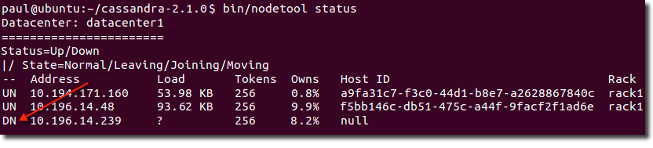

# Replacing a dead node or dead seed node {#opsReplaceNode .task}

Steps to replace a node that has died for some reason, such as hardware failure.

Steps to replace a node that has died for some reason, such as hardware failure.

The procedure for replacing a dead node is the same for vnodes and single-token nodes. Extra steps are required for replacing dead [seed nodes](/en/glossary/doc/glossary/gloss_seed.html).

1.  Run [nodetool status](../tools/toolsStatus.md) to verify that the node is dead \(`DN`\).

    

2.  Record the datacenter, address, and rack settings of the dead node; you will use these later.

3.  Add the [replacement node](../install/install_cassandraTOC.md) to the network and record its IP address.

4.  If the dead node was a seed node, change the cluster's seed node configuration on each node:

    1.  In the cassandra.yaml file for each node, remove the IP address of the dead node from the `- seeds` list in the [seed-provider](../configuration/configCassandra_yaml.md#seed_provider) property.

    2.  If the cluster needs a new seed node to replace the dead node, add the new node's IP address to the `- seeds` list.

        **Attention:** In multiple data-center clusters, include at least one node from each datacenter \(replication group\) in the seed list. Designating more than a single seed node per datacenter is recommended for fault tolerance. Otherwise, gossip has to communicate with another datacenter when bootstrapping a node.

        Making every node a seed node is **not** recommended because of increased maintenance and reduced gossip performance. Gossip optimization is not critical, but it is recommended to use a small seed list \(approximately three nodes per datacenter\).

    3.  [Restart the node.](../initialize/referenceStartStopTOC.md)

5.  On an existing node, gather setting information for the new node from the cassandra.yaml file:

    -   `cluster_name`
    -   `endpoint_snitch`
    -   Other non-default settings: Use the diff tool to compare current settings with default settings.
6.  Gather rack and datacenter information:

    -   If the cluster uses the [PropertyFileSnitch](../architecture/archSnitchPFSnitch.md), record the rack and data assignments listed in the cassandra-topology.properties file, or copy the file to the new node.
    -   If the cluster uses the [GossipPropertyFileSnitch](../architecture/archsnitchGossipPF.md), [Ec2Snitch](../architecture/archSnitchEC2.md), [Ec2MultiRegionSnitch](../architecture/archSnitchEC2MultiRegion.md), or [GoogleCloudSnitch](../architecture/archSnitchGoogle.md), record the rack and datacenter assignments in the dead node's cassandra-rackdc.properties file.
7.  Make sure that the new node meets all prerequisites and then [Install Cassandra](../install/install_cassandraTOC.md) on the new node, but do not start Cassandra.

    **Note:** Be sure to install the same version of Cassandra as is installed on the other nodes in the cluster.

8.  If Cassandra automatically started on the node, [stop](../initialize/referenceStartCservice.md) and [clear](../initialize/referenceClearCpkgData.md) the data that was added automatically on startup.

9.  Add values to the following properties in cassandara.yaml file from the information you gathered earlier:

    -   [auto\_bootstrap](../configuration/configCassandra_yaml.md#auto_bootstrap): If this setting exists and is set to `false`, set it to `true`. \(This setting is not included in the default cassandra.yaml configuration file.\)
    -   [cluster\_name](../configuration/configCassandra_yaml.md#cluster_name)
    -   [seed list](../configuration/configCassandra_yaml.md#seed_provider)
10. Add the rack and datacenter configuration:

    -   If the cluster uses the [GossipPropertyFileSnitch](../architecture/archsnitchGossipPF.md), [Ec2Snitch](../architecture/archSnitchEC2.md), [Ec2MultiRegionSnitch](../architecture/archSnitchEC2MultiRegion.md), or [GoogleCloudSnitch](../architecture/archSnitchGoogle.md):
        1.  Add the dead node's rack and datacenter assignments to the cassandra-rackdc.properties file on the replacement node.

            **Note:** Do not remove the entry for the dead node's IP address yet.

        2.  Delete the cassandra-topology.properties file.
    -   If the cluster uses the [PropertyFileSnitch](../architecture/archSnitchPFSnitch.md):
        1.  Copy the cassandra-topology.properties file from an existing node, or add the settings to the local copy.
        2.  Edit the file to add an entry with the new node's IP address and the dead node's rack and datacenter assignments.
11. Start the new node with the [replace\_address](../tools/toolsCUtility.md#cRplAdsress) option, passing in the IP address of the dead node.

    Package installations:

    1.  Add the following option to cassandra-env.sh file:

        ```
        JVM_OPTS="$JVM_OPTS -Dcassandra.replace_address=address\_of\_dead\_node
        ```

    2.  [Start the node](../initialize/referenceStartCservice.md).
    3.  After the node bootstraps, remove the `replace-address` parameter from cassandra-env.sh.
    4.  [Restart the node](../initialize/referenceStartCservice.md).
    Tarball installations:

    -   Start Cassandra with this option:

        ```screen
        $ sudo bin/cassandra -Dcassandra.replace_address=address\_of\_dead\_node
        ```

12. Run nodetool status to verify that the new node has bootstrapped successfully.

13. Wait at least 72 hours and then remove the old node's IP address from the cassandra-topology.properties or cassandra-rackdc.properties file.

    This ensures that old node's information is removed from gossip. If removed from the property file too soon, problems may result. Use [nodetool gossipinfo](../tools/toolsGossipInfo.md) to check the gossip status. The node is still in gossip until LEFT status disappears.

    The location of the cassandra-topology.properties file depends on the type of installation:

        |Package installations|/etc/cassandra/cassandra-topology.properties|
    |Tarball installations|install\_location/conf/cassandra-topology.properties|

    The location of the [cassandra.yaml](/en/archived/cassandra/3.x/cassandra/configuration/configCassandra_yaml.html) file depends on the type of installation:

        |Package installations|/etc/cassandra/cassandra.yaml|
    |Tarball installations|install\_location/resources/cassandra/conf/cassandra.yaml|


**Parent topic:** [Adding or removing nodes, datacenters, or clusters](../../cassandra/operations/opsAddingRemovingNodeTOC.md)

