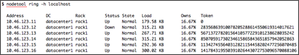

# Replacing a dead node in a single-architecture cluster {#opsReplaceSingleTokenNode .task}

Steps for replacing nodes in single-token architecture clusters, not vnodes.

Steps for replacing nodes in single-token architecture clusters, not vnodes.

1.  Confirm that the node is dead using [nodetool ring](../tools/toolsRing.md) on any live node in the cluster.

    A *Down* status indicates the dead node:

    

2.  [Install Cassandra](../install/install_cassandraTOC.md) on the replacement node.

3.  Remove any pre-existing Cassandra data on the replacement node:

    ```screen
    $ sudo rm -rf /var/lib/cassandra/* 
    ```

4.  Set `auto_bootstrap: true`.

    If `auto_bootstrap` is not in the cassandra.yaml file, it automatically defaults to `true`.

5.  Set the `initial_token` in the cassandra.yaml file to the value of the dead node's token -1.

    ```
    initial_token: 28356863910078205288614550619314017620
    ```

6.  Configure any non-default settings in the node's cassandra.yaml to match your existing cluster.

7.  [Start the new node](../initialize/referenceStartStopTOC.md).

8.  After the new node has finished bootstrapping, check that it is up using `nodetool ring`.

9.  Run [nodetool repair](../tools/toolsRepair.md) on each keyspace to ensure the node is fully consistent:

    ```language-bash
    nodetool repair -h 10.46.123.12 keyspace_name
    ```

10. Remove the dead node.

    The location of the [cassandra.yaml](/en/archived/cassandra/3.x/cassandra/configuration/configCassandra_yaml.html) file depends on the type of installation:

        |Package installations|/etc/cassandra/cassandra.yaml|
    |Tarball installations|install\_location/resources/cassandra/conf/cassandra.yaml|


**Parent topic:** [Adding or removing nodes, datacenters, or clusters](../../cassandra/operations/opsAddingRemovingNodeTOC.md)

