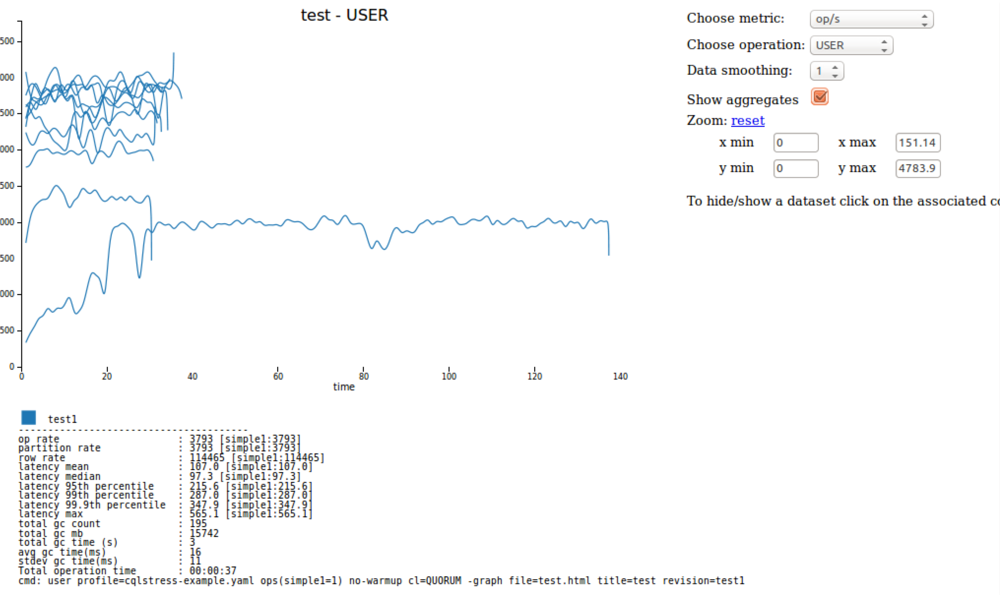

# The cassandra-stress tool {#toolsCStress .task}

A Java-based stress testing utility for basic benchmarking and load testing a Cassandra cluster.

The `cassandra-stress` tool is a Java-based stress testing utility for basic benchmarking and load testing a Cassandra cluster.

Data modeling choices can greatly affect application performance. Significant load testing over several trials is the best method for discovering issues with a particular data model. The `cassandra-stress` tool is an effective tool for populating a cluster and stress testing CQL tables and queries. Use `cassandra-stress` to:

-   Quickly determine how a schema performs.
-   Understand how your database scales.
-   Optimize your data model and settings.
-   Determine production capacity.

The `cassandra-stress` tool also supports a YAML-based profile for defining specific schemas with various compaction strategies, cache settings, and types. Sample files are located in :

-   Package installations: /usr/share/docs/cassandra/examples
-   Tarball installations: install\_location/tools/

The YAML file supports user-defined keyspace, tables, and schema. The YAML file can be used to design tests of reads, writes, and mixed workloads.

When started without a YAML file, `cassandra-stress` creates a keyspace, `keyspace1`, and tables, `standard1` or `counter1`, depending on what type of table is being tested. These elements are automatically created the first time you run a stress test and reused on subsequent runs. You can drop `keyspace1` using [DROP KEYSPACE](/en/cql-oss/3.3/cql/cql_reference/cqlDropKeyspace.html). You cannot change the default keyspace and tables names without [using a YAML file](toolsCStress.md#cassandra-stress-from-yaml).

**Usage:**

-   Package installations: 

    ```screen
    $ cassandra-stress command [options]
    ```

-   Tarball installations:

    ```screen
    $ cd install\_location/tools
    $ bin/cassandra-stress command [options]
    ```


cassandra-stress options

|Command|Description|
|-------|-----------|
|counter\_read|Multiple concurrent reads of counters. The cluster must first be populated by a counter\_write test.|
|counter\_write|Multiple concurrent updates of counters.|
|help|Display help: `cassandra-stress help`Display help for an option: `cassandra-stress help [options]` For example: `cassandra-stress help -schema`

 |
|legacy |Legacy support mode.|
|mixed|Interleave basic commands with configurable ratio and distribution. The cluster must first be populated by a write test.|
|print|Inspect the output of a distribution definition.|
|read|Multiple concurrent reads. The cluster must first be populated by a write test.|
|user|Interleave user provided queries with configurable ratio and distribution.|
|write|Multiple concurrent writes against the cluster.|

**Important:** Additional sub-options are available for each option in the following table. To get more detailed information on any of these, enter:

```no-highlight
$ cassandra-stress help option
```

When entering the `help` command, be sure to precede the option name with a hyphen, as shown.

Cassandra-stress sub-options

|Sub-option|Description|
|----------|-----------|
|**-col**|Column details, such as size and count distribution, data generator, names, and comparator. **Usage**:

```no-highlight
-col names=? [slice] [super=?] [comparator=?] [timestamp=?] [size=DIST(?)]
 or 
-col [n=DIST(?)] [slice] [super=?] [comparator=?] [timestamp=?] [size=DIST(?)]
```

|
|**-errors**|How to handle errors when encountered during stress testing.**Usage**:

```no-highlight
-errors [retries=?] [ignore]
```

|
|**-graph**|Graph results of cassandra-stress tests. Multiple tests can be graphed together.**Usage**:

```no-highlight
-graph file=? [revision=?] [title=?] [op=?]
```

|
|**-insert**|Insert specific options relating to various methods for batching and splitting partition updates.**Usage**:

```no-highlight
-insert [revisit=DIST(?)] [visits=DIST(?)] partitions=DIST(?) [batchtype=?] select-ratio=DIST(?) row-population-ratio=DIST(?)
```

|
|**-log**|Where to log progress and the interval to use.**Usage**:

```no-highlight
-log [level=?] [no-summary] [file=?] [interval=?]
```

|
|**-mode**|Thrift or CQL with options.**Usage**:

```no-highlight
-mode thrift [smart] [user=?] [password=?]
  or 
-mode native [unprepared] cql3 [compression=?] [port=?] [user=?] [password=?] [auth-provider=?] [maxPending=?] [connectionsPerHost=?]
  or
-mode simplenative [prepared] cql3 [port=?]
```

|
|**-node**|Nodes to connect to.**Usage**:

```no-highlight
-node [whitelist] [file=?]
```

|
|**-pop**|Population distribution and intra-partition visit order.**Usage**:

```no-highlight
-pop seq=? [no-wrap] [read-lookback=DIST(?)] [contents=?]
  or
-pop [dist=DIST(?)] [contents=?]
```

|
|**-port**|Specify port for connecting Cassandra nodes. Port can be specified for Cassandra native protocol, Thrift protocol or a JMX port for retrieving statistics.**Usage**:

```no-highlight
-port [native=?] [thrift=?] [jmx=?]
```

|
|**-rate**|Thread count, rate limit, or automatic mode \(default is auto\). **Usage**:

```no-highlight
-rate threads=? [limit=?]
  or 
-rate [threads>=?] [threads<=?] [auto]
```

 |
|**-sample**|Specify the number of samples to collect for measuring latency.**Usage**:

```no-highlight
-sample [history=?] [live=?] [report=?]
```

|
|**-schema**|Replication settings, compression, compaction, and so on. **Usage**:

```no-highlight
-schema [replication(?)] [keyspace=?] [compaction(?)] [compression=?]
```

|
|-sendto|Specify a stress server to send this command to.**Usage**:

```no-highlight
-sendToDaemon <host>
```

|
|**-transport**|Custom transport factories. **Usage**:

```no-highlight
-transport [factory=?] [truststore=?] [truststore-password=?] [ssl-protocol=?] [ssl-alg=?] [store-type=?] [ssl-ciphers=?]
```

|

Additional command-line parameters can modify how cassandra-stress runs:

Additional cassandra-stress parameters

|Command|Description|
|-------|-----------|
|cl=?|Set the consistency level to use during `cassandra-stress`. Options are ONE, QUORUM, LOCAL\_QUORUM, EACH\_QUORUM, ALL, and ANY. Default is LOCAL\_ONE.|
|clustering=DIST\(?\)|Distribution clustering runs of operations of the same kind.|
|duration=?|Specify the time to run, in seconds, minutes or hours.|
|err<?|Specify a standard error of the mean; when this value is reached, `cassandra-stress` will end. Default is 0.02.|
|n\>?|Specify a minimum number of iterations to run before accepting uncertainly convergence.|
|n<?|Specify a maximum number of iterations to run before accepting uncertainly convergence.|
|n=?|Specify the number of operations to run.|
|no-warmup|Do not warmup the process, do a cold start.|
|ops\(?\)|Specify what operations to run and the number of each. \(only with the user option\)|
|profile=?|Designate the YAML file to use with `cassandra-stress`. \(only with the user option\)|
|truncate=?|Truncate the table created during `cassandra-stress`. Options are never, once, or always. Default is never.|

## Simple read and write examples {#simple-read-and-write .example}

```no-highlight
# Insert (write) one million rows
$ cassandra-stress write n=1000000 -rate threads=50

# Read two hundred thousand rows.
$ cassandra-stress read n=200000 -rate threads=50

# Read rows for a duration of 3 minutes.
$ cassandra-stress read duration=3m -rate threads=50

# Read 200,000 rows without a warmup of 50,000 rows first.
$ cassandra-stress read n=200000 no-warmup -rate threads=50
```

## View schema help {#view-schema-help .example}

```no-highlight
$ cassandra-stress help -schema
```

```no-highlight
replication([strategy=?][factor=?][<option 1..N>=?]):                 Define the replication strategy and any parameters
    strategy=? (default=org.apache.cassandra.locator.SimpleStrategy)  The replication strategy to use
    factor=? (default=1)                                              The number of replicas
keyspace=? (default=keyspace1)                                        The keyspace name to use
compaction([strategy=?][<option 1..N>=?]):                            Define the compaction strategy and any parameters
    strategy=?                                                        The compaction strategy to use
compression=?                                                         Specify the compression to use for SSTable, default:no compression
```

## Populate the database {#populate-database .example}

Generally it is easier to let `cassandra-stress` create the basic schema and then modify it in [CQL](/en/cql-oss/3.3/cql/cqlIntro.html):

```no-highlight
#Load one row with default schema
$ cassandra-stress write n=1 cl=one -mode native cql3 -log file=create_schema.log
 
#Modify schema in CQL
$ cqlsh
 
#Run a real write workload
$ cassandra-stress write n=1000000 cl=one -mode native cql3 -schema keyspace="keyspace1" -log file=load_1M_rows.log
```

## Change the replication strategy {#change-the-replication-strategy .example}

Changes the replication strategy to `NetworkTopologyStrategy` and targets one node named `existing`.

```no-highlight
$ cassandra-stress write n=500000 no-warmup -node existing -schema "replication(strategy=NetworkTopologyStrategy, existing=2)"
```

## Run a mixed workload {#run-mixed-workload .example}

When running a mixed workload, you must escape parentheses, greater-than and less-than signs, and other such things. This example invokes a workload that is one-quarter writes and three-quarters reads.

```no-highlight
$ cassandra-stress mixed ratio\(write=1,read=3\) n=100000 cl=ONE -pop dist=UNIFORM\(1..1000000\) -schema keyspace="keyspace1" -mode native cql3 -rate threads\>=16 threads\<=256 -log file=~/mixed_autorate_50r50w_1M.log
```

Notice the following in this example:

1.  The `ratio` parameter requires backslash-escaped parenthesis.
2.  The value of `n` used in the read phase is different from the value used in write phase. During the write phase, `n` records are written. However in the read phase, if `n` is too large, it is inconvenient to read *all* the records for simple testing. Generally, `n` does not need be large when validating the persistent storage systems of a cluster.

    The `-pop dist=UNIFORM\(1..1000000\)` portion says that of the n=100,000 operations, select the keys uniformly distributed between 1 and 1,000,000. Use this when you want to specify more data per node than what fits in DRAM.

3.  In the `rate` section, the greater-than and less-than signs are escaped. If not escaped, the shell attempts to use them for IO redirection: the shell tries to read from a non-existent file called =256 and create a file called =16. The `rate` section tells cassandra-stress to automatically attempt different numbers of client threads and not test less that 16 or more than 256 client threads.

## Standard mixed read/write workload keyspace for a single node {#standare-workload-keyspace .example}

```no-highlight
CREATE KEYSPACE "keyspace1" WITH replication = {
  'class': 'SimpleStrategy',
  'replication_factor': '1'
};
USE "keyspace1";
CREATE TABLE "standard1" (
  key blob,
  "C0" blob,
  "C1" blob,
  "C2" blob,
  "C3" blob,
  "C4" blob,
  PRIMARY KEY (key)
) WITH
  bloom_filter_fp_chance=0.010000 AND
  caching='KEYS_ONLY' AND
  comment='' AND
  dclocal_read_repair_chance=0.000000 AND
  gc_grace_seconds=864000 AND
  index_interval=128 AND
  read_repair_chance=0.100000 AND
  replicate_on_write='true' AND
  default_time_to_live=0 AND
  speculative_retry='99.0PERCENTILE' AND
  memtable_flush_period_in_ms=0 AND
  compaction={'class': 'SizeTieredCompactionStrategy'} AND
  compression={'class': 'LZ4Compressor'};
```

## Split up a load over multiple cassandra-stress instances on different nodes {#split-up-a-load-over-multiple-cassandra-stress-instances .example}

This example demonstrates loading into large clusters, where a single `cassandra-stress` load generator node cannot saturate the cluster. In this example, `$NODES` is a variable whose value is a comma delimited list of IP addresses such as 10.0.0.1, 10.0.0.2, and so on.

```no-highlight
#On Node1
$ cassandra-stress write n=1000000 cl=one -mode native cql3 -schema keyspace="keyspace1" -pop seq=1..1000000 -log file=~/node1\_load.log -node $NODES
 
#On Node2
$ cassandra-stress write n=1000000 cl=one -mode native cql3 -schema keyspace="keyspace1" -pop seq=1000001..2000000 -log file=~/node2\_load.log -node $NODES
 

```

## Run cassandra-stress with authentication {#run-cassandra-stress-with-authentication .example}

The following example shows using the -mode option to supply a username and password:

```screen
$ cassandra-stress -mode native cql3 user=cassandra password=cassandra no-warmup cl=QUORUM
```

**Note:** Check the documentation of the [transport](toolsCStress.md#toolsCStresstransport) option for SSL authentication.

## Run cassandra-stress with authentication and SSL encryption { .example}

The following example shows using the -mode option to supply a username and password, and the -transportation option for SSL parameters:

```screen
$ cassandra-stress write n=100k cl=ONE no-warmup -mode native cql3 user=cassandra password=cassandra 
-transport truststore=/usr/local/lib/dsc-cassandra/conf/server-truststore.jks truststore-password=truststorePass 
factory=org.apache.cassandra.thrift.SSLTransportFactory 
keystore=/usr/local/lib/dsc-cassandra/conf/server-keystore.jks keystore-password=myKeyPass
```

**Note:** [Cassandra authentication and SSL encryption must already be configured](../configuration/secureTOC.md) before executing `cassandra-stress` with these options. The example shown above uses [self-signed CA certificates](../configuration/secureSSLCertWithCA.md).

## Run cassandra-stress using the truncate option {#run-cassandra-stress-using-the-truncate-option .example}

This option must be inserted before the mode option, otherwise the cassandra-stress tool won't apply truncation as specified.

The following example shows the `truncate` command:

```no-highlight
$cassandra-stress write n=100000000 cl=QUORUM truncate=always -schema keyspace=keyspace-rate threads=200 -log file=write_$NOW.log
```

## Use a YAML file to run cassandra-stress {#cassandra-stress-from-yaml .example}

This example uses a YAML file named `cqlstress-example.yaml`, which contains the keyspace and table definitions, and a query definition. The keyspace name and definition are the first entries in the YAML file:

```no-highlight
keyspace: perftesting

keyspace_definition: 

  CREATE KEYSPACE perftesting WITH replication = { 'class': 'SimpleStrategy', 'replication_factor': 3};

```

The table name and definition are created in the next section using CQL:

```no-highlight

table: users

table_definition:

  CREATE TABLE users (
    username text,
    first_name text,
    last_name text,
    password text,
    email text,
    last_access timeuuid,
    PRIMARY KEY(username)
  );
```

In the `extra_definitions` section you can add secondary indexes or materialized views to the table:

```no-highlight


extra_definitions:
  - CREATE MATERIALIZED VIEW perftesting.users_by_first_name AS SELECT * FROM perftesting.users WHERE first_name IS NOT NULL and username IS NOT NULL PRIMARY KEY (first_name, username);
  - CREATE MATERIALIZED VIEW perftesting.users_by_first_name2 AS SELECT * FROM perftesting.users WHERE first_name IS NOT NULL and username IS NOT NULL PRIMARY KEY (first_name, username);
  - CREATE MATERIALIZED VIEW perftesting.users_by_first_name3 AS SELECT * FROM perftesting.users WHERE first_name IS NOT NULL and username IS NOT NULL PRIMARY KEY (first_name, username);

```

The population distribution can be defined for any column in the table. This section specifies a uniform distribution between 10 and 30 characters for username values in gnerated rows, that the values in the generated rows willcreates , a uniform distribution between 20 and 40 characters for generated startdate over the entire Cassandra cluster, and a Gaussian distribution between 100 and 500 characters for description values.

```no-highlight
columnspec:
  - name: username
    size: uniform(10..30)
  - name: first_name
    size: fixed(16)
  - name: last_name
    size: uniform(1..32)
  - name: password
    size: fixed(80) # sha-512
  - name: email
    size: uniform(16..50)
  - name: startdate
    cluster: uniform(20...40)
  - name: description
    size: gaussian(100...500)

```

After the column specifications, you can add specifications for how each batch runs. In the following code, the `partitions` value directs the test to use the column definitions above to insert a fixed number of rows in the partition in each batch:

```no-highlight
insert:
  partitions: fixed(10)
  batchtype: UNLOGGED
```

The last section contains a query, read1, that can be run against the defined table.

```no-highlight
queries:
  read1:
    cql: select * from users where username = ? and startdate = ?
    fields: samerow     # samerow or multirow (select arguments from the same row, or randomly from all rows in the partition)
```

The following example shows using the user option and its parameters to run cassandra-stress tests from `cqlstress-example.yaml`:

```screen
$ cassandra-stress user profile=tools/cqlstress-example.yaml n=1000000 ops\(insert=3,read1=1\) no-warmup cl=QUORUM
```

Notice that:

-   The user option is required for the `profile` and `opt` parameters.
-   The value for the profile parameter is the path and filename of the .yaml file.
-   In this example, `-n` specifies the number of *batches* that run.
-   The values supplied for `ops` specifies which operations run and how many of each. These values direct the command to insert rows into the database and run the read1 query.

    How many times? Each insert or query counts as one batch, and the values in `ops` determine how many of each type are run. Since the total number of batches is 1,000,000, and `ops` says to run three inserts for each query, the result will be 750,000 inserts and 250,000 of the `read1` query.

    Use escaping backslashes when specifying the `ops` value.


For more information, see [Improved Cassandra 2.1 Stress Tool: Benchmark Any Schema – Part 1](https://www.datastax.com/dev/blog/improved-cassandra-2-1-stress-tool-benchmark-any-schema).

## Use the -graph option {#cstress-graph .example}

In Cassandra 3.2 and later, the `-graph` option provides visual feedback for `cassandra-stress` tests. A file must be named to build the resulting HTML file. A `title` and `revision` are optional, but `revision` must be used if multiple stress tests are graphed on the same output.

```screen
$ cassandra-stress user profile=tools/cqlstress-example.yaml ops\(insert=1\) -graph file=test.html title=test revision=test1 
```

An interactive graph can be displayed with a web browser:

  

-   **[Interpreting the output of cassandra-stress](../../cassandra/tools/toolsCStressOutput.md)**  
About the output from the running tests.

**Parent topic:** [Cassandra tools](../../cassandra/tools/toolsTOC.md)

