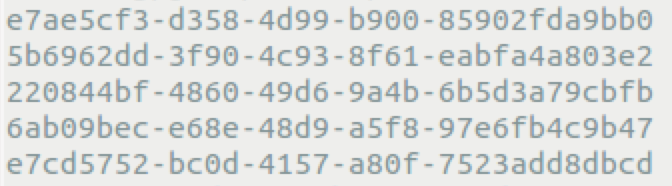

# sstablekeys {#toolsSStabkeys .task}

The sstablekeys utility dumps table keys.

The `sstablekeys` utility dumps table keys.

Usage:

-   Package installations: `$ sstablekeys sstable\_name`
-   Tarball installations:

    ```screen
    $ cd install\_location/tools
    $ bin/sstablekeys sstable\_name
    ```


1.  If data has not been previously flushed to disk, manually flush it. For example:

    ```language-bash
    nodetool flush cycling cyclist_name
    ```

2.  To list the keys in an SSTable, find the name of the SSTable file.

    The file is located in the data directory and has a .db extension.

    -   Package installations: /var/lib/cassandra/data
    -   Tarball installations: install\_location/data/data
3.  Look at keys in the SSTable data. For example, use `sstablekeys` followed by the path to the data. Use the path to data for your Cassandra installation:

    ```screen
    ## Package installations
    $ sstablekeys /var/lib/cassandra/data/cycling/cyclist_name-a882dca02aaf11e58c7b8b496c707234/la-1-big-Data.db
    
    ## Tarball installations
    $ sstablekeys install\_location/data/data/cycling/cyclist_name-a882dca02aaf11e58c7b8b496c707234/la-1-big-Data.db
    ```

    The output appears, for example:

    


**Parent topic:** [SSTable utilities](../../cassandra/tools/toolsSSTableUtilitiesTOC.md)

