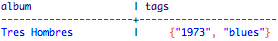
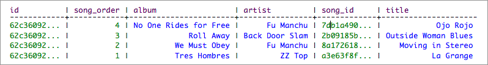
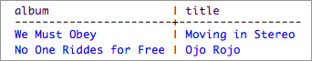
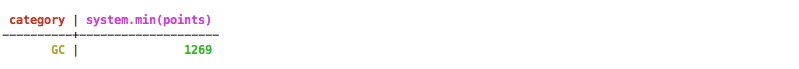
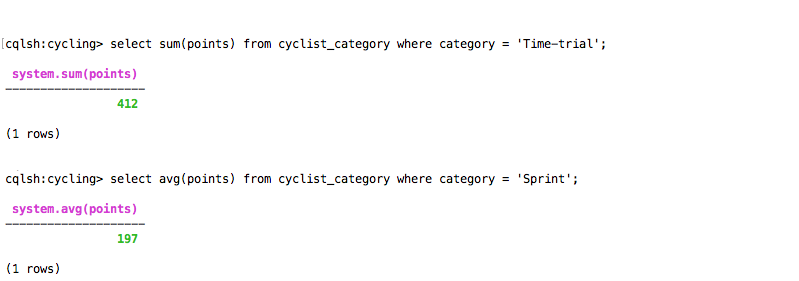

# SELECT {#cqlSelect .reference}

Retrieve data from a Cassandra table.

Returns one or more rows from a single Cassandra table. Although a select statement without a where clause returns all rows from all partitions, it is not recommended.

**Note:** To retrieve data using a SSTable Attached Secondary Index, see [Using SASI](../cql_using/useSASIIndex.md).

## Synopsis {#refsyn_jss_r3w_dw .section}

```
SELECT * | select\_expression | DISTINCT partition 
FROM [keyspace\_name.] table\_name 
[WHERE partition\_value
   [AND clustering\_filters 
   [AND static\_filters]]] 
[ORDER BY PK\_column\_name ASC|DESC] 
[LIMIT N]
[ALLOW FILTERING]
```

|Syntax conventions|Description|
|------------------|-----------|
|UPPERCASE|Literal keyword.|
|Lowercase|Not literal.|
|`Italics`|Variable value. Replace with a user-defined value.|
|`[]`|Optional. Square brackets \(`[]`\) surround optional command arguments. Do not type the square brackets.|
|`( )`|Group. Parentheses \( `( )` \) identify a group to choose from. Do not type the parentheses.|
|`|`|Or. A vertical bar \(`|`\) separates alternative elements. Type any one of the elements. Do not type the vertical bar.|
|`...`|Repeatable. An ellipsis \( `...` \) indicates that you can repeat the syntax element as often as required.|
|`'Literal string'`|Single quotation \(`'`\) marks must surround literal strings in CQL statements. Use single quotation marks to preserve upper case.|
|`{ key : value }`|Map collection. Braces \(`{ }`\) enclose map collections or key value pairs. A colon separates the key and the value.|
|`<datatype1,datatype2>`|Set, list, map, or tuple. Angle brackets \( `< >` \) enclose data types in a set, list, map, or tuple. Separate the data types with a comma.|
|`cql\_statement;`|End CQL statement. A semicolon \(`;`\) terminates all CQL statements.|
|`[--]`|Separate the command line options from the command arguments with two hyphens \( `--` \). This syntax is useful when arguments might be mistaken for command line options.|
|`' <schema\> ... </schema\> '`|Search CQL only: Single quotation marks \(`'`\) surround an entire XML schema declaration.|
|`@xml\_entity='xml\_entity\_type'`|Search CQL only: Identify the entity and literal value to overwrite the XML element in the schema and solrConfig files.|

 \*
 :   Retrieves all the columns of data from each matched row.

  DISTINCT partition
 :   Returns unique values for the [partition key](/en/glossary/doc/glossary/gloss_partition_key.html). Use a comma separate list

  select\_expression
 :   Sets the column to retrieve from each row in a comma separated list. At least one expression is required.

    |Option|Description|
    |------|-----------|
    |\*|Returns all column values.|
    |DISTINCT partition| |
    |aggregate\(arguments\)|Returns the selected column values and executes the aggregate to return a single result row. Use Cassandra [aggregates](cqlSelect.md#retrieving-aggregate-values), such as count\(column\_name\) or [user-defined aggregates](cqlCreateAggregate.md).|
    |function\(arguments\)|Executes a native Cassandra function or a [user-defined function](cqlCreateFunction.md) on each target value in the returned set. Cassandra native functions include [, timeuuid function](timeuuid_functions_r.md), a [token function](../cql_using/useToken.md), or a [blob conversion function](blob_r.md).|

  AS alias\_name
 :   Replaces the column name in the result set to the alias name.

    ```
    column\_name AS alias
    ```

  partition\_value
 :   Condition that restricts query to one or more partitions. Restriction for all parts of the partition key is required for compound keys. The supported conditional operators are equals \(`=`\) and `IN(value1,value2[,…])`

    Simple partition key, select a single partition:

    ```
    partition\_column = value
    ```

    Simple partition key, select multiple partitions:

    ```
    partition\_column IN(value1,value2[,...])
    ```

    For compound partition keys, create a condition for each key separated by AND:

    ```
    partition\_column1 = value1 
    AND partition\_column2 = value2 [AND ...])
    ```

  clustering\_filters
 :     relation
 :   A logical expression. Cassandra returns only those rows that return true for each relation. A relation can consist of:

    ```
    column\_name operator term
    | ( column\_name [, column\_name . . . ) operator term-tuple 
    | column\_name IN ( term , term [,  term ] . . .] 
    | ( column\_name, column\_name [, column\_name] . . . ) IN term-tuple [, term-tuple] . . . )
    | TOKEN ( column\_name ) operator TOKEN ( column\_name )
    ```

  operator
 :   The logical symbol that specifies the relationship between the two sides of the relation. Casandra supports the following operators:

    `=` \| `<` \| `>` \| `<=` \| `>=` \| `CONTAINS` \| `CONTAINS KEY`

  term
 :   -   a constant: string, number, uuid, boolean, hex
-   a function
-   a collection:

    |set|     ```
**\{ literal** [, ...] **\}**
    ```

 \(enclosed in curly brackets\)

 |
    |---|----------------------------------------------------------------------------------|
    |list|     ```
**\[literal** [, ...] **\]**
    ```

 \(enclosed in square brackets\)

 |
    |map|     ```
**\{** key **:** value [, ...] **\}**
    ```

 \(enclosed in curly brackets\)

 |

    -   a set:
    -   a list:\(note the use of square brackets\)
    -   a map collection, a JSON-style array of literals:

        ```
        { ***literal*** : ***literal*** [, ...] }
        ```


  term-tuple
 :   ```
( term*, term, ...* )
```

  TOKEN
 :   A Cassandra [token](/en/glossary/doc/glossary/gloss_token.html)

 ## Examples {#examples .section}

Specifying columns

The columns referenced in the SELECT clause must exist in the target table.

Columns in big data applications duplicate values. Use the DISTINCT keyword to return only distinct \(different\) values of partition keys.

The SELECT statement supports functions that perform calculations on the columns being returned. For details, see [Retrieving aggregate values](cqlSelect.md#retrieving-aggregate-values)

Using a column alias

When your selection list includes functions or other complex expressions, use aliases to make the output more readable. This example applies aliases to the `dateOf(created_at)` and `blobAsText(content)` functions:

```screen
SELECT event_id, 
  dateOf(created_at) AS creation_date,
  blobAsText(content) AS content 
  FROM timeline;
```

The output labels these columns with more understandable names:

```
event_id                | creation_date            | content
-------------------------+--------------------------+----------------
 550e8400-e29b-41d4-a716 | 2013-07-26 10:44:33+0200 | Some stuff
```

Specifying the source table using FROM

The `FROM` clause specifies the table to query. You may want to precede the table name with the name of the keyspace followed by a period \(.\). If you do not specify a keyspace, Cassandra queries the current keyspace.

The following example SELECT statement returns the number of rows in the `IndexInfo` table in the `system` keyspace:

```screen
SELECT COUNT(*) 
FROM system.IndexInfo;
```

Controlling the number of rows returned using LIMIT

The `LIMIT` option sets the maximum number of rows that the query returns:

```screen
SELECT lastname 
FROM cycling.cyclist_name 
LIMIT 50000;
```

Even if the query matches 105,291 rows, Cassandra only returns the first 50,000.

The `cqlsh` shell has a default row limit of 10,000. The Cassandra server and native protocol do not limit the number of returned rows, but they apply a timeout to prevent malformed queries from causing system instability.

Controlling the number of rows returned using PER PARTITION LIMIT

In Cassandra 3.6 and later, the `PER PARTITION LIMIT` option sets the maximum number of rows that the query returns from each partition. For example, create a table that will sort data into more than one partition.

```screen
CREATE TABLE cycling.rank_by_year_and_name ( 
     race_year int, 
     race_name text, 
     cyclist_name text, 
     rank int, 
     PRIMARY KEY ((race_year, race_name), rank) );
```

After inserting data, the table holds:

```
race_year | race_name                                  | rank | cyclist_name
-----------+--------------------------------------------+------+----------------------
      2014 |                        4th Tour of Beijing |    1 |    Phillippe GILBERT
      2014 |                        4th Tour of Beijing |    2 |        Daniel MARTIN
      2014 |                        4th Tour of Beijing |    3 | Johan Esteban CHAVES
      2015 |   Giro d'Italia - Stage 11 - Forli > Imola |    1 |        Ilnur ZAKARIN
      2015 |   Giro d'Italia - Stage 11 - Forli > Imola |    2 |      Carlos BETANCUR
      2015 | Tour of Japan - Stage 4 - Minami > Shinshu |    1 |      Benjamin PRADES
      2015 | Tour of Japan - Stage 4 - Minami > Shinshu |    2 |          Adam PHELAN
      2015 | Tour of Japan - Stage 4 - Minami > Shinshu |    3 |         Thomas LEBAS
```

To get the top two racers in every race year and race name, use the SELECT statement with `PER PARTITION LIMIT 2`.

```screen
SELECT * 
FROM cycling.rank_by_year_and_name 
PER PARTITION LIMIT 2;
```

Output:

```
race_year | race_name                                  | rank | cyclist_name
-----------+--------------------------------------------+------+-------------------
      2014 |                        4th Tour of Beijing |    1 | Phillippe GILBERT
      2014 |                        4th Tour of Beijing |    2 |     Daniel MARTIN
      2015 |   Giro d'Italia - Stage 11 - Forli > Imola |    1 |     Ilnur ZAKARIN
      2015 |   Giro d'Italia - Stage 11 - Forli > Imola |    2 |   Carlos BETANCUR
      2015 | Tour of Japan - Stage 4 - Minami > Shinshu |    1 |   Benjamin PRADES
      2015 | Tour of Japan - Stage 4 - Minami > Shinshu |    2 |       Adam PHELAN
```

Filtering data using WHERE

The `WHERE` clause introduces one or more relations that filter the rows returned by SELECT.

The column specifications

The column specification of the relation must be one of the following:

-   One or more members of the partition key of the table
-   A clustering column, only if the relation is preceded by other relations that specify all columns in the partition key
-   A column that is [indexed](../cql_using/usePrimaryIndex.md) using CREATE INDEX.

**Note:** 

In the `WHERE` clause, refer to a column using the actual name, not an alias.

Filtering on the partition key

For example, the following table definition defines `id` as the table's partition key:

```
CREATE TABLE cycling.cyclist_career_teams ( id UUID PRIMARY KEY, lastname text, teams set<text> );
```

In this example, the SELECT statement includes in the partition key, so the WHERE clause can use the `id` column:

```screen
SELECT id, lastname, teams 
FROM cycling.cyclist_career_teams 
WHERE id=5b6962dd-3f90-4c93-8f61-eabfa4a803e2;
```

Restriction: a relation that references the partition key can only use an equality operator — = or IN. For more details about the IN operator, see [Examples](cqlSelect.md#select-using-in-to-filter) below.

Filtering on a clustering column

Use a relation on a clustering column only if it is preceded by relations that reference all the elements of the partition key.

Example:

```screen
CREATE TABLE cycling.cyclist_points (
   id UUID, 
   firstname text, 
   lastname text, 
   race_title text, 
   race_points int, 
   PRIMARY KEY (id, race_points ));
```

```screen
SELECT sum(race_points) 
FROM cycling.cyclist_points 
WHERE id=e3b19ec4-774a-4d1c-9e5a-decec1e30aac 
      AND race_points > 7;
```

Output:

```
 system.sum(race_points)
-------------------------
                     195

(1 rows)
```

In Cassandra 3.6 and later, add `ALLOW FILTERING` to filter only on a non-indexed cluster column. The table definition is included in this example to show that `race_start_date` is a clustering column without a secondary index.

Example:

```screen
CREATE TABLE cycling.calendar (
   race_id int, 
   race_name text, 
   race_start_date timestamp, 
   race_end_date timestamp, 
   PRIMARY KEY (race_id, race_start_date, race_end_date));
```

```screen
SELECT * 
FROM cycling.calendar 
WHERE race_start_date='2015-06-13' 
ALLOW FILTERING;
```

Output:

```
race_id | race_start_date                 | race_end_date                   | race_name
---------+---------------------------------+---------------------------------+----------------
     102 | 2015-06-13 07:00:00.000000+0000 | 2015-06-13 07:00:00.000000+0000 | Tour de Suisse
     103 | 2015-06-13 07:00:00.000000+0000 | 2015-06-17 07:00:00.000000+0000 | Tour de France
```

It is possible to combine the partition key and a clustering column in a single relation. For details, see [Comparing clustering columns](cqlSelect.md#comparing-clustering-columns).

Filtering on indexed columns

A WHERE clause in a SELECT on an indexed table must include at least one equality relation to the indexed column. For details, see [Indexing a column](../cql_using/useSecondaryIndex.md).

Using the IN operator

Use `IN`, an equals condition operator, to list multiple possible values for a column. Thjs example selects two columns, `first_name` and `last_name`, from three rows having employee ids \(primary key\) 105, 107, or 104:

```screen
SELECT first_name, last_name 
FROM emp 
WHERE empID IN (105, 107, 104);
```

The list can consist of a range of column values separated by commas.

Using IN to filter on a compound or composite primary key

Use an `IN` condition on the last column of the partition key only when it is preceded by equality conditions for all preceding columns of the partition key. For example:

```screen
CREATE TABLE parts (
   part_type text, 
   part_name text, 
   part_num int, 
   part_year text, 
   serial_num text, 
   PRIMARY KEY ((part_type, part_name), part_num, part_year));
```

```screen
SELECT * 
FROM parts 
WHERE part_type='alloy' AND part_name='hubcap' 
AND part_num=1249 AND part_year IN ('2010', '2015');
```

When using `IN`, you can omit the equality test for clustering columns other than the last. But this usage may require the use of `ALLOW FILTERING`, so its performance can be unpredictable. For example:

```screen
SELECT * 
FROM parts 
WHERE part_num=123456 AND part_year IN ('2010', '2015') 
ALLOW FILTERING;
```

CQL supports an empty list of values in the `IN` clause, useful in Java Driver applications when passing empty arrays as arguments for the `IN` clause.

When *not* to use IN

Under most conditions, using `IN` in relations on the partition key is not recommended. To process a list of values, the SELECT may have to query many nodes, which degrades performance. For example, consider a single local datacenter cluster with 30 nodes, a replication factor of 3, and a consistency level of `LOCAL_QUORUM`. A query on a single partition key query goes out to two nodes. But if the SELECT uses the `IN` condition, the operation can involve more nodes — up to 20, depending on where the keys fall in the token range.

Using `IN` for clustering columns is safer. See [Cassandra Query Patterns: Not using the “in” query for multiple partitions](https://lostechies.com/ryansvihla/2014/09/22/cassandra-query-patterns-not-using-the-in-query-for-multiple-partitions/) for additional logic about using `IN`.

Filtering on collections

Your query can retrieve a collection in its entirety. It can also index the collection column, and then use the `CONTAINS` condition in the `WHERE` clause to filter the data for a particular value in the collection, or use `CONTAINS KEY` to filter by key. This example features a collection of tags in the playlists table. The query can index the tags, then filter on 'blues' in the tag set.

```screen
SELECT album, tags 
FROM playlists 
WHERE tags CONTAINS 'blues';
```



After [indexing the music venue map](../cql_using/useIndexColl.md), filter on map values, such as 'The Fillmore':

```screen
SELECT * 
FROM playlists 
WHERE venue 
CONTAINS 'The Fillmore';
```

After [indexing the collection keys](cqlCreateIndex.md#CreatIdxCollKey) in the venues map, filter on map keys.

```screen
SELECT * 
FROM playlists 
WHERE venue CONTAINS KEY '2014-09-22 22:00:00-0700';
```

Filtering a map's entries

Follow this example query to retrieve rows based on map entries. \(This method only works for maps.\)

```screen
CREATE INDEX blist_idx 
ON cycling.birthday_list (ENTRIES(blist));
```

This query finds all cyclists who are 23 years old based on their entry in the blist map of the table birthday\_list.

```screen
SELECT * 
FROM cycling.birthday_list 
WHERE blist['age'] = '23';
```

Filtering a full frozen collection

This example presents a query on a table containing a `FROZEN` collection \(set, list, or map\). The query retrieves rows that fully match the collection's values.

```screen
CREATE INDEX rnumbers_idx 
ON cycling.race_starts (FULL(rnumbers));
```

The following SELECT finds any cyclist who has 39 Pro wins, 7 Grand Tour starts, and 14 Classic starts in a frozen list.

```screen
SELECT * 
FROM cycling.race_starts 
WHERE rnumbers = [39,7,14];
```

Range relations

The [TOKEN function](cqlSelect.md#use-Token) may be used for range queries on the partition key.

Cassandra supports greater-than and less-than comparisons, but for a given partition key, the conditions on the [clustering column](/en/glossary/doc/glossary/gloss_clustering_column.html) are restricted to the filters that allow Cassandra to select a contiguous set of rows.

For example:

```screen
CREATE TABLE ruling_stewards (
  steward_name text,
  king text,
  reign_start int,
  event text,
  PRIMARY KEY (steward_name, king, reign_start)
); 
```

This query constructs a filter that selects data about stewards whose reign started by 2450 and ended before 2500. If `king` were not a component of the primary key, you would need to create an index on king to use this query:

```screen
SELECT * FROM ruling_stewards
WHERE king = 'Brego'
  AND reign_start >= 2450
  AND reign_start < 2500 
ALLOW FILTERING;
```

The output:

```
 steward_name | king  | reign_start | event
--------------+-------+-------------+--------------------
      Boromir | Brego |        2477 |   Attacks continue
       Cirion | Brego |        2489 | Defeat of Balchoth
       
(2 rows)
```

To allow Cassandra to select a contiguous set of rows, the WHERE clause must apply an equality condition to the `king` component of the primary key. The [ALLOW FILTERING](cqlSelect.md#selAllFltr) clause is also required. `ALLOW FILTERING` provides the capability to query the clustering columns using any condition.

CAUTION:

Only use `ALLOW FILTERING` for development! When you attempt a potentially expensive query, such as searching a range of rows, Cassandra displays this message:

```
Bad Request: Cannot execute this query as it might involve data
filtering and thus may have unpredictable performance. If you want
to execute this query despite the performance unpredictability,
use ALLOW FILTERING.
```

To run this type of query, use `ALLOW FILTERING`, and restrict the output to `n` rows using `LIMIT n`. For example:

```screen
Select * 
FROM ruling_stewards
WHERE king = 'none'
  AND reign_start >= 1500
  AND reign_start < 3000 
LIMIT 10 
ALLOW FILTERING;
```

Using `LIMIT` does not prevent all problems caused by `ALLOW FILTERING`. In this example, if there are no entries without a value for king, the SELECT scans the entire table, no matter what the `LIMIT` is.

It is not necessary to use `LIMIT` with `ALLOW FILTERING`, and `LIMIT` can be used by itself. But `LIMIT` can prevent a query from ranging over all partitions in a datacenter, or across multiple datacenters..

Comparing clustering columns

The partition key and clustering columns can be grouped and compared to values for [scanning a partition.](../cql_using/useScanPartition.md) For example:

```screen
SELECT * 
FROM ruling_stewards 
WHERE (steward_name, king) = ('Boromir', 'Brego');
```

The syntax used in the `WHERE` clause compares records of `steward_name` and `king` as a tuple against the `Boromir, Brego` tuple.

Using compound primary keys and sorting results

`ORDER BY` clauses can only work on a single column. That column must be the second column in a compound `PRIMARY KEY`. This also applies to tables with more than two column components in the primary key. Ordering can be done in ascending or descending order using the `ASC` or `DESC` keywords \(default is ascending\).

In the `ORDER BY` clause, refer to a column using the actual name, not an alias.

For example, [set up the playlists table](../cql_using/useCompoundPrimaryKey.md) \(which uses a compound primary key\), and use this query to get information about a particular playlist, ordered by song\_order. You do not need to include the `ORDER BY` column in the select expression.

```screen
SELECT * FROM playlists 
WHERE id = 62c36092-82a1-3a00-93d1-46196ee77204
ORDER BY song_order DESC 
LIMIT 50;
```

Output:



Or, create an index on playlist artists, and use this query to get titles of Fu Manchu songs on the playlist:

```screen
CREATE INDEX ON playlists(artist);
```

```screen
SELECT album, title 
FROM playlists 
WHERE artist = 'Fu Manchu';
```

Output:



Displaying rows from an unordered partitioner with the TOKEN function

Use the TOKEN function to display rows based on the hash value of the partition key, for a single partition table. Selecting a slice using TOKEN values will only work with clusters that use the [ByteOrderedPartitioner](/en/cassandra-oss/3.0/cassandra/architecture/archPartitionerBOP.html).

For example, create this table:

```screen
CREATE TABLE cycling.last_3_days (
  race_name text, 
  year timestamp, 
  rank int, 
  cyclist_name text, 
  PRIMARY KEY (year, rank, cyclist_name)
);
```

After inserting data, SELECT using the TOKEN function to find the data using the partition key.

```screen
SELECT * 
FROM cycling.last_3_days 
WHERE TOKEN(year) < TOKEN('2015-05-26') 
  AND year IN ('2015-05-24','2015-05-25');
```

Computing aggregates

Cassandra provides standard built-in functions that return aggregate values to SELECT statements.

**Using COUNT\(\) to get the non-NULL value count for a column**

A `SELECT` expression using `COUNT(column_name)` returns the number of non-NULL values in a column.

For example, count the number of last names in the `cyclist_name` table:

```screen
SELECT COUNT(lastname) 
FROM cycling.cyclist_name;
```

**Getting the number of matching rows and aggregate values with COUNT\(\)**

A `SELECT` expression using `COUNT(*)` returns the number of rows that matched the query. Use `COUNT(1)` to get the same result. `COUNT(*)` or `COUNT(1)` can be used in conjunction with other aggregate functions or columns.

This example returns the number of rows in the users table:

```screen
SELECT COUNT(*) 
FROM users;
```

This example counts the number of rows and calculates the maximum value for points in the users table:

```screen
SELECT name, max(points), COUNT(*) 
FROM users; 
```

**Getting maximum and minimum values in a column**

A `SELECT` expression using `MAX(column\_name)` returns the maximum value in a column. If the column's datatype is numeric \(`bigint`, `decimal`, `double`, `float`, `int`, `smallint`\), this is the highest value.

```screen
SELECT MAX(points) 
FROM cycling.cyclist_category;
```

Output:


`MIN` returns the minimum value. If the query includes a `WHERE` clause, `MAX` or `MIN` returns the largest or smallest value from the rows that satisfy the `WHERE` condition.

```screen
SELECT category, MIN(points) 
FROM cycling.cyclist_category 
WHERE category = 'GC';
```

Output:



**Note:** If the column referenced by `MAX` or `MIN` has an `ascii` or `text` datatype, these functions return the last or first item in an alphabetic sort of the column values. If the specified column has datatype `date` or `timestamp`, these functions return the most recent or least recent times/dates. If the specified column has `null` values, the `MIN` function ignores it.

**Note:** Cassandra does not return a null value as the `MIN`.

**Getting the sum or average of a column of numbers**

Cassandra computes the sum or average of all values in a column when `SUM` or `AVG` is used in the SELECT statement:

**Note:** If any of the rows returned has a null value for the column referenced for `AVG` aggregation, Cassandra includes that row in the row count, but uses a zero value to calculate the average.

**Note:** The `sum` and `avg` functions do not work with `text`, `uuid` or `date` fields.

Retrieving the date/time a write occurred

The [WRITETIME](../cql_using/useWritetime.md) function applied to a column returns the date/time in microseconds at which the column was written to the database.

R\\For example, to retrieve the date/time that a write occurred to the first\_name column of the user whose last name is Jones:

```screen
SELECT WRITETIME (first_name) 
FROM users 
WHERE last_name = 'Jones';
```

```
 writetime(first_name)
-----------------------
 1353010594789000
```

The `WRITETIME` output in microseconds converts to November 15, 2012 at 12:16:34 GMT-8.

Retrieving the time-to-live of a column

The time-to-live \(TTL\) value of a cell is the number of seconds before the cell is marked with a tombstone. To set the TTL for a single cell, a column, or a column family, for example:

```screen
INSERT INTO cycling.calendar (race_id, race_name, race_start_date, race_end_date) 
VALUES (200, 'placeholder', '2015-05-27', '2015-05-27') 
USING TTL;
```

```screen
UPDATE cycling.calendar 
USING TTL 300 
SET race_name = 'dummy' 
WHERE race_id = 200 
  AND race_start_date = '2015-05-27' 
  AND race_end_date = '2015-05-27';
```

After inserting the TTL, use SELECT statement to check its current value:

```screen
SELECT TTL(race_name) 
FROM cycling.calendar 
WHERE race_id=200;
```

Output:

```
 ttl(race_name)
----------------
            276

(1 rows)
```

Retrieving values in the JSON format

This option is available in Cassandra 2.2 and later. For details, see [Retrieval using JSON](../cql_using/useQueryJSON.md)

**Parent topic:** [CQL commands](../../cql/cql_reference/cqlCommandsTOC.md)

