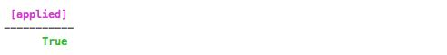
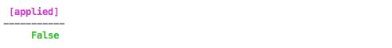
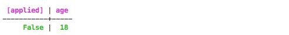

# UPDATE {#cqlUpdate .reference}

Update columns in a row.

Update columns in a row.

## Synopsis { .refsyn}

```
UPDATE [keyspace\_name.] table\_name
[**USING TTL** time\_value | **USING TIMESTAMP** timestamp\_value]
**SET** assignment [, assignment] . . . 
**WHERE** row\_specification
[**IF EXISTS** | **IF NOT EXISTS** | **IF** condition [**AND** condition] . . .] **;**

```

|Syntax conventions|Description|
|------------------|-----------|
|UPPERCASE|Literal keyword.|
|Lowercase|Not literal.|
|`Italics`|Variable value. Replace with a user-defined value.|
|`[]`|Optional. Square brackets \(`[]`\) surround optional command arguments. Do not type the square brackets.|
|`( )`|Group. Parentheses \( `( )` \) identify a group to choose from. Do not type the parentheses.|
|`|`|Or. A vertical bar \(`|`\) separates alternative elements. Type any one of the elements. Do not type the vertical bar.|
|`...`|Repeatable. An ellipsis \( `...` \) indicates that you can repeat the syntax element as often as required.|
|`'Literal string'`|Single quotation \(`'`\) marks must surround literal strings in CQL statements. Use single quotation marks to preserve upper case.|
|`{ key : value }`|Map collection. Braces \(`{ }`\) enclose map collections or key value pairs. A colon separates the key and the value.|
|`<datatype1,datatype2>`|Set, list, map, or tuple. Angle brackets \( `< >` \) enclose data types in a set, list, map, or tuple. Separate the data types with a comma.|
|`cql\_statement;`|End CQL statement. A semicolon \(`;`\) terminates all CQL statements.|
|`[--]`|Separate the command line options from the command arguments with two hyphens \( `--` \). This syntax is useful when arguments might be mistaken for command line options.|
|`' <schema\> ... </schema\> '`|Search CQL only: Single quotation marks \(`'`\) surround an entire XML schema declaration.|
|`@xml\_entity='xml\_entity\_type'`|Search CQL only: Identify the entity and literal value to overwrite the XML element in the schema and solrConfig files.|

## Description {#description .section}

UPDATE writes one or more column values to a row in a Cassandra table. Like [INSERT](cqlInsert.md), UPDATE is an [upsert](/en/glossary/doc/glossary/gloss_upsert.html) operation: if the specified row does not exist, the command creates it. All UPDATEs within the same partition key are applied atomically and in isolation.

The USING clause can add a *time to live* \([TTL](/en/glossary/doc/glossary/gloss_ttl.html)\) value to the row. You cannot apply TTLs to counter columns.

Assign new values to the row's columns in the SET clause. UPDATE cannot update the values of a row's primary key fields. To update a counter in a counter table, specify the increment or decrement to the counter column.

**Note:** Unlike the INSERT command, the UPDATE command supports counters. Otherwise, the UPDATE and INSERT operations are identical.

The WHERE clause specifies the row or rows to be updated. To specify a row, the WHERE clause must provide a value for each column of the row's primary key. To specify more than one row, you can use the IN keyword to introduce a list of possible values. You can only do this for the last column of the primary key.

The IF EXISTS or IF keywords introduce a lightweight transaction:

```
UPDATE cycling.cyclist_name
SET comments ='='Rides hard, gets along with others, a real winner'
WHERE id = fb372533-eb95-4bb4-8685-6ef61e994caa IF EXISTS;
```

Use the IF keyword to introduce a condition that must return TRUE for the update to succeed. Using an IF condition incurs a performance hit associated with using Paxos to support [linearizable consistency](/en/glossary/doc/glossary/gloss_linearizable_consistency.html).

The UPDATE command does not return any result unless it includes IF EXISTS.

## Parameters {#cql-update-parameters .section}

 keyspace\_name
 :   The name of the keyspace containing the table to be updated. Not needed if the keyspace has been set for the session with the USE command.

  table\_name
 :   The name of the table to be updated.

  time\_value
 :   The value for [TTL](/en/glossary/doc/glossary/gloss_ttl.html) is a number of seconds. Column values in a command marked with TTL are automatically marked as deleted \(with a tombstone\) after the specified number of seconds. The TTL applies to the marked column values, not the column itself. Any subsequent update of the column resets the value to the TTL specified in the update. By default, values never expire. You cannot set a time\_value for data in a counter column.

    You can set a default TTL for an entire table by setting the table's [default\_time\_to\_live](cqlCreateTable.md#cqlTableDefaultTTL) property. If you try to set a TTL for a specific column that is longer than the time defined by the table TTL, Cassandra returns an error.

    In addition, you can delete a column's TTL by setting its `time_value` to zero.

  timestamp\_value
 :   If TIMESTAMP is used, the inserted column is marked with its value – a timestamp in microseconds. If a TIMESTAMP value is not set, Cassandra uses the time \(in microseconds\) that the update occurred to the column.

  assignment
 :   Assigns a value to an existing element. Can be one of:

```
column\_name = column\_value [, column\_name = column\_value] . . . 
| counter\_column\_name = counter\_column\_name **+** | **-** counter\_offset
| list\_name **=** **\['**list\_item**'** [**, '**list\_item**'**] . . . **\]**
| list\_name **=** list\_name **+** | **-** **\['**list\_item**'** [, 'list\_item**'**] . . . **\]** 
| list\_name **= \['**list\_item**'** [, **'**list\_item**'**] . . . **\] + **list\_name  
| map\_name = map\_name **+** | **-** **\{** map\_key : map\_value [, map\_key : map\_value . . . **\}**
| map\_name**\[** index **\]** = map\_value
| set\_name **=** set\_name **+** | **-** **\{** [**'**set\_item'] **\}** 

```

    |Variable|Description|
    |--------|-----------|
    |column\_name|The name of the column to be updated.|
    |column\_value|The value to be inserted for the specified column name.|
    |counter\_column\_name|The name of the counter column to be updated.|
    |counter\_offset|The value by which the specified counter is be incremented or decremented \(depending on whether the counter\_offset is preceded by "=" or "-"\).|
    |list\_name|The name of the list to be updated. Format of a list:    ```
[list_item , list_item , list_item]
    ```

Note the use of square brackets.

|
    |list\_item|The value to be added to the list, or removed from it.|
    |map\_name|The name of the map to be updated. Format of a map:    ```
{ key : value , key: value , key: value . . . }
    ```

Note the use of curly brackets \( \{ \} \).

|
    |map\_key|The first term or *key*in a map entry.|
    |map\_value|The second term or *value* in a map entry.|
    |set\_name| The name of the set to be updated. Format of a set:

    ```
{ set_item , set_item , set_item . . . }
    ```

 Note the use of curly brackets \( \{ \} \).

 |
    |set\_item|The literal value included in a set. **Note:** The difference between a list and a set: each item in a set must be unique.

|

  row\_specification
 :   The `WHERE` clause must identify the row or rows to be updated by primary key:

    -   To specify one row, use `primary\_key\_name = primary\_key\_value`. If the primary key is a combination of elements, follow this with `AND primary\_key\_name = primary\_key\_value ...`. The WHERE clause must specify a value for every component of the primary key.
    -   To specify more than one row, use `primary\_key\_name IN ( primary\_key\_value, primary\_key\_value … )`. This only works for the last component of the primary key.

    **Note:** To update a static column, you only need to specify the partition key.

  IF EXISTS / IF NOT EXISTS \| IF condition
 :   An IF clause can limit the command's action on rows that match the WHERE clause:

    -   Use IF EXISTS to make the UPDATE fail when rows match the `WHERE` conditions.
    -   Use IF NOT EXISTS to make the UPDATE fail when no rows exist match the `WHERE` conditions.
    -   Use IF to specify one or more conditions that must test true for the values in the specified row or rows.

    When an IF is used, the command returns a result to standard output. For examples, see [Conditionally updating columns](cqlUpdate.md#conditionally-updating-columns).

 ## Examples: updating a column {#examples-of-updating-a-column .section}

Update a column in several rows at once:

```
UPDATE users
  SET state = 'TX'
  WHERE user_uuid
  IN (88b8fd18-b1ed-4e96-bf79-4280797cba80,
    06a8913c-c0d6-477c-937d-6c1b69a95d43,
    bc108776-7cb5-477f-917d-869c12dfffa8);
```

CQL supports an empty list of values in the IN clause, useful in Java Driver applications when passing empty arrays as arguments for the IN clause.

Update several columns in a single row:

```
UPDATE cycling.cyclists
  SET firstname = 'Marianne,
  lastname = 'VOS'
  WHERE id = 88b8fd18-b1ed-4e96-bf79-4280797cba80;
```

Update a row in a table with a complex primary key:

To do this, specify all keys in a table having compound and clustering columns. For example, update the value of a column in a table having a compound primary key, userid and url:

```
UPDATE excelsior.clicks USING TTL 432000
  SET user_name = 'bob'
  WHERE userid=cfd66ccc-d857-4e90-b1e5-df98a3d40cd6 AND
    url='http://google.com';
UPDATE Movies SET col1 = val1, col2 = val2 WHERE movieID = key1;
UPDATE Movies SET col3 = val3 WHERE movieID IN (key1, key2, key3);
UPDATE Movies SET col4 = 22 WHERE movieID = key4;
```

**Note:** In Cassandra 3.0 and earlier, you cannot insert any value larger than 64K bytes into a clustering column.

## Updating a counter column {#update-counter .section}

To update a counter column value in a counter table, specify the increment or decrement to apply to the current value.

```
UPDATE cycling.popular_count SET popularity = popularity + 2 WHERE id = 6ab09bec-e68e-48d9-a5f8-97e6fb4c9b47;
```

To use a lightweight transaction on a counter column to ensure accuracy, put one or more counter updates in the [batch statement](cqlBatch.md). For details, see [Performing conditional updates in a batch](cqlUpdate.md#performing-conditional-batches).

## Creating a partition using UPDATE {#section_w4d_brb_hx .section}

Since Cassandra processes an UPDATE as an upsert, it is possible to create a new row by *updating* it in a table. Example: to create a new partition in the `cyclists` table, whose primary key is `(id)`, you can UPDATE the partition with id `e7cd5752-bc0d-4157-a80f-7523add8dbcd`, even though it does not exist yet:

```
UPDATE cycling.cyclists
SET firstname = 'Anna', lastname = 'VAN DER BREGGEN' WHERE id = e7cd5752-bc0d-4157-a80f-7523add8dbcd;
```

## Updating a list {#using-a-collection-list .section}

To insert values into the list:

```
UPDATE cycling.upcoming_calendar 
SET events = ['Criterium du Dauphine','Tour de Suisse'];
```

To prepend an element to the list, enclose it in square brackets and use the addition \(+\) operator:

```
UPDATE cycling.upcoming_calendar 
SET events = ['Tour de France'] + events WHERE year=2015 AND month=06;
```

To append an element to the list, switch the order of the new element data and the list name:

```
UPDATE cycling.upcoming_calendar 
SET events = events + ['Tour de France'] WHERE year=2017 AND month=05;
```

To add an element at a particular position, use the list index position in square brackets:

```
UPDATE cycling.upcoming_calendar 
SET events[4] = 'Tour de France' WHERE year=2016 AND month=07;
```

To remove all elements having a particular value, use the subtraction operator \(-\) and put the list value in square brackets:

```
UPDATE cycling.upcoming_calendar 
SET events = events - ['Criterium du Dauphine'] WHERE year=2016 AND month=07;
```

To update data in a collection column of a user-defined type, enclose components of the type in parentheses within the curly brackets, as shown in ["Using a user-defined type."](../cql_using/useInsertUDT.md)

CAUTION:

The Java List Index is not thread safe. The `set` or `map` collection types are safer for updates.

## Updating a set {#using-a-collection-set .section}

To add an element to a set, use the UPDATE command and the addition \(+\) operator:

```
UPDATE cycling.cyclist_career_teams
SET teams = teams + {'Team DSB - Ballast Nedam'} WHERE id=5b6962dd-3f90-4c93-8f61-eabfa4a803e2;
```

To remove an element from a set, use the subtraction \(-\) operator:

```
UPDATE cycling.cyclist_career_teams
SET teams = teams - {'DSB Bank Nederland bloeit'} WHERE id=5b6962dd-3f90-4c93-8f61-eabfa4a803e2;
```

To remove all elements from a set:

```
UPDATE cycling.cyclist_career_teams
SET teams = {} WHERE id=5b6962dd-3f90-4c93-8f61-eabfa4a803e2;
```

## Updating a map {#using-a-collection-map .section}

To set or replace map data, enclose the values in map syntax: strings in curly brackets, separated by a colon.

```
UPDATE cycling.upcoming_calendar 
SET description = description + {'Criterium du Dauphine' : 'Easy race'} WHERE year = 2015;

```

To update or set a specific element, such as adding a new race to the calendar in a map named `events`:

```
UPDATE cycling.upcoming_calendar 
SET events[2] = 'Vuelta Ciclista a Venezuela' WHERE year = 2016 AND month = 06;
```

To set the a TTL for each map element:

```
UPDATE cycling.upcoming_calendar USING TTL <ttl_value>
SET events[2] = 'Vuelta Ciclista a Venezuela' WHERE year = 2016 AND month = 06;
```

You can update the map by adding one or more elements separated by commas:

```
UPDATE cycling.upcoming_calendar 
SET description = description + {'Criterium du Dauphine' : 'Easy race', 'Tour du Suisse' : 'Hard uphill race'}
WHERE year = 2015 AND month = 6;
```

Remove elements from a map in the same way using - instead of +.

## About updating sets and maps caution {#section_k5s_zjg_xw .section}

CQL supports alternate methods for updating sets and maps. These alternatives may seem to accomplish the same tasks, but Cassandra handles them differently in important ways.

For example: CQL provides a straightforward method for creating a new row containing a collection map:

```
UPDATE cycling.upcoming_calendar 
SET description = 
{'Criterium du Dauphine' : 'Easy race', 
 'Tour du Suisse' : 'Hard uphill race'} 
WHERE year = 2015 AND month = 6;
```

The easiest way to add a new entry to the map is to use the `+` operator as described above:

```
UPDATE cycling.upcoming_calendar 
SET description = description + { 'Tour de France' : 'Very competitive'} 
WHERE year = 2015 AND month = 6;
```

You may, however, try to add the new entry with a command that overwrites the first two and adds the new one:

```
UPDATE cycling.upcoming_calendar 
SET description = 
{'Criterium du Dauphine' : 'Easy race', 
 'Tour du Suisse' : 'Hard uphill race',
 'Tour de France' : 'Very competitive'} 
WHERE year = 2015 AND month = 6;
```

These two statements seem to do the same thing. But behind the scenes, Cassandra processes the second statement by deleting the entire collection and replacing it with a new collection containing three entries. This creates tombstones for the deleted entries, even though these entries are identical to the entries in the new map collection. If your code updates all map collections this way, it generates many tombstones, which may slow the system down.

The examples above use map collections, but the same caution applies to updating sets.

## Updating a UDT with non-collection fields {#section_mnn_wy2_gw .section}

In Cassandra 3.6 and later, to change the value of an individual field value in a user-defined type with non-collection fields, use the UPDATE command:

```
UPDATE cyclist_stats SET basics.birthday = '2000-12-12' WHERE id = 220844bf-4860-49d6-9a4b-6b5d3a79cbfb;
```

## Conditionally updating columns {#conditionally-updating-columns .section}

In Cassandra 2.0.7 and later, you can conditionally update columns using IF or IF EXISTS.

Add IF EXISTS to the command to ensure that the operation is not performed if the specified row exists:

```
UPDATE cycling.cyclist_id SET age = 28 WHERE lastname = 'WELTEN' and firstname = 'Bram' IF EXISTS;
```

Without IF EXISTS, the command proceeds with no standard output. If IF EXISTS returns true \(if a row with this primary key does exist\), standard output displays a table like the following:



If no such row exists, however, the condition returns FALSE and the command fails. In this case, standard output looks like:



Use IF condition to apply tests to one or more column values in the selected row:

```
UPDATE cyclist_id SET id = 15a116fc-b833-4da6-ab9a-4a3775750239 where lastname = 'WELTEN' and firstname = 'Bram' IF age = 18;
```

If all the conditions return TRUE, standard output is the same as if IF EXISTS returned true \(see above\). If any of the conditions fails, standard output displays `False` in the `[applied]` column and also displays information about the condition that failed:



Conditional updates are examples of *lightweight transactions*. They incur a non-negligible performance cost and should be used sparingly.

## Performing conditional updates in a BATCH {#performing-conditional-batches .section}

The UPDATE command can create new rows. But until Cassandra 3.0, the new *updated* rows were not immediately available for lightweight transactions \(for example, conditional statements added to UPDATE commands\) if both the UPDATE and the conditional statement were applied in the same BATCH.

For example, consider a simple table with four defined columns:

```
CREATE TABLE mytable (a int, b int, s int static, d text, PRIMARY KEY (a, b))

BEGIN BATCH
     INSERT INTO mytable (a, b, d) values (7, 7, 'a')
     UPDATE mytable SET s = 7 WHERE a = 7 IF s = NULL;
APPLY BATCH

```

In the first batch above, the insert command creates a partition with primary key values \(7,7\) but does not set a value for the `s` column. Even though the `s` column was not defined for this row, the `IF s = NULL` conditional succeeds, so the batch succeeds. \(In previous versions of Cassandra, the conditional would have failed,and that failure would have caused the entire batch to fail.\)

The second batch demonstrates more complex handling of a lightweight transaction:

```
BEGIN BATCH
     INSERT INTO mytable (a, b, d) values (7, 7, 'a')
     UPDATE mytable SET s = 1 WHERE a = 1 IF s = NULL;
APPLY BATCH
```

In this case, the `IF` statement tests the value of a column in a partition that does not even exist before it is created by the UPDATE. Even so, Cassandra recognizes the implicit presence of the partition and its column `s`, and lets the conditional test succeed. This allows the batch to succeed.

**Parent topic:** [CQL commands](../../cql/cql_reference/cqlCommandsTOC.md)

