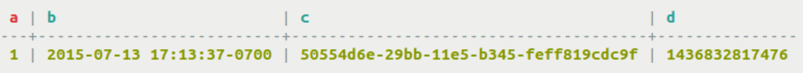
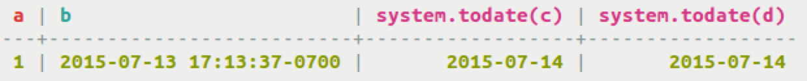

# UUID and timeuuid functions {#timeuuid_functions_r .reference}

About using Timeuuid functions.

Cassandra 2.0.7 and later includes the `uuid()` function. This function takes no parameters and generates a random Type 4 UUID suitable for use in `INSERT` or `SET` statements.

Several `timeuuid()` functions are designed for use with the `timeuuid()` type:

-   `dateOf()`

    Used in a `SELECT` clause, this function extracts the timestamp of a `timeuuid` column in a result set. This function returns the extracted timestamp as a date. Use `unixTimestampOf()` to get a raw timestamp.

-   `now()`

    In the coordinator node, generates a new unique `timeuuid` in milliseconds when the statement is executed. The timestamp portion of the `timeuuid` conforms to the UTC \(Universal Time\) standard. This method is useful for inserting values. The value returned by `now()` is guaranteed to be unique.

-   `minTimeuuid()` and `maxTimeuuid()`

    Returns a `UUID`-like result given a conditional time component as an argument. For example:

    ```
    SELECT * FROM myTable
       WHERE t > maxTimeuuid('2013-01-01 00:05+0000')
       AND t < minTimeuuid('2013-02-02 10:00+0000')
    ```

    The min/maxTimeuuid example selects all rows where the `timeuuid` column, `t`, is strictly later than 2013-01-01 00:05+0000 but strictly earlier than 2013-02-02 10:00+0000. The t \>= maxTimeuuid\('2013-01-01 00:05+0000'\) does not select a `timeuuid` generated exactly at 2013-01-01 00:05+0000 and is essentially equivalent to t \> maxTimeuuid\('2013-01-01 00:05+0000'\).

    The values returned by `minTimeuuid` and `maxTimeuuid` functions are not true `UUID`s in that the values do not conform to the Time-Based `UUID` generation process specified by the [RFC 4122](http://www.ietf.org/rfc/rfc4122.txt). The results of these functions are deterministic, unlike the `now()` function.

-   `unixTimestampOf()`

    Used in a `SELECT` clause, this functions extracts the timestamp in milliseconds of a `timeuuid` column in a result set. Returns the value as a raw, 64-bit integer timestamp.


Cassandra 2.2 and later support some additional `timeuuid` and timestamp functions to manipulate dates. The functions can be used in `INSERT`, `UPDATE`, and `SELECT` statements.

-   `toDate(timeuuid)`

    Converts `timeuuid` to `date` in YYYY-MM-DD format.

-   `toTimestamp(timeuuid)`

    Converts `timeuuid` to `timestamp` format.

-   `toUnixTimestamp(timeuuid)`

    Converts `timeuuid` to `UNIX timestamp` format.

-   `toDate(timestamp)`

    Converts `timestamp` to `date` in YYYY-MM-DD format.

-   `toUnixTimestamp(timestamp)`

    Converts timestamp to UNIX timestamp format.

-   `toTimestamp(date)`

    Converts `date` to `timestamp` format.

-   `toUnixTimestamp(date)`

    Converts `date` to `UNIX timestamp` format.


An example of the new functions creates a table and inserts various time-related values:

```
CREATE TABLE sample_times (a int, b timestamp, c timeuuid, d bigint, PRIMARY KEY (a,b,c,d));
INSERT INTO sample_times (a,b,c,d) VALUES (1, toUnixTimestamp(now()), 50554d6e-29bb-11e5-b345-feff819cdc9f, toTimestamp(now()));
```



Select data and convert it to a new format:

```
SELECT toDate(c) FROM sample_times;
```



**Parent topic:** [CQL data types](../../cql/cql_reference/cql_data_types_c.md)

