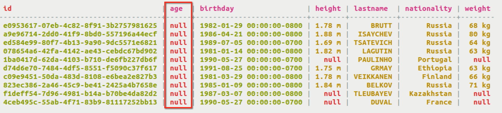
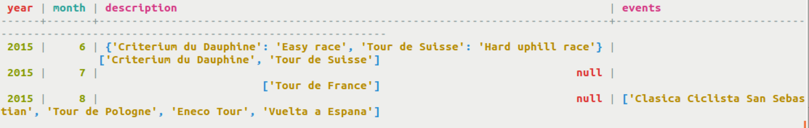

# Altering a table {#useAlterTableTOC}

How to alter a table to add or delete columns or change table properties.

Tables can be changed with the `ALTER` command.

**Parent topic:** [Using CQL](../../cql/cql_using/useAboutCQL.md)

## Altering columns in a table {#useAlterColumn}

Adding or changing columns to a table with the ALTER TABLE command.

The `ALTER TABLE` command can be used to add new columns to a table and to alter the column type of an existing column.

-   Add a age column of type int to the table cycling.cyclist\_alt\_stats.

    ```
    cqlsh> ALTER TABLE cycling.cyclist_alt_stats ADD age int;
    ```

    This creates the column metadata and adds the column to the table schema, and sets the value to NULL for all rows.

    

-   Add a column favorite\_color of varchar, and then change the data type of the same column to text.

    ```
    cqlsh> ALTER TABLE cycling.cyclist_alt_stats ADD favorite_color varchar;
    ALTER TABLE cycling.cyclist_alt_stats ALTER favorite_color TYPE text;
    ```

    **Note:** There are limitations on altering the data type of a column. The two data types, the original and the one changing to, must be compatible.


## Altering a table to add a collection {#useAlterAddColl}

Adding or changing collection columns to a table with the ALTER TABLE command.

The `ALTER TABLE` command can be used to add new collection columns to a table and to alter the column type of an existing column.

-   Alter the table cycling.upcoming\_calendar to add a collection map description that can store a description for each race listed.

    ```language-cql
    cqlsh> ALTER TABLE cycling.upcoming_calendar ADD description map<text,text>;
    ```

-   After updating cycling.upcoming\_calendar table to insert some data, description can be displayed.

    ```language-cql
    cqlsh> UPDATE cycling.upcoming_calendar 
    SET description = description + {'Criterium du Dauphine' : "Easy race', 'Tour du Suisse' : 'Hard uphill race'} WHERE year = 2015 AND month = 6;
    ```

    


## Altering the data type of a column {#useAlterColType}

Changing the data type of a column after it is defined or added to a table using ALTER TABLE.

Using ALTER TABLE, you can change the data type of a column after it is defined or added to a table.

1.  Change the `favorite_color` column to store as `text` instead of `varchar` by changing the data type of the column.

    ```
    ALTER TABLE cycling.cyclist_alt_stats ADD favorite_color varchar; 
    ALTER TABLE cycling.cyclist_alt_stats ALTER favorite_color TYPE text;
    ```

    Only newly inserted values will be created with the new type. However, the data type before must be [compatible with the new data type specified](../cql_reference/cql_data_types_c.md#cql_data_type_compatibility).


## Altering the table properties {#useAlterTabProp}

Changing the table properties after the table properties are defined or adding table properties to a table using ALTER TABLE.

Using ALTER TABLE, you can change the table properties of a table.

1.  Alter a table to change the caching properties.

    ```
    cqlsh> ALTER TABLE cycling.race_winners WITH caching = {'keys' : 'NONE', 'rows_per_partition' : '15' };
    ```


