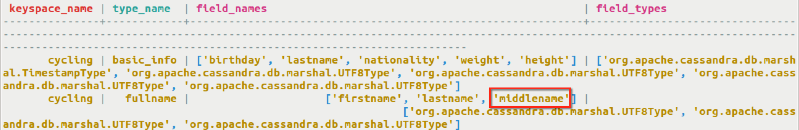
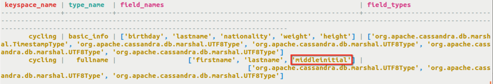

# Altering a user-defined type {#useAlterType .task}

Adding columns to a user-defined type with the ALTER TYPE command.

The `ALTER TYPE` command can be used to add new columns to a user-defined type and to alter the data type of an existing column in a user-defined type.

-   Add a middlename column of type text to the user-defined type cycling.fullname.

    ```
    cqlsh> ALTER TYPE cycling.fullname ADD middlename text;
    ```

    This creates the column metadata and adds the column to the type schema. To verify, display the table ssystem.schema\_usertypes.

    

-   A column can be renamed in either `ALTER TABLE` or `ALTER TYPE`. In `ALTER TABLE`, only primary key columns may be renamed.

    ```
    cqlsh> ALTER TYPE cycling.fullname RENAME middlename TO middleinitial;
    ```

    


**Parent topic:** [Using CQL](../../cql/cql_using/useAboutCQL.md)

