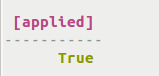
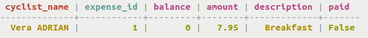
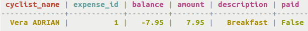
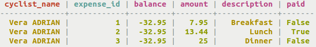
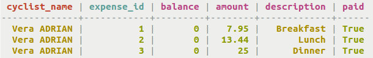

# Good use of BATCH statement {#useBatchGoodExample .task}

How to use a BATCH statement.

Batch operations can be beneficial. See these examples below to see a good use of `BATCH`. The examples below use the following table **cyclist\_expenses**:

```
cqlsh> CREATE TABLE cycling.cyclist_expenses ( 
  cyclist_name text, 
  balance float STATIC, 
  expense_id int, 
  amount float, 
  description text, 
  paid boolean, 
  PRIMARY KEY (cyclist_name, expense_id) 
);
```

```

```

Note that `balance` is `STATIC`.

-   **Single partition batch**
-   The first INSERT in the `BATCH` statement sets the `balance` to zero. The next two statements insert an `expense_id` and change the `balance` value. All the `INSERT` and `UPDATE` statements in this batch write to the same partition, keeping the latency of the write operation low.

    ```
    cqlsh> BEGIN BATCH
      INSERT INTO cycling.cyclist_expenses (cyclist_name, balance) VALUES ('Vera ADRIAN', 0) IF NOT EXISTS;
      INSERT INTO cycling.cyclist_expenses (cyclist_name, expense_id, amount, description, paid) VALUES ('Vera ADRIAN', 1, 7.95, 'Breakfast', false);
      APPLY BATCH;
    ```

    This batching example includes conditional updates combined with using [static columns](refStaticCol.md). Recall that single partition batches are not logged.

    **Note:** It would be reasonable to expect that an UPDATE to the balance could be included in this BATCH statement:

    ```
    cqlsh> UPDATE cycling.cyclist_expenses SET balance = -7.95 WHERE cyclist_name = 'Vera ADRIAN' IF balance = 0;
    
    ```

    However, it is important to understand that all the statements processed in a `BATCH` statement timestamp the records with the same value. The operations may not perform in the order listed in the `BATCH` statement. The UPDATE might be processed BEFORE the first INSERT that sets the balance value to zero, allowing the conditional to be met.

    An acknowledgement of a batch statement is returned if the batch operation is successful.

    

    The resulting table will only have one record so far.

    

-   The balance can be adjusted separately with an UPDATE statement. Now the `balance` will reflect that breakfast was unpaid.

    ```
    cqlsh> UPDATE cycling.cyclist_expenses SET balance = -7.95 WHERE cyclist_name = 'Vera ADRIAN' IF balance = 0;
    ```

    

-   The table **cyclist\_expenses** stores records about each purchase by a cyclist and includes the running balance of all the cyclist's purchases. Because the balance is static, all purchase records for a cyclist have the same running balance. This `BATCH` statement inserts expenses for two more meals changes the balance to reflect that breakfast and dinner were unpaid.

    ```
    cqlsh> BEGIN BATCH
    INSERT INTO cycling.cyclist_expenses (cyclist_name, expense_id, amount, description, paid) VALUES ('Vera ADRIAN', 2, 13.44, 'Lunch', true);
    INSERT INTO cycling.cyclist_expenses (cyclist_name, expense_id, amount, description, paid) VALUES ('Vera ADRIAN', 3, 25.00, 'Dinner', false);
    UPDATE cycling.cyclist_expenses SET balance = -32.95 WHERE cyclist_name = 'Vera ADRIAN' IF balance = -7.95;
    APPLY BATCH;
    ```

    

-   Finally, the cyclist pays off all outstanding bills and the balance of the account goes to zero.

    ```
    cqlsh> BEGIN BATCH
    UPDATE cycling.cyclist_expenses SET balance = 0 WHERE cyclist_name = 'Vera ADRIAN' IF balance = -32.95;
    UPDATE cycling.cyclist_expenses SET paid = true WHERE cyclist_name = 'Vera ADRIAN' AND expense_id = 1 IF paid = false;
    UPDATE cycling.cyclist_expenses SET paid = true WHERE cyclist_name = 'Vera ADRIAN' AND expense_id = 3 IF paid = false;
    APPLY BATCH;
    ```

    

    Because the column is static, you can provide only the partition key when updating the data. To update a non-static column, you would also have to provide a clustering key. Using batched conditional updates, you can maintain a running balance. If the balance were stored in a separate table, maintaining a running balance would not be possible because a batch having conditional updates cannot span multiple partitions.

-   **Multiple partition logged batch**
-   A classic example for using `BATCH` for a multiple partition insert involves writing the same data to two related tables:

    ```
    cqlsh> BEGIN LOGGED BATCH
    INSERT INTO cycling.cyclist_names (cyclist_name, race_id) VALUES ('Vera ADRIAN', 100);
    INSERT INTO cycling.cyclist_by_id (race_id, cyclist_name) VALUES (100, 'Vera ADRIAN');
    APPLY BATCH;
    ```

    Here, it is important that the same data is written to both tables to keep them in synchronization. Another common use for this batch operation is updating usernames and passwords.


**Parent topic:** [Batching data insertion and updates](../../cql/cql_using/useBatchTOC.md)

