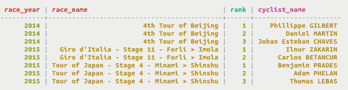

# Composite Partition Key {#useCompositePartitionKeyConcept .concept}

A partition key can have a partition key defined with multiple table columns which determines which node stores the data.

For a table with a composite partition key, Cassandra uses multiple columns as the partition key. These columns form logical sets inside a partition to facilitate retrieval. In contrast to a simple partition key, a composite partition key uses two or more columns to identify where data will reside. Composite partition keys are used when the data stored is too large to reside in a single partition. Using more than one column for the partition key breaks the data into chunks, or buckets. The data is still grouped, but in smaller chunks. This method can be effective if a Cassandra cluster experiences hotspotting, or congestion in writing data to one node repeatedly, because a partition is heavily writing. Cassandra is often used for time series data, and hotspotting can be a real issue. Breaking incoming data into buckets by year:month:day:hour, using four columns to route to a partition can decrease hotspots.

Data is retrieved using the partition key. Keep in mind that to retrieve data from the table, values for all columns defined in the partition key have to be supplied, if [secondary indexes](useCreateQueryIndexes.md) are not used. The table shown uses race\_year and race\_name in the primary key, as a composition partition key. To retrieve data, both parameters must be identified.



Cassandra stores an entire row of data on a node by partition key. If you have too much data in a partition and want to spread the data over multiple nodes, [use a composite partition key](useCompositePartitionKeyConcept.md#).

**Parent topic:** [Creating a table](../../cql/cql_using/useCreateTableTOC.md)

## Using a composite partition key {#useCompositePartitionKey}

Use a composite partition key to identify where data will be stored.

Use a composite partition key in your primary key to create a set of columns that you can use to distribute data across multiple partitions and to query and return sorted results. This example creates a rank\_by\_year\_and\_name table storing the ranking and name of cyclists who competed in races. The table uses race\_year and race\_name as the columns defining the composition partition key of the [primary key](/en/glossary/doc/glossary/gloss_primary_key.html). The query discovers the ranking of cyclists who competed in races by supplying year and race name values.

A composite partition key table can be created in two different ways, as shown.

-   Create the table rank\_by\_year\_and\_name in the cycling keyspace. Use race\_year and race\_name for the composite partition key. The table definition shown has an additional column rank used in the primary key. Before creating the table, set the keyspace with a `USE` statement. This example identifies the primary key at the end of the table definition. Note the double parentheses around the first two columns defined in the `PRIMARY KEY`.

    ```
    cqlsh> USE cycling;
    CREATE TABLE rank_by_year_and_name ( 
    race_year int, 
    race_name text, 
    cyclist_name text, 
    rank int, 
    PRIMARY KEY ((race_year, race_name), rank) 
    );
    ```

-   The keyspace name can be used to identify the keyspace in the `CREATE TABLE` statement instead of the `USE` statement.

    ```
    cqlsh> CREATE TABLE cycling.rank_by_year_and_name ( 
    race_year int, 
    race_name text, 
    cyclist_name text, 
    rank int, 
    PRIMARY KEY ((race_year, race_name), rank) 
    );
    ```


