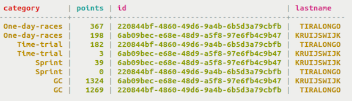

# Compound Primary Key {#useCompoundPrimaryKeyConcept .concept}

A compound primary key consists of a partition key that determines which node stores the data and of clustering column\(s\) which determine the order of the data on the partition.

For a table with a compound primary key, Cassandra uses a partition key that is either simple or composite. In addition, clustering column\(s\) are defined. [Clustering](/en/glossary/doc/glossary/gloss_clustering.html) is a storage engine process that sorts data within each partition based on the definition of the clustering columns. Normally, columns are sorted in ascending alphabetical order. Generally, a different grouping of data will benefit reads and writes better than this simplistic choice.

Remember that data is distributed throughout the Cassandra cluster. An application can experience high latency while retrieving data from a large partition if the entire partition must be read to gather a small amount of data. On a physical node, when rows for a partition key are stored in order based on the clustering columns, retrieval of rows is very efficient. Grouping data in tables using clustering columns is the equivalent of `JOINs` in a relational database, but are much more performant because only one table is accessed. This table uses category as the partition key and points as the clustering column. Notice that for each category, the points are ordered in descending order.

Cassandra stores an entire row of data on a node by partition key and can order the data for retrieval with clustering columns.Retrieving data from a partition is more versatile with clustering columns. For the example shown, a [query](useQueryColumnsSort.md) could retrieve all point values greater than 200 for the One-day-races. If you have more complex needs for querying, [use a compound primary key](useCompoundPrimaryKey.md).

-   **[Using a compound primary key](../../cql/cql_using/useCompoundPrimaryKey.md)**  
 Use a compound primary key to create columns that you can query to return sorted results.

**Parent topic:** [Creating a table](../../cql/cql_using/useCreateTableTOC.md)

