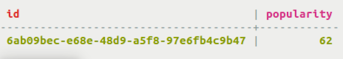

# Creating a counter table {#useCountersConcept .concept}

A counter is a special column for storing a number that is changed in increments.

A counter is a special column used to store an integer that is changed in increments.

Counters are useful for many data models. Some examples:

-   To keep track of the number of web page views received on a company website
-   To keep track of the number of games played online or the number of players who have joined an online game

The table shown below uses id as the primary key and keeps track of the popularity of a cyclist based on thumbs up/thumbs down clicks in the popularity field of a counter table.

Tracking count in a distributed database presents an interesting challenge. In Cassandra, at any given moment, the counter value may be stored in the Memtable, commit log, and/or one or more SSTables. Replication between nodes can cause consistency issues in certain edge cases. Cassandra counters were redesigned in Cassandra 2.1 to alleviate some of the difficulties. Read ["What’s New in Cassandra 2.1: Better Implementation of Counters"](https://www.datastax.com/dev/blog/whats-new-in-cassandra-2-1-a-better-implementation-of-counters) to discover the improvements made in the counters.

Because counters are implemented differently from other columns, counter columns can only be created in dedicated tables. A counter column must have the datatype [counter data type](../cql_reference/counter_type.md). This data type cannot be assigned to a column that serves as the primary key or partition key. To implement a counter column, create a table that only includes:

-   The primary key \(can be one or more columns\)
-   The counter column

Many [counter-related settings](/en/cassandra-oss/3.0/cassandra/configuration/configCassandra_yaml.html) can be set in the cassandra.yaml file.

A counter column cannot be indexed or deleted.. To load data into a counter column, or to increase or decrease the value of the counter, use the `UPDATE` command. Cassandra rejects `USING TIMESTAMP` or `USING TTL` when updating a counter column.

To create a table having one or more counter columns, use this:

-   Use CREATE TABLE to define the counter and non-counter columns. Use all non-counter columns as part of the PRIMARY KEY definition.

-   **[Using a counter](../../cql/cql_using/useCounters.md)**  
A counter is a special column for storing a number that is changed in increments.

**Parent topic:** [Creating a table](../../cql/cql_using/useCreateTableTOC.md)

