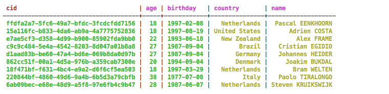
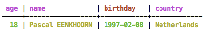

# Creating a materialized view {#useCreateMV .concept}

How to create CQL materialized views.

In Cassandra 3.0 and later, a materialized view is a table that is built from another table's data with a new primary key and new properties. In Cassandra, queries are optimized by primary key definition. Standard practice is to create the table for the query, and create a new table if a different query is needed. Until Cassandra 3.0, these additional tables had to be updated manually in the client application. A materialized view automatically receives the updates from its source table.

[Secondary indexes](usePrimaryIndex.md) are suited for low cardinality data. Queries of high cardinality columns on secondary indexes require Cassandra to access all nodes in a cluster, [causing high read latency](useWhenIndex.md#highCardCol).

Materialized views are suited for high cardinality data. The data in a materialized view is arranged serially based on the view's primary key. Materialized views cause hotspots when low cardinality data is inserted.

Requirements for a materialized view:

-   The columns of the source table's primary key must be part of the materialized view's primary key.
-   Only one new column can be added to the materialized view's primary key. [Static columns](/en/glossary/doc/glossary/gloss_static_col.html) are not allowed.

You can create a materialized view with its own WHERE conditions and its own properties.

Materialized view example

The following table is the original, or source, table for the materialized view examples in this section.

```
CREATE TABLE cyclist_mv (cid UUID PRIMARY KEY, name text, age int, birthday date, country text);
```

This table holds values for the name, age, birthday, and country affiliation of several cyclists.

The `cyclist_mv` table can be the basis of a materialized view that uses age in the primary key.

```
CREATE MATERIALIZED VIEW cyclist_by_age 
AS SELECT age, birthday, name, country 
FROM cyclist_mv 
WHERE age IS NOT NULL AND cid IS NOT NULL 
PRIMARY KEY (age, cid);
```

This `CREATE MATERIALIZED VIEW` statement has several features:

-   The `AS SELECT` phrase identifies the columns copied from the base table to the materialized view.
-   The `FROM` phrase identifies the source table from which Cassandra will copy the data.
-   The `WHERE` clause must include all primary key columns with the `IS NOT NULL` phrase so that only rows with data for all the primary key columns are copied to the materialized view.
-   As with any table, the specification of the primary key columns. Since `cyclist_mv`, the source table, uses cid as its primary key, cid must be present in the materialized view's primary key.

    **Note:** In this materialized view, age is used as the primary key and cid is a clustering column. In Cassandra3.0 and earlier, you cannot use a column as a clustering column if any of its values is larger than 64K bytes.


Because the new materialized view is partitioned by age, it supports queries based on the cyclists' ages.

```
SELECT age, name, birthday FROM cyclist_by_age WHERE age = 18;
```


Other materialized views, based on the same source table, can organize information by cyclists' birthdays or countries of origin.

```
CREATE MATERIALIZED VIEW cyclist_by_birthday 
AS SELECT age, birthday, name, country 
FROM cyclist_mv 
WHERE birthday IS NOT NULL AND cid IS NOT NULL
PRIMARY KEY (birthday, cid);

CREATE MATERIALIZED VIEW cyclist_by_country 
AS SELECT age,birthday, name, country 
FROM cyclist_mv 
WHERE country IS NOT NULL AND cid IS NOT NULL
PRIMARY KEY (country, cid);
```

The following queries use the new materialized views.

```
SELECT age, name, birthday FROM cyclist_by_country WHERE country = 'Netherlands';
```


```
SELECT age, name, birthday FROM cyclist_by_birthday WHERE birthday = '1987-09-04';
```


In Cassandra 3.10 and later, a materialized view can be created using a filtering statement that includes a restriction on a non-primary key column.

```
CREATE MATERIALIZED VIEW cyclist_by_birthday_Netherlands 
AS SELECT age, birthday, name, country 
FROM cyclist_mv 
WHERE birthday IS NOT NULL AND cid IS NOT NULL
AND country='Netherlands'
PRIMARY KEY (birthday, cid);
```

This materialized view will only store information for cyclists from the Netherlands because of the addition of:

```
AND country='Netherlands'
```

to the `WHERE` clause. Now a query can be submitted to find those cyclists from the Netherlands with a particular birthday:

```
SELECT age, name, birthday FROM cyclist_by_birthday WHERE birthday = '1997-02-08';
```

  

When another INSERT is executed on `cyclist_mv`, Cassandra updates the source table and both of these materialized views. When data is deleted from `cyclist_mv`, Cassandra deletes the same data from any related materialized views.

Materialized views allow fast lookup of the data using the normal Cassandra read path. However, materialized views do not have the same write performance as normal table writes. Cassandra performs an additional read-before-write to update each materialized view. To complete an update, Cassandra preforms a data consistency check on each replica. A write to the source table incurs latency. The performance of deletes on the source table also suffers. If a delete on the source table affects two or more contiguous rows, this delete is tagged with one tombstone. But these same rows may not be contiguous in materialized views derived from the source table. If they are not, Cassandra creates multiple tombstones in the materialized views.

Cassandra can only write data directly to source tables, not to materialized views. Cassandra updates a materialized view asynchronously after inserting data into the source table, so the update of materialized view is delayed. Cassandra performs a read repair to a materialized view only after updating the source table.

For additional information on how materialized views work, go to [New in Cassandra 3.0: Materialized Views](https://www.datastax.com/dev/blog/new-in-cassandra-3-0-materialized-views) and [Cassandra Summit 2015 talk on Materialized Views](http://www.slideshare.net/carlyeks/cassandra-materialized-views).

**Parent topic:** [Using CQL](../../cql/cql_using/useAboutCQL.md)

**Related information**  


[Altering a materialized view](useAlterMV.md)

[CREATE MATERIALIZED VIEW](../cql_reference/cqlCreateMaterializedView.md)

[ALTER MATERIALIZED VIEW](../cql_reference/cqlAlterMaterializedView.md)

[DROP MATERIALIZED VIEW](../cql_reference/cqlDropMatializedView.md)

