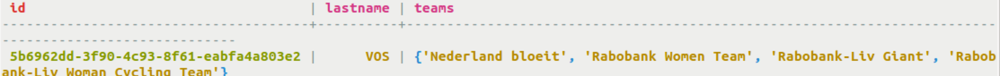
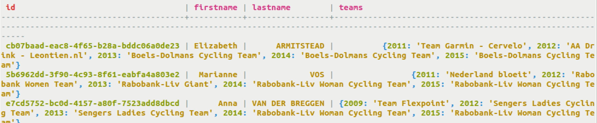
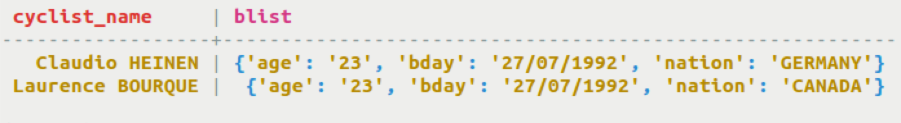
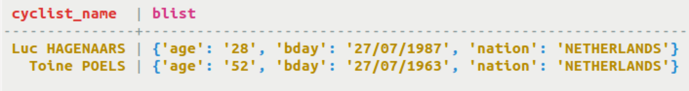
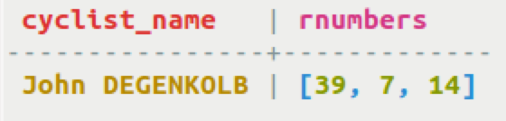

# Indexing a collection {#useIndexColl .task}

How to index collections and query the database to find a collection containing a particular value.

Collections can be indexed and queried to find a collection containing a particular value. Sets and lists are indexed slightly differently from maps, given the key-value nature of maps.

Sets and lists can index all values found by indexing the collection column. Maps can index a map key, map value, or map entry using the methods shown below. Multiple indexes can be created on the same map column in a table, so that map keys, values, or entries can be queried. In addition, frozen collections can be indexed using `FULL` to index the full content of a frozen collection.

**Note:** All the cautions about using secondary indexes apply to indexing collections.

-   For set and list collections, create an index on the column name. Create an index on a set to find all the cyclists that have been on a particular team.

    ```
    CREATE INDEX team_idx ON cycling.cyclist_career_teams ( teams );
    SELECT * FROM cycling.cyclist_career_teams WHERE teams CONTAINS 'Nederland bloeit';
    ```

    

-   For map collections, create an index on the map key, map value, or map entry. Create an index on a map key to find all cyclist/team combinations for a particular year.

    ```
    CREATE INDEX team_year_idx ON cycling.cyclist_teams ( KEYS (teams) );
    SELECT * From cycling.cyclist_teams WHERE teams CONTAINS KEY 2015;
    ```

    

-   Create an index on the map entries and find cyclists who are the same age. An index using `ENTRIES` is only valid for maps.

    ```
    CREATE TABLE cycling.birthday_list (cyclist_name text PRIMARY KEY, blist map<text,text>);
    CREATE INDEX blist_idx ON cycling.birthday_list (ENTRIES(blist));
    SELECT * FROM cycling.birthday_list WHERE blist['age'] = '23';
    ```

    

-   Using the same index, find cyclists from the same country.

    ```
    SELECT * FROM cyclist.birthday_list WHERE blist['nation'] = 'NETHERLANDS';
    ```

    

-   Create an index on the map values and find cyclists who have a particular value found in the specified map. An index using `VALUES` is only valid for maps.

    ```
    CREATE TABLE cycling.birthday_list (cyclist_name text PRIMARY KEY, blist
          map<text,text>;
    );CREATE INDEX blist_idx ON cycling.birthday_list (VALUES(blist));
    SELECT * FROM cycling.birthday_list CONTAINS 'NETHERLANDS';
    ```

    

-   Create an index on the full content of a `FROZEN` map. The table in this example stores the number of Pro wins, Grand Tour races, and Classic races that a cyclist has competed in. The SELECT statement finds any cyclist who has 39 Pro race wins, 7 Grand Tour starts, and 14 Classic starts.

    ```
    CREATE TABLE cycling.race_starts (cyclist_name text PRIMARY KEY, rnumbers FROZEN<LIST<int>>);
    CREATE INDEX rnumbers_idx ON cycling.race_starts (FULL(rnumbers));
    SELECT * FROM cycling.race_starts WHERE rnumbers = [39,7,14];
    ```

    


**Parent topic:** [Indexing](../../cql/cql_using/usePrimaryIndex.md)

