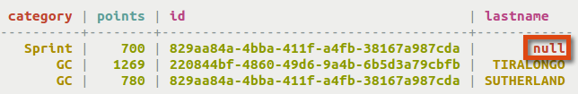

# Inserting JSON data into a table {#useInsertJSON .task}

Inserting JSON data with the INSERT command for testing queries.

In a production database, inserting columns and column values programmatically is more practical than using cqlsh, but often, testing queries using this SQL-like shell is very convenient. With Cassandra 2.2 and later, JSON data can be inserted. All values will be inserted as a string if they are not a number, but will be stored using the column data type. For example, the id below is inserted as a string, but is stored as a UUID. For more information, see [What's New in Cassandra 2.2: JSON Support](https://www.datastax.com/dev/blog/whats-new-in-cassandra-2-2-json-support).

-   To insert JSON data, add `JSON` to the `INSERT` command.. Note the absence of the keyword `VALUES` and the list of columns that is present in other `INSERT` commands.

    ```
    cqlsh> INSERT INTO cycling.cyclist_category JSON '{
      "category" : "GC", 
      "points" : 780, 
      "id" : "829aa84a-4bba-411f-a4fb-38167a987cda",
      "lastname" : "SUTHERLAND" }';
      
    ```

-   A null value will be entered if a defined column like lastname, is not inserted into a table using JSON format.

    ```
    cqlsh> INSERT INTO cycling.cyclist_category JSON '{
      "category" : "Sprint", 
      "points" : 700, 
      "id" : "829aa84a-4bba-411f-a4fb-38167a987cda"
    }';
    ```

    


**Parent topic:** [Inserting and updating data](../../cql/cql_using/useInsertDataTOC.md)

