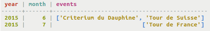

# Creating the list type {#useList .task}

Use a list when the order of elements matter or when you need to store same value multiple times.

A list has a form much like a set, in that a list groups and stores values. Unlike a set, the values stored in a list do not need to be unique and can be duplicated. In addition, a list stores the elements in a particular order and may be inserted or retrieved according to an index value.

Use the list data type to store data that has a possible many-to-many relationship with another column. For example, in the example below, a list called events stores all the race events on an upcoming calendar. Each month/year pairing might have several events occurring, and the races are stored in a list. The list can be ordered so that the races appear in the order that they will take place, rather than alphabetical order.

-   Define events in a table upcoming\_calendar. Each event listed in the list will have a text data type.

    ```
    cqlsh> CREATE TABLE cycling.upcoming_calendar ( year int, month int, events list<text>, PRIMARY KEY ( year, month) );
    ```

    


**Parent topic:** [Creating collections](../../cql/cql_using/useCollections.md)

