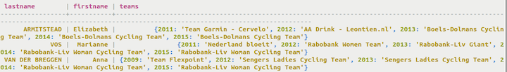

# Creating the map type {#useMap .task}

Use a map when pairs of related elements must be stored as a key-value pair.

A map relates one item to another with a key-value pair. For each key, only one value may exist, and duplicates cannot be stored. Both the key and the value are designated with a data type.

.Using the map type, you can store timestamp-related information in user profiles. Each element of the map is internally stored as one Cassandra column that you can modify, replace, delete, and query. Each element can have an individual time-to-live and expire when the TTL ends.

1.  Define teams in a table cyclist\_teams. Each team listed in the map will have an integer data type for the year a cyclist belonged to the team and a textdata type for the team name. The map collection is specified with a map column name and the pair of data types enclosed in angle brackets.

    ```
    cqlsh> CREATE TABLE cycling.cyclist_teams ( id UUID PRIMARY KEY, lastname text, firstname text, teams map<int,text> );
    ```

    


**Parent topic:** [Creating collections](../../cql/cql_using/useCollections.md)

