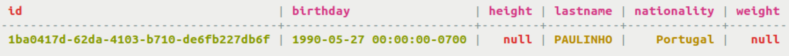

# Using multiple indexes {#useMultIndexes .task}

How to use multiple secondary indexes.

Indexes can be created on multiple columns and used in queries. The general rule about cardinality applies to all columns indexed. In a real-world situation, certain columns might not be good choices, depending on their [cardinality](useWhenIndex.md#when-no-index).

-   The table cycling.alt\_stats can yield the statistics about cyclists.

    ```
    cqlsh> CREATE TABLE cycling.cyclist_alt_stats ( id UUID PRIMARY KEY, lastname text, birthday timestamp, nationality text, weight text, height text );
    ```

-   Create indexes on the columns birthday and nationality.

    ```
    cqlsh> CREATE INDEX birthday_idx ON cycling.cyclist_alt_stats ( birthday );
    CREATE INDEX nationality_idx ON cycling.cyclist_alt_stats ( nationality );
    ```

-   Query for all the cyclists with a particular birthday from a certain country.

    ```
    cqlsh> SELECT * FROM cycling.cyclist_alt_stats WHERE birthday = '1982-01-29' AND nationality = 'Russia';
    ```

    

-   The indexes have been created on appropriate low cardinality columns, but the query still fails. Why? The answer lies with the partition key, which has not been defined. When you attempt a potentially expensive query, such as searching a range of rows, Cassandra requires the ALLOW FILTERING directive. The error is not due to multiple indexes, but the lack of a partition key definition in the query.

    ```
    cqlsh> SELECT * FROM cycling.cyclist_alt_stats WHERE birthday = '1990-05-27' AND nationality = 'Portugal' ALLOW FILTERING
    ```

    


**Parent topic:** [Indexing](../../cql/cql_using/usePrimaryIndex.md)

