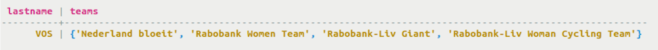
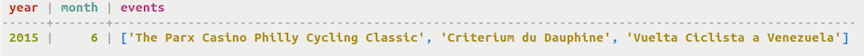
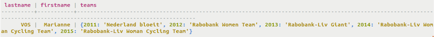

# Retrieval using collections {#useQueryCollections .task}

How to retrieve data from a collection.

Collections do not differ from other columns in retrieval. To query for a subset of the collection, a [secondary index for the collection](useIndexColl.md) must be created.

-   Retrieve teams for a particular cyclist id from the set.

    ```
    cqlsh> SELECT lastname, teams FROM cycling.cyclist_career_teams WHERE id = 5b6962dd-3f90-4c93-8f61-eabfa4a803e2;
    ```

    To query a table containing a collection, Cassandra retrieves the collection in its entirety. Keep collections small enough to be manageable because the collection store in memory. Alternatively, construct a data model to replace a collection if it must accommodate large amounts of data.

    Cassandra returns results in an order based on the type of the elements in the collection. For example, a set of text elements is returned in alphabetical order. If you want elements of the collection returned in insertion order, use a list.

    

-   Retrieve events stored in a list from the upcoming calendar for a particular year and month.

    ```
    cqlsh> SELECT * FROM cycling.upcoming_calendar WHERE year=2015 AND month=06;
    ```

    

    **Note:** The order is not alphabetical, but rather in the order of insertion.

-   Retrieve teams for a particular cyclist id from the map.

    ```
    cqlsh> SELECT lastname, firstname, teams FROM cycling.cyclist_teams WHERE id=5b6962dd-3f90-4c93-8f61-eabfa4a803e2;
    ```

    The order of the map output depends on the key type of the map. In this case, the key is an integer type.

    


**Parent topic:** [Querying tables](../../cql/cql_using/useQueryDataTOC.md)

