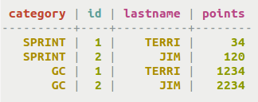
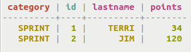
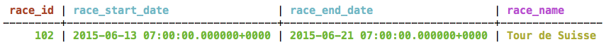
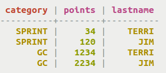
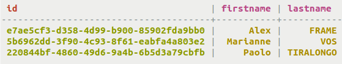
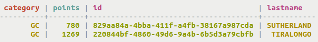
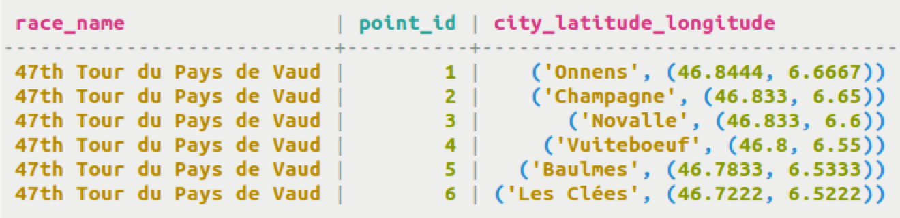

# Retrieval and sorting results {#useQueryColumnsSort .task}

Using the SELECT command for simple queries.

Querying tables to select data is the reason data is stored in databases. Similar to SQL, CQL can SELECT data using simple or complex qualifiers. At its simplest, a query selects all data in a table. At its most complex, a query delineates which data to retrieve and display and even calculate new values based on user-defined functions. For SASI indexing, see queries in [Using SASI](useSASIIndex.md).

## Controlling the number of rows returned using PER PARTITION LIMIT {#section_n5f_pgg_gw .section}

In Cassandra 3.6 and later, the `PER PARTITION LIMIT` option sets the maximum number of rows that the query returns from each partition. Create a table that will sort data into more than one partition.

```
CREATE TABLE cycling.rank_by_year_and_name ( 
  race_year int, 
  race_name text, 
  cyclist_name text, 
  rank int, 
  PRIMARY KEY ((race_year, race_name), rank) );
```

After inserting data, the table holds:

```
race_year | race_name                                  | rank | cyclist_name
-----------+--------------------------------------------+------+----------------------
      2014 |                        4th Tour of Beijing |    1 |    Phillippe GILBERT
      2014 |                        4th Tour of Beijing |    2 |        Daniel MARTIN
      2014 |                        4th Tour of Beijing |    3 | Johan Esteban CHAVES
      2015 |   Giro d'Italia - Stage 11 - Forli > Imola |    1 |        Ilnur ZAKARIN
      2015 |   Giro d'Italia - Stage 11 - Forli > Imola |    2 |      Carlos BETANCUR
      2015 | Tour of Japan - Stage 4 - Minami > Shinshu |    1 |      Benjamin PRADES
      2015 | Tour of Japan - Stage 4 - Minami > Shinshu |    2 |          Adam PHELAN
      2015 | Tour of Japan - Stage 4 - Minami > Shinshu |    3 |         Thomas LEBAS
```

Now, to get the top two racers in every race year and race name, use the following command with `PER PARTITION LIMIT 2`.

```
SELECT * FROM cycling.rank_by_year_and_name PER PARTITION LIMIT 2;
```

Output:

```
race_year | race_name                                  | rank | cyclist_name
-----------+--------------------------------------------+------+-------------------
      2014 |                        4th Tour of Beijing |    1 | Phillippe GILBERT
      2014 |                        4th Tour of Beijing |    2 |     Daniel MARTIN
      2015 |   Giro d'Italia - Stage 11 - Forli > Imola |    1 |     Ilnur ZAKARIN
      2015 |   Giro d'Italia - Stage 11 - Forli > Imola |    2 |   Carlos BETANCUR
      2015 | Tour of Japan - Stage 4 - Minami > Shinshu |    1 |   Benjamin PRADES
      2015 | Tour of Japan - Stage 4 - Minami > Shinshu |    2 |       Adam PHELAN
```

-   Use a simple `SELECT` query to display all data from a table.

    ```
    cqlsh> SELECT * FROM cycling.cyclist_category;
    ```

    

-   The example below illustrates how to create a query that uses category as a filter.

    ```
    cqlsh> SELECT * FROM cycling.cyclist_category WHERE category = 'SPRINT';
    ```

    

    Note that Cassandra will reject this query if category is not a partition key or clustering column. Queries require a sequential retrieval across the entire cyclist\_category table. In a distributed database like Cassandra, this is a crucial concept to grasp; scanning all data across all nodes is prohibitively slow and thus blocked from execution. The use of partition key and clustering columns in a `WHERE` clause must result in the selection of a contiguous set of rows.

    Queries can filter using secondary indexes, discussed in the [Indexing Tables](useCreateQueryIndexes.md) section. A query based on lastname can result in satisfactory results if the lastname column is [indexed](/en/glossary/doc/glossary/gloss_secondary_index.html).

-   In Cassandra 3.6 and later, clustering columns can be defined in `WHERE` clauses if `ALLOW FILTERING` is also used even if a secondary index is not created. The table definition is given and then the `SELECT` command. Note that `race_start_date` is a clustering column that has no secondary index.

    ```
    CREATE TABLE cycling.calendar (
        race_id int, 
        race_name text, race_start_date timestamp, race_end_date timestamp, PRIMARY KEY (race_id, race_start_date, race_end_date));
    SELECT * FROM cycling.calendar WHERE race_start_date='2015-06-13' ALLOW FILTERING;
    ```

      

-   You can also pick the columns to display instead of choosing all data.

    ```
    cqlsh> SELECT category, points, lastname FROM cycling.cyclist_category;
    ```

      

-   For a large table, limit the number of rows retrieved using `LIMIT`. The default limit is 10,000 rows. To sample data, pick a smaller number. To retrieve more than 10,000 rows set `LIMIT` to a large value.

    ```
    cqlsh> SELECT * From cycling.cyclist_name LIMIT 3;
    ```

      

-   You can fine-tune the display order using the `ORDER BY` clause. The partition key must be defined in the `WHERE` clause and the `ORDER BY` clause defines the clustering column to use for ordering.

    ```
    cqlsh> CREATE TABLE cycling.cyclist_cat_pts ( category text, points int, id UUID,lastname text, PRIMARY KEY (category, points) ); 
    SELECT * FROM cycling.cyclist_cat_pts WHERE category = 'GC' ORDER BY points ASC;
    ```

      

-   Tuples are retrieved in their entirety. This example uses `AS` to change the header of the tuple name.

    ```
    cqlsh> SELECT race_name, point_id, lat_long AS CITY_LATITUDE_LONGITUDE FROM cycling.route;
    ```

    

-   In Cassandra 3.6 and later, the `PER PARTITION LIMIT` option sets the maximum number of rows that the query returns from each partition. This is interesting because it allows a query to select a "Top 3" selection if the partitions are separated correctly. Create a table that will sort data into more than one partition and insert some data:

    ```
    CREATE TABLE cycling.rank_by_year_and_name ( 
      race_year int, 
      race_name text, 
      cyclist_name text, 
      rank int, 
      PRIMARY KEY ((race_year, race_name), rank) );
    ```

    ```
    race_year | race_name                                  | rank | cyclist_name
    -----------+--------------------------------------------+------+----------------------
          2014 |                        4th Tour of Beijing |    1 |    Phillippe GILBERT
          2014 |                        4th Tour of Beijing |    2 |        Daniel MARTIN
          2014 |                        4th Tour of Beijing |    3 | Johan Esteban CHAVES
          2015 |   Giro d'Italia - Stage 11 - Forli > Imola |    1 |        Ilnur ZAKARIN
          2015 |   Giro d'Italia - Stage 11 - Forli > Imola |    2 |      Carlos BETANCUR
          2015 | Tour of Japan - Stage 4 - Minami > Shinshu |    1 |      Benjamin PRADES
          2015 | Tour of Japan - Stage 4 - Minami > Shinshu |    2 |          Adam PHELAN
          2015 | Tour of Japan - Stage 4 - Minami > Shinshu |    3 |         Thomas LEBAS
    ```

-   Now use a `PER PARTITION LIMIT` to get the top two races for each race year and race name pair:

    ```
    SELECT * FROM cycling.rank_by_year_and_name PER PARTITION LIMIT 2;
    ```

    ```
    race_year | race_name                                  | rank | cyclist_name
    -----------+--------------------------------------------+------+-------------------
          2014 |                        4th Tour of Beijing |    1 | Phillippe GILBERT
          2014 |                        4th Tour of Beijing |    2 |     Daniel MARTIN
          2015 |   Giro d'Italia - Stage 11 - Forli > Imola |    1 |     Ilnur ZAKARIN
          2015 |   Giro d'Italia - Stage 11 - Forli > Imola |    2 |   Carlos BETANCUR
          2015 | Tour of Japan - Stage 4 - Minami > Shinshu |    1 |   Benjamin PRADES
          2015 | Tour of Japan - Stage 4 - Minami > Shinshu |    2 |       Adam PHELAN
    ```


**Parent topic:** [Querying tables](../../cql/cql_using/useQueryDataTOC.md)

