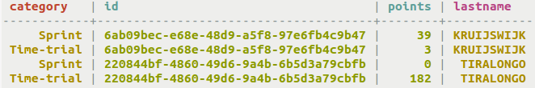
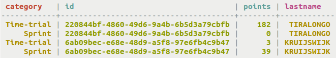
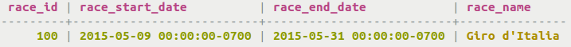
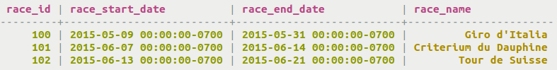

# Retrieval using the IN keyword {#useQueryIN .task}

Using the SELECT command with the IN keyword.

The IN keyword can define a set of clustering columns to fetch together, supporting a "multi-get" of CQL rows. A single clustering column can be defined if all preceding columns are defined for either equality or group inclusion. Alternatively, several clustering columns may be defined to collect several rows, as long as all preceding columns are queried for equality or group inclusion. The defined clustering columns can also be queried for inequality.

Note that using both IN and ORDER BY will require turning off paging with the PAGING OFF command in `cqlsh`.

-   Turn off paging.

    ```
    cqlsh> PAGING OFF
    ```

-   Retrieve and sort results in descending order.

    ```
    cqlsh> SELECT * FROM cycling.cyclist_cat_pts WHERE category IN ('Time-trial', 'Sprint') ORDER BY id DESC;
    ```

    

-   Alternatively, retrieve and sort results in ascending order.

    To retrieve results, use the SELECT command.

    ```
    cqlsh> SELECT * FROM cycling.cyclist_cat_pts WHERE category IN ('Time-trial', 'Sprint') ORDER BY id ASC;
    ```

    

-   Retrieve rows using multiple clustering columns. This example searches the partition key race\_ids for several races, but the partition key can also be composed as an equality for one value.

    ```
    cqlsh> SELECT * FROM cycling.calendar WHERE race_id IN (100, 101, 102) AND (race_start_date, race_end_date) IN (('2015-05-09','2015-05-31'),('2015-05-06', '2015-05-31'));
    ```

    

-   Retrieve several rows using multiple clustering columns and inequality.

    ```
    cqlsh> SELECT * FROM cycling.calendar WHERE race_id IN (100, 101, 102) AND (race_start_date, race_end_date) >= ('2015-05-09','2015-05-24');
    ```

    


**Parent topic:** [Querying tables](../../cql/cql_using/useQueryDataTOC.md)

