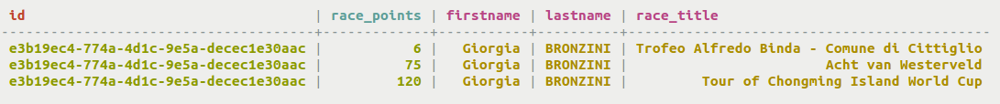
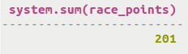
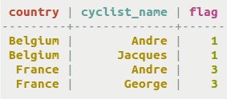
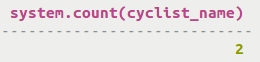

# Retrieval using standard aggregate functions {#useQueryStdAggregate .task}

Using the SELECT command to return data and apply standard aggregate functions.

In Cassandra 2.2, the standard aggregate functions of `min`, `max`, `avg`, `sum`, and `count` are built-in functions.

-   A table cyclist\_points records the race points for cyclists.

    ```
    cqlsh> CREATE TABLE cycling.cyclist_points (id UUID, firstname text, lastname text, race_title text, race_points int, PRIMARY KEY (id, race_points );
    ```

    

-   Calculate the standard aggregation function `sum` to find the sum of race points for a particular cyclist. The value of the aggregate will be returned.

    ```
    cqlsh> SELECT sum(race_points) FROM cycling.cyclist_points WHERE id=e3b19ec4-774a-4d1c-9e5a-decec1e30aac;
    ```

    

-   Another standard aggregate function is `count`. A table country\_flag records the country of each cyclist.

    ```
    CREATE TABLE cycling.country_flag (country text, cyclist_name text, flag int STATIC, PRIMARY KEY (country, cyclist_name));
    ```

    

-   Calculate the standard aggregation function `count` to find the number of cyclists from Belgium. The value of the aggregate will be returned.

    ```
    cqlsh> SELECT count(cyclist_name) FROM cycling.country_flag WHERE country='Belgium';
    ```

    


**Parent topic:** [Querying tables](../../cql/cql_using/useQueryDataTOC.md)

