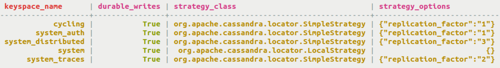
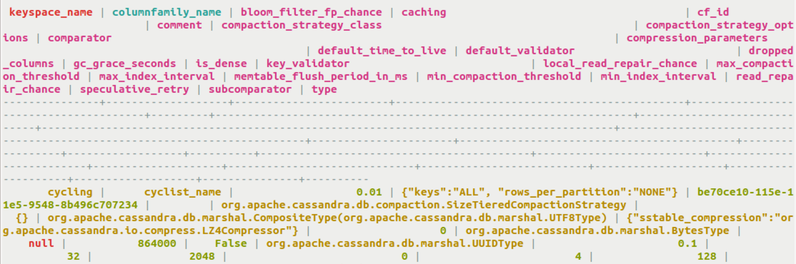
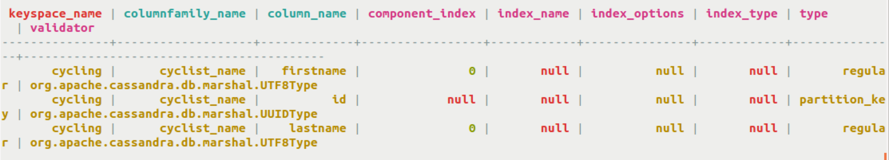

# Keyspace, table, and column information {#useQuerySystemTable .task}

Querying system.schema\_\* tables directly to get keyspace, table, and column information.

An alternative to the `cqlsh` describe\_\* functions or using `DevCenter` to discover keyspace, table, and column information is querying system.schema\_\* table directly.

-   Query the defined keyspaces using the SELECT statement.

    ```
    cqlsh> SELECT * FROM system.schema_keyspaces;
    ```

    

-   Query schema\_columnfamilies about a particular table.

    ```
    cqlsh> SELECT * FROM system.schema_columnfamilies WHERE keyspace_name = 'cycling' AND columnfamily_name = 'cyclist_name';
    ```

    

-   Query schema\_columns about the columns in a table.

    ```
    cqlsh> SELECT * FROM system.schema_columns WHERE keyspace_name = 'cycling' AND columnfamily_name = 'cyclist_name';
    ```

    


**Parent topic:** [Querying a system table](../../cql/cql_using/useQuerySystem.md)

