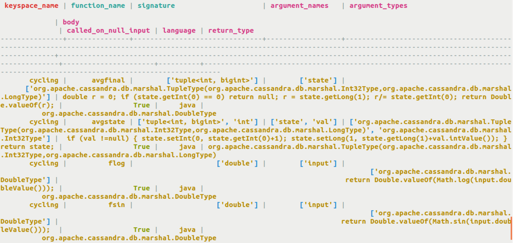
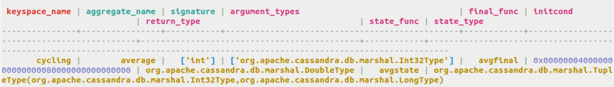
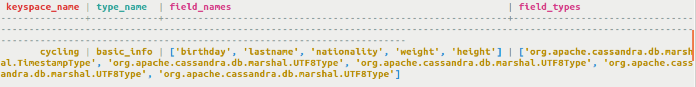

# Functions, aggregates, and user types {#useQuerySystemTableUserDefined .task}

Querying system.schema\_\* tables directly to get information about user-defined functions, aggregates, and user types.

Currently, the system tables are the only method of displaying information about user-defined functions, aggregates, and user types.

-   Show all user-defined functions in the system.schema\_functions table.

    ```
    cqlsh> SELECT * FROM system.schema_functions;
    ```

    

-   Show all user-defined aggregates in the system.schema\_aggregates table.

    ```
    cqlsh> SELECT * FROM system.schema_aggregates;
    ```

    

-   Show all user-defined types in the system.schema\_usertypes table.

    ```
    cqlsh> SELECT * FROM system.schema_usertypes;
    ```

    


**Parent topic:** [Querying a system table](../../cql/cql_using/useQuerySystem.md)

