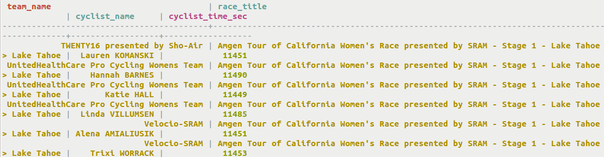
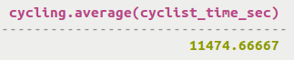

# Retrieval using user-defined aggregate \(UDA\) functions {#useQueryUDA .task}

Using the SELECT command to return data and apply user-defined aggregate functions.

Referring back to the user-defined aggregate average\(\), retrieve the average of the column cyclist\_time\_sec from a table.

1.  List all the data in the table.

    ```
    cqlsh> SELECT * FROM cycling.team_average;
    ```

    

2.  Apply the user-defined aggregate function `average()` to the cyclist\_time\_sec column.

    ```
    cqlsh> SELECT average(cyclist_time_sec) FROM cycling.team_average WHERE team_name='UnitedHealthCare Pro Cycling Womens Team' AND race_title='Amgen Tour of California Women''s Race presented by SRAM - Stage 1 - Lake Tahoe > Lake Tahoe';
    
    ```

    


**Parent topic:** [Querying tables](../../cql/cql_using/useQueryDataTOC.md)

