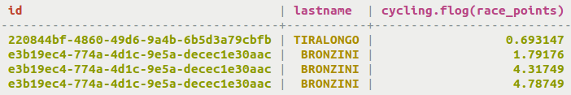

# Retrieval using a user-defined function \(UDF\) {#useQueryUDF .task}

Using the SELECT command to return data and applying a UDF.

The SELECT command can be used to retrieve data from a table while applying a user-defined function \(UDF\) to it.

1.  Use the user-defined function \(UDF\) [fLog\(\)](useCreateUDF.md) created previously to retrieve data from a table cycling.cyclist\_points.

    ```
    cqlsh> SELECT id, lastname, fLog(race_points) FROM cycling.cyclist_points;
    ```

    


**Parent topic:** [Querying tables](../../cql/cql_using/useQueryDataTOC.md)

