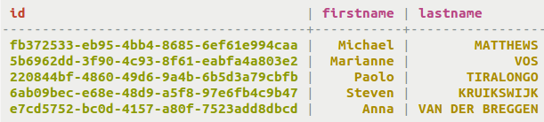
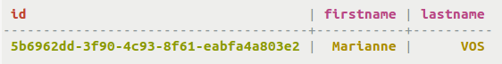
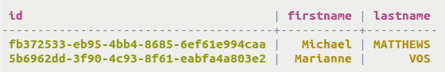
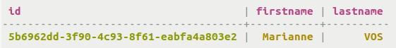
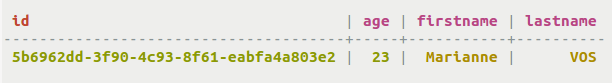
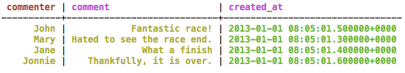
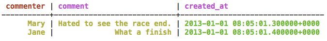
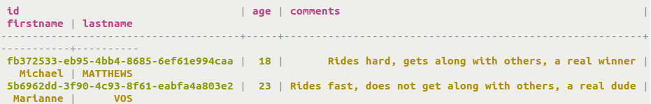

# Using a SSTable Attached Secondary Index \(SASI\) {#useSASIIndex .task}

Using CQL to create a SSTable Attached Secondary Index \(SASI\) on a column after defining a table.

In Cassandra 3.4 and later, a new implementation of secondary indexes, [SSTable Attached Secondary Indexes \(SASI\)](useSASIIndexConcept.md) is available.

Using CQL, SSTable attached secondary indexes \(SASI\) can be created on a non-collection column defined in a table. Secondary indexes are used to query a table that uses a column that is not normally queryable, such as a non primary key column. SASI implements three types of indexes, `PREFIX`, `CONTAINS`, and `SPARSE`.

-   **PREFIX index**
-   Create an index `fn_prefix` for the table `cyclist_name` on the column `firstname`. `PREFIX` is the default mode, so it does not need to be specified.

    ```
    CREATE TABLE cycling.cyclist_name ( 
      id UUID PRIMARY KEY, 
      lastname text, 
      firstname text
    );
    
    CREATE CUSTOM INDEX  fn_prefix ON cyclist_name (firstname) USING 'org.apache.cassandra.index.sasi.SASIIndex';
    ```

      

-   Queries can find exact matches for values in `firstname`. Note that indexing is used for this query, as the primary key `id` is not specified.

    ```
    SELECT * FROM cyclist_name WHERE firstname = 'Marianne';
    ```

      

-   Queries can find matches for values in `firstname` based on partial matches. The use of `LIKE` specifies that the match is looking for a word that starts with the letter "M". The `%` after the letter "M" will match any characters can return a matching value. Note that indexing is used for this query, as the primary key `id` is not specified.

    ```
    SELECT * FROM cyclist_name WHERE firstname LIKE 'M%';
    ```

      

-   Many queries will fail to find matches based on the partial string. All the of the following queries will fail.

    ```
    SELECT * FROM cyclist_name WHERE firstname = 'MARIANNE';
    SELECT * FROM cyclist_name WHERE firstname LIKE 'm%';
    SELECT * FROM cyclist_name WHERE firstname LIKE '%m%';
    SELECT * FROM cyclist_name WHERE firstname LIKE '%m%' ALLOW FILTERING;
    SELECT * FROM cyclist_name WHERE firstname LIKE '%M%';
    SELECT * FROM cyclist_name WHERE firstname = 'M%';
    SELECT * FROM cyclist_name WHERE firstname = '%M';
    SELECT * FROM cyclist_name WHERE firstname = '%M%';
    SELECT * FROM cyclist_name WHERE firstname = 'm%';
    ```

    The first four queries fail because of case sensitivity. "MARIANNE" is all uppercase, whereas the stored value is not. The next three use a lowercase "m". The placement of the `%` are critical; since the index specifies the `PREFIX` mode, only a trailing `%` will yield results when coupled with `LIKE`. The queries with equalities fail unless the exact match is designated.

-   **CONTAINS index**
-   Create an index `fn_suffix` for the table `cyclist_name` on the column `firstname`. `CONTAINS` is the specified mode, so that pattern matching for partial patterns given, not just in the prefix.

    ```
    CREATE CUSTOM INDEX fn_contains ON cyclist_name (firstname) USING 'org.apache.cassandra.index.sasi.SASIIndex'
    WITH OPTIONS = { 'mode': 'CONTAINS' };
    ```

-   Queries can find exact matches for values in `firstname`. Note that indexing is used for this query, as the primary key `id` is not specified. For queries on `CONTAINS` indexing, the `ALLOW FILTERING` phrase must be included, although Cassandra will not actually filter.

    ```
    SELECT * FROM cyclist_name WHERE firstname = 'Marianne' ALLOW FILTERING;
    ```

      

    This query returns the same results as a query using `PREFIX` indexing that does an exact match using a slightly modified query.

-   Queries can find matches for values in `firstname` based on partial matches. The use of `LIKE` specifies that the match is looking for a word that contains the letter "M". The `%` before and after the letter "M" will match any characters can return a matching value. Note that indexing is used for this query, as the primary key `id` is not specified.

    ```
    SELECT * FROM cyclist_name WHERE firstname LIKE '%M%';
    ```

      

    Again, the same results are returned as for the `PREFIX` indexing, using a slightly modified query.

-   The `CONTAINS` indexing has a more versatile matching algorithm than `PREFIX`. Look at the examples below to see what results from variations of the last search.

    ```
    SELECT * FROM cyclist_name WHERE firstname LIKE '%arianne';
    SELECT * FROM cyclist_name WHERE firstname LIKE '%arian%';
    ```

      

    Each query matches the pattern, either the final characters of the column value as in `%arianne` or the characters bracketed by `%` such as `%arian%`.

-   With `CONTAINS` indexing, even inequality pattern matching is possible. Note again the use of the `ALLOW FILTERING` phrase that required but causes no latency in the query response.

    ```
    SELECT * FROM cyclist_name WHERE firstname > 'Mar' ALLOW FILTERING;
    ```

      

    The only row matching the conditions returns the same value as the last query.

-   Like with `PREFIX` indexing, many queries will fail to find matches based on the partial string. All the of the following queries will fail.

    ```
    SELECT * FROM cyclist_name WHERE firstname = 'Marianne';
    SELECT * FROM cyclist_name WHERE firstname = 'MariAnne' ALLOW FILTERING;
    SELECT * FROM cyclist_name WHERE firstname LIKE '%m%';
    SELECT * FROM cyclist_name WHERE firstname LIKE 'M%';
    SELECT * FROM cyclist_name WHERE firstname LIKE '%M';
    SELECT * FROM cyclist_name WHERE firstname LIKE 'm%';
    ```

    The first query fails due to the absence of the `ALLOW FILTERING` phrase. The next two queries fail because of case sensitivity. "MariAnne" has one uppercase letter, whereas the stored value does not. The last three fail due to placement of the `%`.

-   Either the `PREFIX` index or the `CONTAINS` index can be created with case sensitivity by adding an analyzer class and case\_sensitive option.

    ```
    CREATE CUSTOM INDEX fn_suffix_allcase ON cyclist_name (firstname) USING 'org.apache.cassandra.index.sasi.SASIIndex'
    WITH OPTIONS = { 
    'mode': 'CONTAINS',
    'analyzer_class': 'org.apache.cassandra.index.sasi.analyzer.NonTokenizingAnalyzer',
    'case_sensitive': 'false'
    };
    ```

    The `analyzer_class` used here is the non-tokenizing analyzer that does not perform analysis on the text in the specified column. The option `case_sensitive` is set to `false` to make the indexing case insensitive.

-   With the addition of the analyzer class and option, the following query now also works, using a lowercase "m".

    ```
    SELECT * FROM cyclist_name WHERE firstname LIKE '%m%';
    ```

      

-   If queries are narrowed with an indexed column value, non-indexed columns can be specified. Compound queries can also be created with multiple indexed columns. This example alters the table to add a column `age` that is not indexed before performing the query.

    ```
    ALTER TABLE cyclist_name ADD age int;
    UPDATE cyclist_name SET age=23 WHERE id=5b6962dd-3f90-4c93-8f61-eabfa4a803e2;
    INSERT INTO cyclist_name (id,age,firstname,lastname) VALUES (8566eb59-07df-43b1-a21b-666a3c08c08a,18,'Marianne','DAAE');
    SELECT * FROM cyclist_name WHERE firstname='Marianne' and age > 20 allow filtering;
    ```

      

-   **SPARSE index**
-   The `SPARSE` index is meant to improve performance of querying large, dense number ranges like timestamps for data inserted every millisecond. If the data is numeric, millions of columns values with a small number of partition keys characterize the data, and range queries will be performed against the index, then `SPARSE` is the best choice. For numeric data that does not meet this criteria, `PREFIX` is the best choice.

    ```
    CREATE CUSTOM INDEX fn_contains ON cyclist_name (age) USING 'org.apache.cassandra.index.sasi.SASIIndex'
    WITH OPTIONS = { 'mode': 'SPARSE' };
    ```

    Use `SPARSE` indexing for data that is sparse \(every term/column value has less than 5 matching keys\). Indexing the `created_at` field in time series data \(where there is typically few matching rows/events per `created_at` timestamp\) is a good use case. `SPARSE` indexing is primarily an optimization for range queries, especially large ranges that span large timespans.

-   To illustrate the use of the `SPARSE` index, create a table and insert some time series data:

    ```
    CREATE TABLE cycling.comments (commenter text, created_at timestamp, comment text, PRIMARY KEY (commenter));
    INSERT INTO cycling.comments (commenter, comment, created_at) VALUES ('John', 'Fantastic race!', '2013-01-01 00:05:01.500');
    INSERT INTO cycling.comments (commenter, comment, created_at) VALUES ('Jane', 'What a finish', '2013-01-01 00:05:01.400');
    INSERT INTO cycling.comments (commenter, comment, created_at) VALUES ('Mary', 'Hated to see the race end.', '2013-01-01 00:05:01.300');
    INSERT INTO cycling.comments (commenter, comment, created_at) VALUES ('Jonnie', 'Thankfully, it is over.', '2013-01-01 00:05:01.600');
    ```

      

-   Find all the comments made before the timestamp `2013-01-01 00:05:01.500`.

    ```
    SELECT * FROM cycling.comments WHERE created_at < '2013-01-01 00:05:01.500';
    ```

      

    This query returns all the results where `created_at` is found to be less than the timestamp supplied. The inequalities `>=`, `>` and `<=` are all valid operators.

    `SPARSE` indexing is used only for numeric data, so `LIKE` queries do not apply.

-   **Using analyzers**
-   Analyzers can be specified that will analyze the text in the specified column. The `NonTokenizingAnalyzer` is used for cases where the text is not analyzed, but case normalization or sensitivity is required. The `StandardAnalyzer` is used for analysis that involves stemming, case normalization, case sensitivity, skipping common words like "and" and "the", and localization of the language used to complete the analysis. Altering the table again to add a lengthier text column provides a window into the analysis.

    ```
    ALTER TABLE cyclist_name ADD comments text;
    UPDATE cyclist_name SET comments ='Rides hard, gets along with others, a real winner' WHERE id = fb372533-eb95-4bb4-8685-6ef61e994caa;
    UPDATE cyclist_name SET comments ='Rides fast, does not get along with others, a real dude' WHERE id = 5b6962dd-3f90-4c93-8f61-eabfa4a803e2;
    
    CREATE CUSTOM INDEX stdanalyzer_idx ON cyclist_name (comments) USING 'org.apache.cassandra.index.sasi.SASIIndex'
    WITH OPTIONS = {
    'mode': 'CONTAINS',
    'analyzer_class': 'org.apache.cassandra.index.sasi.analyzer.StandardAnalyzer',
    'analyzed': 'true',
    'tokenization_skip_stop_words': 'and, the, or',
    'tokenization_enable_stemming': 'true',
    'tokenization_normalize_lowercase': 'true',
    'tokenization_locale': 'en'
    };
    ```

-   This query will search for the presence of a designated string, using the analyzed text to return a result.

    ```
    SELECT * FROM cyclist_name WHERE comments LIKE 'ride';
    ```

      

    This query returns all the results where `ride` is found either as an exact word or as a stem for another word - `rides` in this case.


**Parent topic:** [Indexing with SSTable attached secondary indexes \(SASI\)](../../cql/cql_using/useSASIIndexConcept.md)

