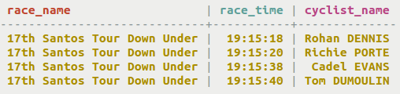
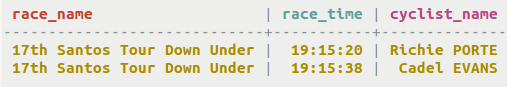

# Retrieval by scanning a partition {#useScanPartition .task}

Scanning partition when the table has more than one clustering column and comparing groups of clustering keys to certain values.

Queries can scan a partition to retrieve a segment of stored data. The segment must be sequentially stored, so clustering columns can be used to define the [slice](/en/glossary/doc/glossary/gloss_slice.html) of data selected.

-   Create a table race\_times to hold the race times of various cyclists for various races.

    ```
    CREATE TABLE cycling.race_times (race_name text, cyclist_name text, race_time text, PRIMARY KEY (race_name, race_time));
    ```

    

-   Scan the race times in the table to find a particular segment of data using a conditional operator.

    ```
    SELECT * FROM cycling.race_times WHERE race_name = '17th Santos Tour Down Under' AND race_time >= '19:15:19' AND race_time <= '19:15:39' );
    ```

    


**Parent topic:** [Querying tables](../../cql/cql_using/useQueryDataTOC.md)

