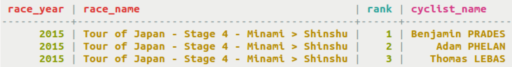
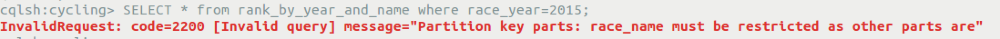
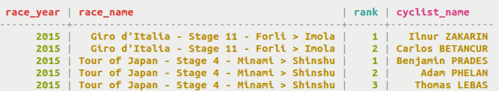
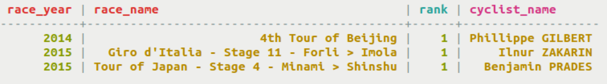

# Using a secondary index {#useSecondaryIndex .task}

Using CQL to create a secondary index on a column after defining a table.

Using CQL, you can create an index on a column after defining a table. In Cassandra 2.1 and later, you can [index a collection](useIndexColl.md) column. In Cassandra 3.4 and later, static columns can be indexed. Secondary indexes are used to query a table using a column that is not normally queryable.

Secondary indexes are tricky to use and can impact performance greatly. The index table is stored on each node in a cluster, so a query involving a secondary index can rapidly become a performance nightmare if multiple nodes are accessed. A general rule of thumb is to index a column with low cardinality of few values. Before creating an index, be aware of when and [when not to create an index](useWhenIndex.md#when-no-index).

In Cassandra 3.4 and later, a new implementation of secondary indexes, [SSTable Attached Secondary Indexes \(SASI\)](useSASIIndexConcept.md) have greatly improved the performance of secondary indexes and should be used, if possible.

-   The table rank\_by\_year\_and\_name can yield the rank of cyclists for races.

    ```
    cqlsh> CREATE TABLE cycling.rank_by_year_and_name ( 
      race_year int, 
      race_name text, 
      cyclist_name text, 
      rank int, 
      PRIMARY KEY ((race_year, race_name), rank) 
    );
    ```

-   Both race\_year and race\_name must be specified as these columns comprise the partition key.

    ```
    cqlsh> SELECT * FROM cycling.rank_by_year_and_name WHERE race_year=2015 AND race_name='Tour of Japan - Stage 4 - Minami > Shinshu';
    ```

    

-   A logical query to try is a listing of the rankings for a particular year. Because the table has a composite partition key, this query will fail if only the first column is used in the conditional operator.

    ```
    cqlsh> SELECT * FROM cycling.rank_by_year_and_name WHERE race_year=2015;
    ```

    

-   An index is created for the race year, and the query will succeed. An index name is optional and must be unique within a keyspace. If you do not provide a name, Cassandra will assign a name like race\_year\_idx.

    ```
    cqlsh> CREATE INDEX ryear ON cycling.rank_by_year_and_name (race_year);
    SELECT * FROM cycling.rank_by_year_and_name WHERE race_year=2015;
    ```

    

-   A clustering column can also be used to create an index. An index is created on rank, and used in a query.

    ```
    cqlsh> CREATE INDEX rrank ON cycling.rank_by_year_and_name (rank);
    SELECT * FROM cycling.rank_by_year_and_name WHERE rank = 1;
    ```

    


**Parent topic:** [Indexing](../../cql/cql_using/usePrimaryIndex.md)

