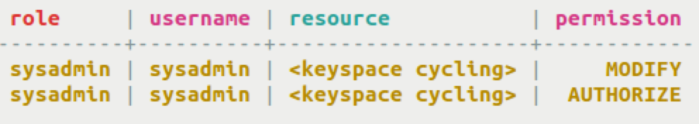

# Database Permissions {#useSecurePermission .task}

How to set role permissions.

Authentication and authorization should be set based on roles, rather than users. Authentication and authorization for Cassandra 2.2 and later are based on roles, and user commands are included only for legacy backwards compatibility.

Roles may be granted to other roles to create hierarchical permissions structures; in these hierarchies, permissions and `SUPERUSER` status are inherited, but the `LOGIN` privilege is not.

Permissions can be granted at any level of the database hierarchy and flow downwards. Keyspaces and tables are hierarchical as follows: `ALL KEYSPACES > KEYSPACE > TABLE`. Functions are hierarchical in the following manner: `ALL FUNCTIONS > KEYSPACE > FUNCTION`. `ROLES` can also be hierarchical and encompass other `ROLES`. Permissions can be granted on:

-   CREATE - keyspace, table, function, role, index
-   ALTER - keyspace, table, function, role
-   DROP - keyspace, table, function, role, index
-   SELECT - keyspace, table
-   MODIFY - INSERT, UPDATE, DELETE, TRUNCATE - keyspace, table
-   AUTHORIZE - GRANT PERMISSION, REVOKE PERMISSION - keyspace, table, function, role, MBean \(in Cassandra 3.6 and later\)
-   DESCRIBE - LIST ROLES
-   EXECUTE - SELECT, INSERT, UPDATE - functions

**Note:** Index must additionally have ALTER permission on the base table in order to CREATE or DROP.

The permissions are extensive with many variations. A few examples are described below.

-   The first line grants anyone with the team\_manager role the ability to `INSERT, UPDATE, DELETE, and TRUNCATE` any table in the keyspace cycling. The second line grants anyone with the sys\_admin role the ability to view all roles in the database.

    ```
    GRANT MODIFY ON KEYSPACE cycling TO team_manager;
    GRANT DESCRIBE ON ALL ROLES TO sys_admin;
    ```

-   The first line revokes `SELECT` in all keyspaces for anyone with the team\_manager role. The second line prevents the team\_manager role from executing the named function `fLog()`.

    ```
    REVOKE SELECT ON ALL KEYSPACES FROM team_manager;
    REVOKE EXECUTE ON FUNCTION cycling.fLog(double) FROM team_manager;
    ```

-   All permissions can be listed, for either all keyspaces or a single keyspace.

    ```
    LIST ALL PERMISSIONS OF sandy;
    LIST ALL PERMISSIONS ON cycling.cyclist_name OF chuck;
    ```

    

-   Grant permission to drop all functions, including aggregate in the current keyspace.

    ```
    GRANT DROP ON ALL FUNCTIONS IN KEYSPACE TO coach;
    ```


See the [Apache Cassandra CQL document](https://cassandra.apache.org/doc/latest/cql/index.html) for more details.

**Parent topic:** [Securing a table](../../cql/cql_using/useSecureTOC.md)

