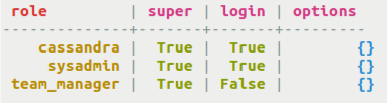

# Database roles {#useSecureRoles .task}

How to create and work with roles.

Roles-based access control is available in Cassandra 2.2 and later. Roles enable authorization management on a larger scale than security per user can provide. A role is created and may be granted to other roles. Hierarchical sets of [permissions](useSecurePermission.md) can be created. For more information, see [Role Based Access Control in Cassandra](https://www.datastax.com/dev/blog/role-based-access-control-in-cassandra).

-   Create a role with a password. `IF NOT EXISTS` is included to ensure a previous role definition is not overwritten.

    ```
    cqlsh> CREATE ROLE IF NOT EXISTS team_manager WITH PASSWORD = 'RockIt4Us!';
    ```

-   Create a role with `LOGIN` and `SUPERUSER` privileges. `LOGIN` allows a client to identify as this role when connecting. `SUPERUSER` grants the ability to create roles unconditionally if the role has `CREATE` permissions.

    ```
    cqlsh> CREATE ROLE sys_admin WITH PASSWORD = 'IcanDoIt4ll' AND LOGIN = true AND SUPERUSER = true;
    ```

-   Alter a role to change options. A role with `SUPERUSER` status can alter the `SUPERUSER` status of another role, but not the role currently held. `PASSWORD`, `LOGIN`, and `SUPERUSER` can be modified with `ALTER ROLE`. To modify properties of a role, the user must have `ALTER` permission.

    ```
    cqlsh> ALTER ROLE sys_admin WITH PASSWORD = 'All4one1forAll' AND SUPERUSER = false;
    ```

-   Grant a role to a user or a role. To execute `GRANT` and `REVOKE` statements requires `AUTHORIZE` permission on the role being granted/revoked.

    ```
    cqlsh> GRANT sys_admin TO team_manager;
    GRANT team_manager TO sandy;
    ```

-   List roles of a user.

    ```
    cqlsh> LIST ROLES;
    LIST ROLES OF sandy;
    ```

    **Note:** `NORECURSIVE` is an option to discover all roles directly granted to a user. Without `NORECURSIVE`, transitively acquired roles are also listed.

    

-   Revoke role that was previously granted to a user or a role. Any permission that derives from the role is revoked.

    ```
    cqlsh> REVOKE sys_admin FROM team_manager;
    REVOKE team_manager FROM sandy;
    ```

-   Drop role that is not a current role. User must be a `SUPERUSER`.

    ```
    DROP ROLE IF EXISTS sys_admin;
    ```


**Parent topic:** [Securing a table](../../cql/cql_using/useSecureTOC.md)

