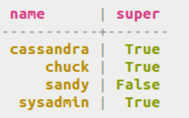

# Database users {#useSecureUsers .task}

How to create and work with users.

User-based access control enables authorization management on a per-user basis.

**Note:** Creating users is supported for backwards compatibility. Authentication and authorization for Cassandra 2.2 and later are based on roles, and role-based commands should be used.

-   Create a user with a password. `IF NOT EXISTS` is included to ensure a previous user definition is not overwritten.

    ```
    cqlsh> CREATE USER IF NOT EXISTS sandy WITH PASSWORD 'Ride2Win@' NOSUPERUSER;
    ```

-   Create a user with `SUPERUSER` privileges. `SUPERUSER` grants the ability to create users and roles unconditionally.

    ```
    cqlsh> CREATE USER chuck WITH PASSWORD 'Always1st$' SUPERUSER;
    ```

    **Note:** `WITH PASSWORD` implicitly specifies `LOGIN`.

-   Alter a user to change options. A role with `SUPERUSER` status can alter the `SUPERUSER` status of another user, but not the user currently held. To modify properties of a user, the user must have permission.

    ```
    cqlsh> ALTER USER sandy SUPERUSER;
    ```

-   List the users.

    ```
    cqlsh> LIST USERS;
    ```

    

-   Drop user that is not a current user. User must be a `SUPERUSER`.

    ```
    DROP USER IF EXISTS chuck;
    ```


**Parent topic:** [Securing a table](../../cql/cql_using/useSecureTOC.md)

